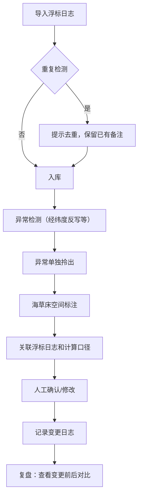

# 海草床调查空间标注系统 产品需求文档

## 1. 产品概述

面向港口与海洋生态调查团队的海草床空间标注与浮标日志管理工具，解决人工记录繁琐、平均值掩盖风险、补录覆盖原判断、异常数据难追溯等问题。

- 核心用户：港口工程师（老何）、排班同事、海草床调查人员
- 核心价值：让浮标数据、空间标注、异常检测、变更追溯形成完整闭环

## 2. 核心功能

### 2.1 用户角色

| 角色 | 核心场景 | 核心权限 |
|------|----------|----------|
| 调查工程师 | 导入浮标日志、标注海草床、标记异常 | 全部功能 |
| 排班同事 | 复盘查看、核对变更记录 | 查看、对比、确认 |

### 2.2 功能模块

1. **浮标日志管理**：分批次导入、智能去重、人工备注保留、导入历史
2. **海草床空间标注**：地图标注、异常点位标记、计算口径说明
3. **异常检测中心**：经纬度反写识别、异常单独拎出、风险分级
4. **图表联动面板**：趋势图表、点击异常回溯日志、计算口径展示
5. **变更审计记录**：人工确认前后对比、修改留痕、复盘视图

### 2.3 页面详情

| 页面名称 | 模块名称 | 功能描述 |
|----------|----------|----------|
| 总览仪表盘 | 数据概览卡片 | 浮标数量、标注点位、异常数、待确认项统计 |
| 总览仪表盘 | 趋势图表 | 海草床覆盖度/生物量趋势，支持点击异常点 |
| 总览仪表盘 | 最近变更列表 | 最新人工确认、补录记录、异常标记 |
| 浮标日志 | 日志列表 | 按批次展示，支持筛选、搜索、查看详情 |
| 浮标日志 | 导入面板 | 文件/手动导入，智能去重提示，保留已有备注 |
| 浮标日志 | 日志详情 | 单条日志完整信息、计算口径、关联标注 |
| 空间标注 | 地图区域 | 海草床分布点位标注，异常点位特殊标记 |
| 空间标注 | 标注操作 | 新增/编辑标注、选择关联日志、填写计算口径 |
| 空间标注 | 异常筛选 | 一键切换只看异常点位 |
| 异常中心 | 异常列表 | 所有异常数据单独列出，分类展示 |
| 异常中心 | 异常详情 | 异常类型、原始数据、检测规则、处理状态 |
| 异常中心 | 经纬度反写检测 | 自动识别经纬度反写的异常记录 |
| 变更审计 | 时间线视图 | 按时间展示所有变更记录 |
| 变更审计 | 变更对比 | 人工确认前后数据对比，高亮修改字段 |
| 变更审计 | 批次追溯 | 按导入批次追溯数据变化 |

## 3. 核心流程

### 3.1 主流程描述

调查工程师分批导入浮标日志 → 系统自动去重并检测异常 → 在地图上标注海草床点位并关联日志 → 人工确认异常并填写备注 → 排班同事复盘时查看变更历史和前后对比

### 3.2 流程图

## 4. 用户界面设计

### 4.1 设计风格

- **主色调**：深海蓝 (#0A3D62) 为主，搭配海草绿 (#218C74) 和珊瑚橙 (#FF7F50)
- **辅助色**：浅蓝灰背景，米白色卡片，柔和阴影
- **按钮风格**：圆角中等（8px），主按钮有渐变效果，悬停有微动效
- **字体**：标题用思源黑体/苹方粗体，正文用思源黑体/苹方常规体
- **布局风格**：左侧导航 + 右侧内容区，卡片式信息分组
- **图标风格**：线性图标，海洋主题元素（海浪、海草、浮标、鱼群）
- **整体调性**：专业、清新、可信，如海洋研究所般严谨又有生命力

### 4.2 页面设计概览

| 页面名称 | 模块名称 | UI 元素 |
|----------|----------|----------|
| 总览仪表盘 | 数据概览卡片 | 四张卡片，数字+趋势小图，海蓝渐变背景 |
| 总览仪表盘 | 趋势图表 | 面积图，异常点用橙色圆点高亮，支持点击 |
| 总览仪表盘 | 最近变更列表 | 时间线样式，左侧图标，右侧文字 |
| 浮标日志 | 顶部操作栏 | 导入按钮、搜索框、筛选下拉、批次标签 |
| 浮标日志 | 日志列表 | 表格样式，斑马纹，异常行红色边框 |
| 浮标日志 | 详情抽屉 | 右侧滑出，完整信息+计算口径 |
| 空间标注 | 地图区域 | 模拟海图背景，标注点位可交互 |
| 空间标注 | 标注信息卡 | 点击点位弹出，含日志关联和计算口径 |
| 空间标注 | 异常筛选开关 | 顶部切换，只看异常时地图变暗，异常点亮 |
| 异常中心 | 异常分类卡片 | 不同异常类型卡片，数字+图标 |
| 异常中心 | 异常列表 | 带状态标签，支持标记已处理 |
| 变更审计 | 时间线 | 垂直时间线，节点可点击展开对比 |
| 变更审计 | 对比视图 | 左右分栏或上下对比，红色删除线+绿色新增 |

### 4.3 响应式

- 桌面端优先（1280px 及以上），横向布局
- 平板端（768-1279px）：导航收起为图标，内容区自适应
- 移动端（768px 以下）：底部 Tab 导航，列表单列，地图可缩放

### 4.4 动效设计

- 页面加载：卡片依次淡入上移（staggered fade-in-up）
- 异常点位：轻微呼吸动画（pulse），吸引注意
- 抽屉滑入：从右侧平滑滑入，带遮罩淡入
- 按钮悬停：背景色加深 + 轻微上移 + 阴影加深
- 数据更新：数字滚动动画（count up）
- 地图点位：hover 时放大并显示波纹效果
