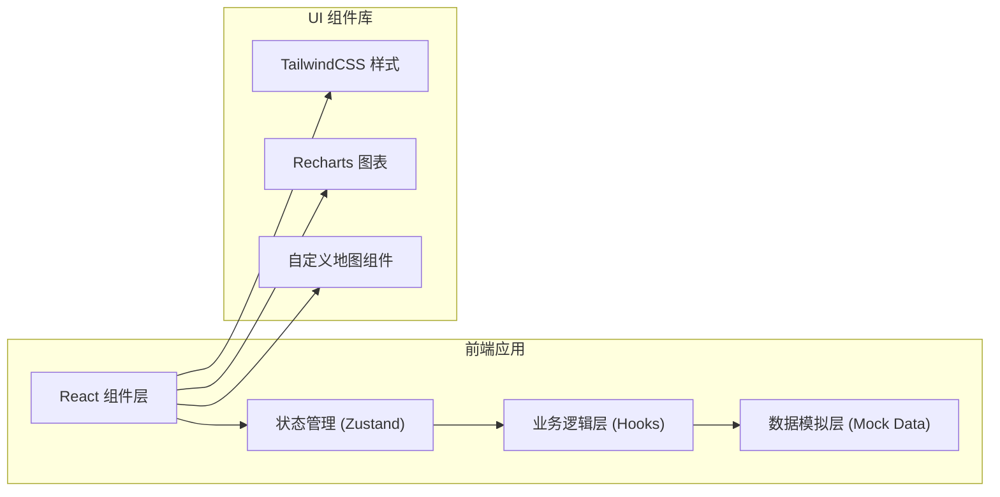
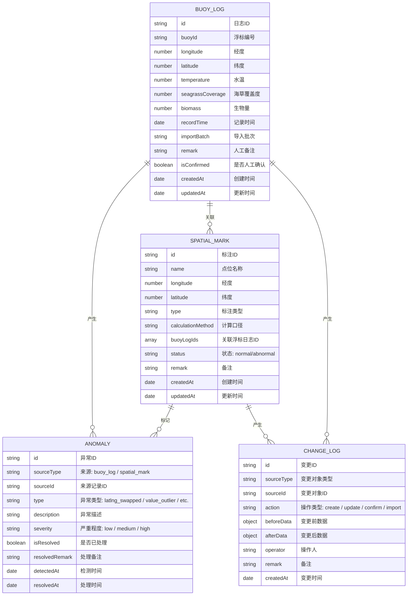

# 海草床调查空间标注系统 技术架构文档

## 1. 架构设计



## 2. 技术说明

- **前端框架**：React@18 + TypeScript
- **构建工具**：Vite@5
- **样式方案**：TailwindCSS@3
- **状态管理**：Zustand（轻量，适合中小型应用）
- **图表库**：Recharts（React 友好，面积图/折线图）
- **地图**：自定义 SVG 模拟海图（无需第三方地图服务）
- **数据存储**：LocalStorage 持久化 + 初始 Mock 数据
- **后端**：无后端，纯前端实现所有业务逻辑

## 3. 路由定义

| 路由路径 | 页面名称 | 页面说明 |
|----------|----------|----------|
| `/` | 总览仪表盘 | 数据概览、趋势图表、最近变更 |
| `/buoy-logs` | 浮标日志 | 日志列表、导入、详情、批次管理 |
| `/spatial-marking` | 空间标注 | 海草床地图标注、异常标记 |
| `/anomalies` | 异常中心 | 异常列表、检测详情、处理状态 |
| `/audit` | 变更审计 | 时间线、变更对比、批次追溯 |

## 4. 数据模型

### 4.1 ER 图



### 4.2 类型定义（TypeScript）

```typescript
// 浮标日志
interface BuoyLog {
  id: string;
  buoyId: string;
  longitude: number;
  latitude: number;
  temperature: number;
  seagrassCoverage: number;
  biomass: number;
  recordTime: string;
  importBatch: string;
  remark: string;
  isConfirmed: boolean;
  createdAt: string;
  updatedAt: string;
}

// 空间标注
interface SpatialMark {
  id: string;
  name: string;
  longitude: number;
  latitude: number;
  type: string;
  calculationMethod: string;
  buoyLogIds: string[];
  status: 'normal' | 'abnormal';
  remark: string;
  createdAt: string;
  updatedAt: string;
}

// 异常记录
interface Anomaly {
  id: string;
  sourceType: 'buoy_log' | 'spatial_mark';
  sourceId: string;
  type: 'latlng_swapped' | 'value_outlier' | 'missing_data';
  description: string;
  severity: 'low' | 'medium' | 'high';
  isResolved: boolean;
  resolvedRemark?: string;
  detectedAt: string;
  resolvedAt?: string;
}

// 变更日志
interface ChangeLog {
  id: string;
  sourceType: 'buoy_log' | 'spatial_mark' | 'anomaly';
  sourceId: string;
  action: 'create' | 'update' | 'confirm' | 'import' | 'resolve';
  beforeData: Record<string, any> | null;
  afterData: Record<string, any> | null;
  operator: string;
  remark?: string;
  createdAt: string;
}
```

## 5. 核心模块

### 5.1 异常检测模块

- **经纬度反写检测**：判断经纬度值域是否合理（经度通常 -180~180，纬度 -90~90），若数值范围明显颠倒则标记
- **数值异常检测**：超出历史均值 2 倍标准差标记为异常
- **去重检测**：按浮标编号 + 记录时间判断重复，重复导入时保留已有备注和确认状态

### 5.2 变更审计模块

- 每次数据变更前记录 beforeData，变更后记录 afterData
- 支持按时间线查看所有变更
- 支持变更前后字段对比，高亮差异

### 5.3 图表联动模块

- 趋势图上的异常点可点击
- 点击后展示对应浮标日志详情
- 展示当时的计算口径说明

## 6. 初始 Mock 数据

预置 3-4 条小数据，覆盖以下场景：
1. 正常记录（顺利记录）
2. 补录记录（分批次导入，追加数据）
3. 异常记录（经纬度反写）
4. 人工确认后的变更记录

排班同事可以照着这几条数据走一遍完整流程。
