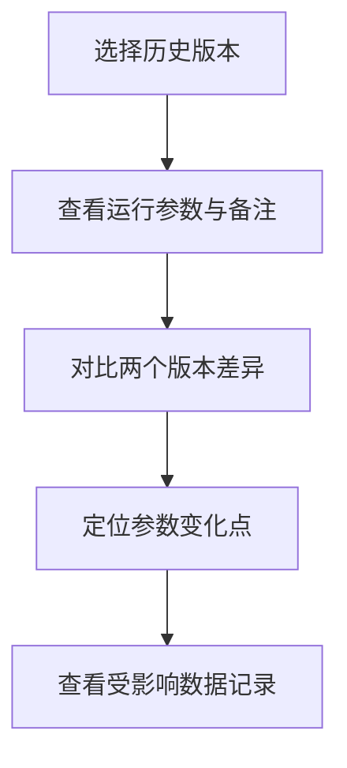

## 1. 产品概述

港湾淤积报告汇总系统是一款面向港口工程师的数据分析工具，用于汇总处理浮标日志与遥感监测数据，生成淤积分析报告。系统解决经纬度格式不统一、参数变更追溯难、异常数据混同等实际痛点，支持多版本对比、历史回溯和筛选分享。

- **目标用户**：港口工程师（老何）、接手同事、复核人员
- **核心价值**：数据清洗自动化、变更过程可追溯、异常数据独立展示

## 2. 核心功能

### 2.1 用户角色

| 角色 | 描述 | 核心权限 |
|------|------|----------|
| 港口工程师 | 主要使用者，负责日常报告生成 | 全部功能：数据导入、参数调整、报告生成、历史查看 |
| 接手同事 | 交接工作时使用 | 查看历史、对比版本、复现报告 |
| 复核人员 | 审核报告结果 | 筛选追溯、查看详情、导出验证 |

### 2.2 功能模块

1. **报告汇总主页**：数据概览、筛选面板、记录列表、版本切换
2. **数据详情页**：单条记录完整信息、清洗前后对比、备注历史
3. **版本对比页**：两次运行结果对比、参数差异高亮、数据变化追踪
4. **导出与分享**：报告导出、筛选条件保存、分享链接生成

### 2.3 页面详情

| 页面名称 | 模块名称 | 功能描述 |
|-----------|-------------|---------------------|
| 报告汇总主页 | 顶部导航 | 系统标题、版本选择、新建报告按钮、导出按钮 |
| 报告汇总主页 | 筛选面板 | 日期范围、数据来源（浮标/遥感）、异常标记、淤积等级筛选 |
| 报告汇总主页 | 统计卡片 | 总记录数、正常记录、云遮挡记录、淤积严重占比 |
| 报告汇总主页 | 数据列表 | 记录列表，支持分页、排序、异常行高亮、云遮挡单独分组 |
| 报告汇总主页 | 版本历史侧边栏 | 历史运行记录列表，显示运行时间、参数摘要、备注 |
| 数据详情页 | 基本信息 | 经纬度、时间、来源、淤积深度等核心字段 |
| 数据详情页 | 清洗对比 | 原始数据 vs 标准化后数据，标注经纬度格式转换过程 |
| 数据详情页 | 备注与历史 | 后补说明、版本变更记录、操作人 |
| 版本对比页 | 版本选择器 | 选择两个版本进行对比 |
| 版本对比页 | 参数差异 | 高亮显示两次运行的参数差异 |
| 版本对比页 | 数据变化列表 | 新增/删除/变更的记录对比 |
| 导出弹窗 | 导出选项 | 导出格式（CSV/PDF）、是否包含异常数据、筛选条件嵌入 |

## 3. 核心流程

### 主流程：生成淤积报告

### 版本追溯流程

## 4. 用户界面设计

### 4.1 设计风格

- **整体定位**：工业/工程专业风格，沉稳可靠，数据密集型
- **主色调**：深海蓝 `#0f2a44`（专业感、海事主题）
- **辅助色**：警示橙 `#ff7a45`（异常标记、重点高亮）、成功绿 `#52c41a`（正常数据）
- **中性色**：深灰 `#1f2937`、中灰 `#6b7280`、浅灰 `#f3f4f6`
- **按钮风格**：扁平化，轻微圆角（4px），悬停时有深色过渡
- **字体**：标题使用 Noto Sans SC 粗体，正文使用思源宋体/系统等宽字体展示数据，保证数字对齐
- **布局风格**：左右分栏 + 卡片式数据展示，顶部固定导航
- **图标风格**：线性图标（lucide-react），统一 16px 尺寸

### 4.2 页面设计概述

| 页面名称 | 模块名称 | UI 元素 |
|-----------|-------------|----------|
| 报告汇总主页 | 顶部导航 | 深蓝色背景，白色文字，左侧 logo + 标题，右侧版本切换下拉、导出按钮 |
| 报告汇总主页 | 筛选面板 | 浅灰背景卡片，多条件横向排列，标签式筛选切换 |
| 报告汇总主页 | 统计卡片 | 4 个等宽卡片，大数字 + 小字标签，不同状态用色条区分 |
| 报告汇总主页 | 数据列表 | 斑马纹表格，异常行橙色左边框，云遮挡行有专用标签 |
| 报告汇总主页 | 版本侧边栏 | 右侧滑出式面板，时间线式版本列表，当前版本高亮 |
| 数据详情页 | 信息区块 | 分组展示，每组有标题分割线，字段标签右对齐 |
| 数据详情页 | 清洗对比 | 左右两栏对比布局，箭头指示转换方向，变更处红色标注 |
| 版本对比页 | 差异对比 | 表格形式，左右两列，差异行黄色背景，新增绿色、删除红色 |

### 4.3 响应式

- **桌面优先**：以 1440px 宽度为基准设计
- **平板适配**：筛选面板改为两行布局，版本侧边栏改为底部抽屉
- **移动端**：统计卡片垂直堆叠，数据列表可横向滚动

### 4.4 动效与交互

- 列表行悬停：背景色微亮（`bg-gray-50`），0.15s 过渡
- 版本切换：内容区淡入淡出过渡（0.3s opacity）
- 异常标记：呼吸动画（轻微透明度脉动），提示注意
- 筛选条件应用：列表数据有轻量位移过渡，表示数据已更新
