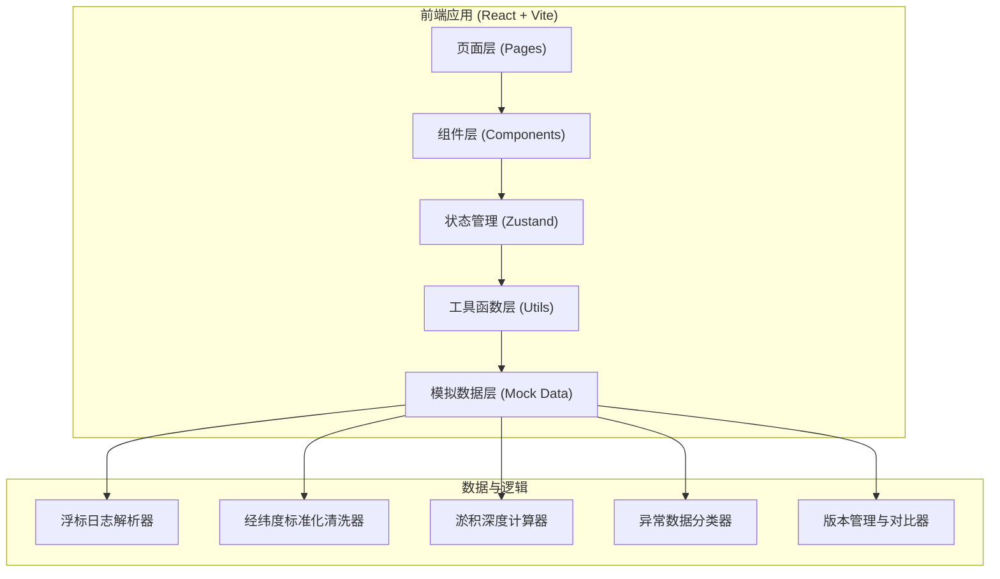
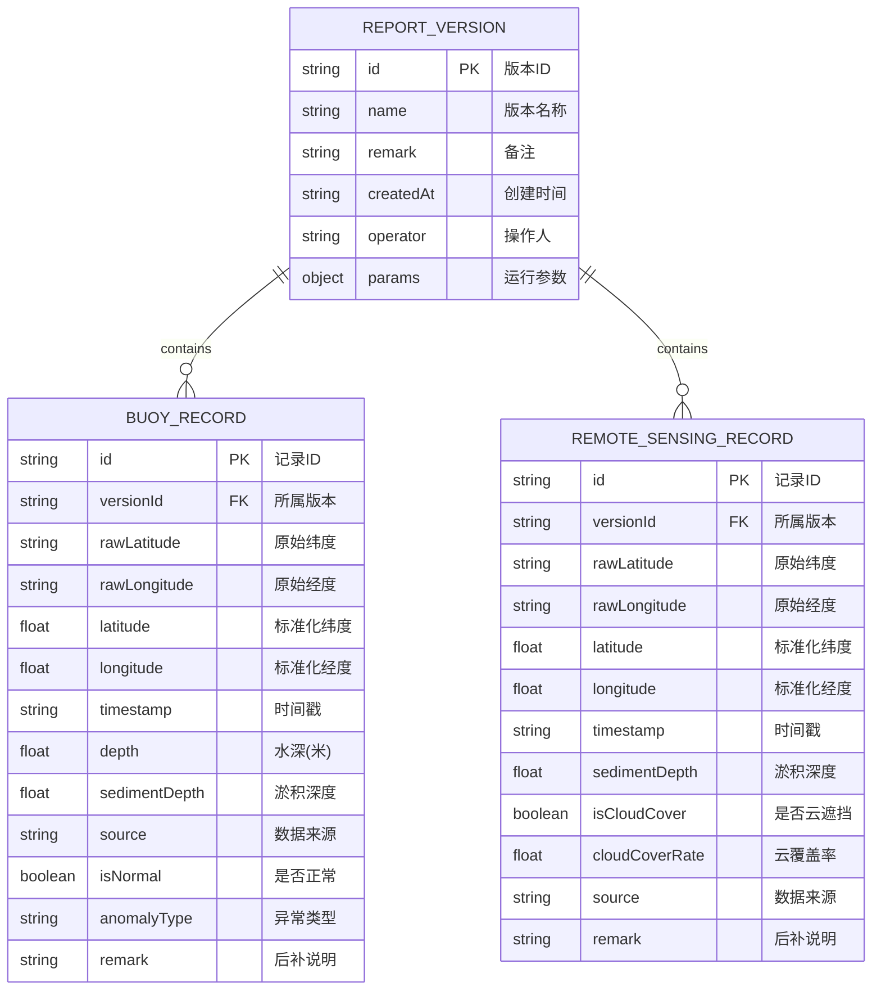

## 1. 架构设计



## 2. 技术描述

- **前端框架**：React@18 + TypeScript
- **构建工具**：Vite@5
- **样式方案**：Tailwind CSS@3
- **状态管理**：Zustand
- **路由管理**：react-router-dom@6
- **图标库**：lucide-react
- **后端**：无（纯前端应用，使用 Mock 数据）
- **数据持久化**：localStorage 存储筛选条件和版本历史

## 3. 路由定义

| 路由 | 页面 | 用途 |
|-------|------|------|
| `/` | 报告汇总主页 | 数据列表、筛选、统计概览、版本切换 |
| `/record/:id` | 数据详情页 | 单条记录详情、清洗前后对比、备注历史 |
| `/compare` | 版本对比页 | 两个版本参数与数据的差异对比 |

## 4. 数据模型

### 4.1 数据模型定义



### 4.2 核心数据类型（TypeScript）

```typescript
// 通用坐标格式
type CoordinateFormat = 'decimal' | 'dms' | 'dm';

// 运行参数
interface ReportParams {
  sedimentThreshold: number;      // 淤积阈值(米)
  depthUnit: 'meter' | 'fathom';  // 深度单位
  coordinateFormat: CoordinateFormat; // 输出坐标格式
  includeAnomaly: boolean;        // 是否包含异常数据
  dataSources: ('buoy' | 'remoteSensing')[]; // 数据来源
}

// 报告版本
interface ReportVersion {
  id: string;
  name: string;
  remark: string;
  createdAt: string;
  operator: string;
  params: ReportParams;
  recordCount: number;
  normalCount: number;
  anomalyCount: number;
}

// 淤积记录（统一格式）
interface SedimentRecord {
  id: string;
  versionId: string;
  rawLatitude: string;    // 原始纬度字符串
  rawLongitude: string;   // 原始经度字符串
  latitude: number;       // 标准化纬度(十进制度)
  longitude: number;      // 标准化经度(十进制度)
  timestamp: string;
  source: 'buoy' | 'remoteSensing';
  sedimentDepth: number;  // 淤积深度
  isNormal: boolean;
  anomalyType?: 'cloudCover' | 'missingData' | 'outOfRange';
  anomalyDetail?: string;
  remark?: string;        // 后补说明
  rawData?: string;       // 原始数据快照
}
```

## 5. 核心工具函数

### 5.1 经纬度清洗工具

```typescript
// 解析多种格式的经纬度字符串
function parseCoordinate(raw: string, type: 'lat' | 'lng'): number;

// 十进制度 转 度分秒
function decimalToDMS(decimal: number, type: 'lat' | 'lng'): string;

// 度分秒 转 十进制度
function dmsToDecimal(dms: string): number;

// 检测输入格式类型
function detectCoordinateFormat(raw: string): CoordinateFormat;
```

### 5.2 淤积计算工具

```typescript
// 根据水深和基准计算淤积深度
function calculateSediment(depth: number, baseline: number, threshold: number): {
  depth: number;
  level: 'normal' | 'mild' | 'moderate' | 'severe';
};
```

### 5.3 版本对比工具

```typescript
// 对比两个版本的参数差异
function compareParams(oldParams: ReportParams, newParams: ReportParams): ParamDiff[];

// 对比两个版本的数据变化
function compareRecords(oldRecords: SedimentRecord[], newRecords: SedimentRecord[]): RecordDiff[];
```

## 6. 目录结构

```
src/
├── components/         # 可复用组件
│   ├── Header.tsx          # 顶部导航
│   ├── FilterPanel.tsx     # 筛选面板
│   ├── StatCard.tsx        # 统计卡片
│   ├── DataTable.tsx       # 数据列表
│   ├── VersionSidebar.tsx  # 版本侧边栏
│   ├── AnomalyBadge.tsx    # 异常标签
│   └── ExportModal.tsx     # 导出弹窗
├── pages/              # 页面组件
│   ├── Home.tsx            # 报告汇总主页
│   ├── RecordDetail.tsx    # 数据详情页
│   └── ComparePage.tsx     # 版本对比页
├── store/              # 状态管理
│   └── reportStore.ts      # 报告数据 store
├── utils/              # 工具函数
│   ├── coordinate.ts       # 经纬度处理
│   ├── sediment.ts         # 淤积计算
│   ├── versionDiff.ts      # 版本对比
│   └── export.ts           # 导出工具
├── data/               # 模拟数据
│   └── mockData.ts         # 演示数据（含"不干净"样例）
├── types/              # 类型定义
│   └── index.ts
├── App.tsx
├── main.tsx
└── index.css
```

## 7. 演示数据设计

包含一组"不太干净"的演示数据，用于展示系统处理真实数据的能力：

1. **正常浮标记录**：1 条，格式规范、数据完整
2. **不规范经纬度记录**：若干条，混合使用度分秒（如 `39°54'26"N`）、度分格式（如 `116°23.5'E`）、十进制度等不同写法
3. **遥感云遮挡记录**：1 条，标记为异常，云覆盖率 75%，单独分组展示
4. **带后补说明的记录**：1 条，原始数据有缺失，后补了说明备注
5. **历史版本数据**：3 个版本，参数有差异，用于演示版本对比功能
