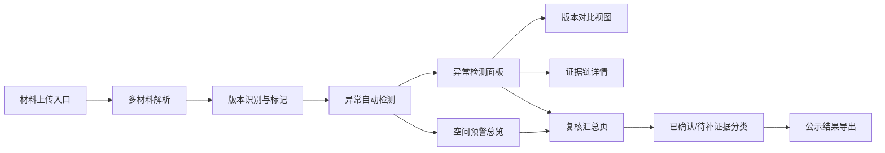

## 1. 产品概述

海洋牧场异常预警系统是面向水质分析师和复核人员的数据核查工具，用于整合实验室结果表、晚到附件和口头说明等多源材料，自动检测数据口径变更、潮位单位混写等异常，提供空间位置与异常记录的联动追溯，帮助团队高效完成社区公示前的质量校核。

- **核心问题**：多材料版本混乱、采样时间与实验结果对不上、潮位单位混写靠人眼扫、复核时结论变化原因难追溯
- **目标用户**：水质分析师（阿乔）、复核人员、社区公示相关人员
- **产品价值**：将异常检测从人工经验转为系统自动识别，保留证据链，降低沟通成本

## 2. 核心特性

### 2.1 用户角色

| 角色 | 进入方式 | 核心权限 |
|------|----------|----------|
| 水质分析师 | 材料上传入口 | 上传实验室结果表、附件、补充说明，查看异常预警 |
| 复核人员 | 汇总视图入口 | 查看全部异常、追溯结论变化、区分已确认/待补证据 |
| 公示浏览者 | 公开视图入口 | 查看最终预警结果、空间分布、来源标注 |

### 2.2 功能模块

1. **材料导入页**：拖拽上传实验室结果表、晚到附件、口头说明记录，自动识别版本与来源
2. **空间预警总览**：海洋牧场地图可视化，点位异常高亮，点击联动数据详情
3. **异常检测面板**：自动识别口径变更、单位混写、时间不一致等异常，标注影响范围与来源行
4. **版本对比视图**：展示材料修改前后差异，标记哪份材料后来改过口径
5. **复核汇总页**：按异常类型分类汇总，区分已确认与待补证据，支持下钻追溯原因
6. **证据链详情**：单条异常的完整证据链展示，解释结论为什么变化

### 2.3 页面详情

| 页面名称 | 模块名称 | 功能描述 |
|----------|----------|----------|
| 材料导入页 | 上传区域 | 拖拽上传 CSV/Excel/文本，支持多文件批量导入 |
| 材料导入页 | 材料清单 | 已上传材料列表，显示版本号、上传时间、来源类型 |
| 材料导入页 | 版本标记 | 手动标记哪份是"晚到附件"、哪份是"口头说明" |
| 空间预警总览 | 地图区域 | 海洋牧场栅格/点位地图，异常点位高亮着色 |
| 空间预警总览 | 点位弹窗 | 点击点位显示基本指标、异常数、最新数据时间 |
| 空间预警总览 | 图例说明 | 异常等级色卡、单位标识、来源标注说明 |
| 异常检测面板 | 异常列表 | 按严重程度排序的异常记录，类型标签化展示 |
| 异常检测面板 | 单位混写检测 | 自动识别潮位 m/cm/mm 混写，标注影响范围行号 |
| 异常检测面板 | 口径变更检测 | 对比多版本材料，标记数值/结论改动的位置 |
| 异常检测面板 | 时间一致性检测 | 采样时间与实验结果时间不匹配提示 |
| 版本对比视图 | 双栏对比 | 左右分栏展示材料修改前后，差异高亮 |
| 版本对比视图 | 修改溯源 | 标注哪个版本、哪一行发生了口径变更 |
| 复核汇总页 | 汇总卡片 | 异常总数、已确认数、待补证据数、今日新增 |
| 复核汇总页 | 分类筛选 | 按异常类型、确认状态、点位区域筛选 |
| 复核汇总页 | 证据状态 | 每条异常标注"已确认"或"待补证据" |
| 证据链详情 | 时间线 | 按时间顺序展示该异常相关的所有材料版本 |
| 证据链详情 | 结论变化说明 | 自动生成或手动编辑的结论变化原因描述 |

## 3. 核心流程

### 3.1 分析师工作流

水质分析师阿乔拿到实验室结果表、晚到附件和口头说明后，依次上传到系统。系统自动解析数据、识别点位、检测异常。阿乔可以在异常面板中查看所有检测到的问题，对已知问题标记"已确认"，对需要补充的标记"待补证据"，最终导出预警结果用于社区公示。

### 3.2 复核人员工作流

复核人员从汇总视图进入，按异常类型分类浏览。点击单条异常可下钻查看完整证据链，包括材料版本变化、口径修改记录、潮位单位混写的影响范围等。复核人员可以看到哪些结论发生了变化、为什么变化，以及支撑每次变化的证据来源。

## 4. 用户界面设计

### 4.1 设计风格

- **主色调**：深海蓝 (#0B3D5C) 为主，青蓝 (#1A7A9A) 为辅，体现海洋主题与专业感
- **强调色**：警示橙 (#FF7A45) 用于异常高亮，确认绿 (#2ECC71) 用于已确认状态，待补黄 (#F1C40F) 用于待补证据
- **背景色**：极浅灰蓝 (#F5F8FA) 背景，白色卡片，清晰的层次分隔
- **字体**：标题使用 Source Serif Pro 营造专业严谨感，正文使用 Inter 保证可读性
- **按钮风格**：方形微圆角 (6px)，2px 边框，悬停时背景色微变 + 轻微上浮阴影
- **布局风格**：三栏式工作台布局（左侧导航 + 中间主视图 + 右侧详情面板），卡片式信息分组
- **图标风格**：Lucide 线性图标，统一 20px 尺寸，与文字基线对齐

### 4.2 页面设计概述

| 页面名称 | 模块名称 | UI 元素 |
|----------|----------|---------|
| 材料导入页 | 上传区域 | 虚线边框拖拽区，海洋波纹装饰底纹，上传后文件卡片堆叠动画 |
| 空间预警总览 | 地图区域 | 深蓝色海域底图，异常点位脉冲呼吸动画，选中点位放射光环 |
| 异常检测面板 | 异常列表 | 斑马纹列表行，异常等级色条在左侧，悬停时行背景微亮 |
| 版本对比视图 | 双栏对比 | 左右等宽分栏，中间竖向分隔条可拖拽，差异行背景色标记 |
| 复核汇总页 | 汇总卡片 | 四个大数字卡片横向排列，底部趋势微线图，悬停放大 |
| 证据链详情 | 时间线 | 左侧竖轴时间线，右侧内容卡片，当前版本卡片高亮边框 |

### 4.3 响应式

- 桌面端优先设计，主视图区域自适应宽度
- 中等屏幕下右侧详情面板可收起为抽屉
- 移动端简化为单栏滚动，地图与表格可切换标签

### 4.4 动效设计

- 页面加载：内容区域从下往上淡入 + 轻微位移 (translateY 12px → 0)
- 异常点位：脉冲呼吸动画 (scale 1 → 1.15 → 1，opacity 0.8 → 0.4 → 0.8)
- 卡片悬停：translateY -2px + box-shadow 加深，过渡 200ms ease-out
- 版本切换：横向滑动切换，旧版本滑出左侧，新版本从右侧滑入
- 数据刷新：数字滚动动画，从旧值平滑过渡到新值
