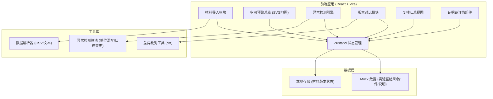

## 1. 架构设计



## 2. 技术选型

- **前端框架**：React@18 + TypeScript
- **构建工具**：Vite@5
- **样式方案**：TailwindCSS@3
- **状态管理**：Zustand
- **路由**：React Router DOM@6
- **地图可视化**：SVG 自定义海洋牧场地图（无需第三方地图库，轻量可控）
- **图标库**：Lucide React
- **数据格式**：前端纯 Mock 数据 + localStorage 持久化

**说明**：本项目为纯前端应用，不设后端服务器。所有材料数据、异常检测均在前端完成，状态通过 Zustand 管理，持久化使用浏览器 localStorage。

## 3. 路由定义

| 路由 | 页面 | 用途 |
|------|------|------|
| `/` | 空间预警总览 | 首页，展示地图与异常点位概览 |
| `/import` | 材料导入页 | 上传实验室结果表、附件、说明 |
| `/anomalies` | 异常检测面板 | 异常列表、筛选、单位混写检测结果 |
| `/compare` | 版本对比视图 | 双栏对比材料版本差异 |
| `/review` | 复核汇总页 | 分类汇总、已确认/待补证据管理 |
| `/evidence/:id` | 证据链详情 | 单条异常的完整证据链时间线 |

## 4. 数据模型

### 4.1 核心数据结构

```typescript
// 材料来源类型
type MaterialSource = 'lab_result' | 'late_attachment' | 'verbal_note';

// 材料版本
interface Material {
  id: string;
  name: string;
  source: MaterialSource;
  version: number;
  uploadTime: string;
  content: string;      // 原始内容
  parsedData: LabRecord[]; // 解析后的数据
  isLatest: boolean;
}

// 实验室记录
interface LabRecord {
  id: string;
  stationId: string;    // 点位编号
  stationName: string;  // 点位名称
  sampleTime: string;   // 采样时间
  resultTime: string;   // 实验结果时间
  temperature: number;  // 水温
  salinity: number;     // 盐度
  tideLevel: number;    // 潮位值
  tideUnit: 'm' | 'cm' | 'mm'; // 潮位单位
  dissolvedOxygen: number; // 溶解氧
  ph: number;           // pH值
  sourceRow: number;    // 来源行号
  materialId: string;   // 所属材料ID
}

// 点位（空间位置）
interface Station {
  id: string;
  name: string;
  x: number;  // SVG 坐标
  y: number;
  area: string; // 所属区域
}

// 异常类型
type AnomalyType = 
  | 'unit_mismatch'      // 单位混写
  | 'caliber_change'     // 口径变更
  | 'time_mismatch'      // 时间不一致
  | 'value_abnormal'     // 数值异常
  | 'missing_data';      // 数据缺失

// 异常记录
interface Anomaly {
  id: string;
  type: AnomalyType;
  severity: 'high' | 'medium' | 'low';
  stationId: string;
  description: string;
  impactRange: string;   // 影响范围描述
  sourceRows: number[];  // 来源行号
  materialIds: string[]; // 涉及的材料ID
  evidenceChain: EvidenceItem[];
  status: 'confirmed' | 'pending'; // 已确认/待补证据
  conclusionChange: string; // 结论变化说明
  detectedAt: string;
}

// 证据项
interface EvidenceItem {
  id: string;
  materialId: string;
  materialName: string;
  version: number;
  timestamp: string;
  content: string;
  isVerbal: boolean;     // 是否口头说明
  changeType?: 'add' | 'modify' | 'delete';
  previousValue?: string;
  currentValue?: string;
}
```

### 4.2 状态管理 (Zustand Store)

```typescript
interface AppState {
  materials: Material[];
  stations: Station[];
  labRecords: LabRecord[];
  anomalies: Anomaly[];
  selectedStationId: string | null;
  selectedAnomalyId: string | null;
  filter: {
    type: AnomalyType | 'all';
    status: 'confirmed' | 'pending' | 'all';
    severity: 'high' | 'medium' | 'low' | 'all';
  };
  
  // Actions
  addMaterial: (material: Material) => void;
  updateMaterial: (id: string, data: Partial<Material>) => void;
  detectAnomalies: () => void;
  setAnomalyStatus: (id: string, status: 'confirmed' | 'pending') => void;
  selectStation: (id: string | null) => void;
  selectAnomaly: (id: string | null) => void;
  setFilter: (filter: Partial<AppState['filter']>) => void;
}
```

## 5. 核心算法

### 5.1 潮位单位混写检测

遍历所有记录的 `tideUnit` 字段，同一材料内出现多种单位则标记异常：
- 按材料分组统计单位类型数量
- 超过 1 种单位即触发 `unit_mismatch` 异常
- 记录每种单位对应的行号范围作为影响范围

### 5.2 口径变更检测

对比同一数据点在不同材料版本中的数值：
- 按 `stationId + 指标名` 匹配跨版本数据
- 数值偏差超过阈值（如 10%）或结论性描述不一致则标记
- 记录变更前后的值、版本号、行号

### 5.3 时间一致性检测

比较 `sampleTime` 和 `resultTime`：
- 结果时间早于采样时间 → 异常
- 时间差过大（如 > 7天）→ 警告
- 跨材料同一指标时间不连续 → 标记

## 6. 项目目录结构

```
src/
├── components/          # 可复用组件
│   ├── layout/         # 布局组件（侧边栏、顶部栏）
│   ├── map/            # 地图相关组件
│   ├── anomaly/        # 异常相关组件
│   ├── material/       # 材料相关组件
│   └── common/         # 通用组件（卡片、按钮、标签）
├── pages/              # 页面级组件
│   ├── Dashboard.tsx
│   ├── ImportPage.tsx
│   ├── AnomaliesPage.tsx
│   ├── ComparePage.tsx
│   ├── ReviewPage.tsx
│   └── EvidencePage.tsx
├── store/              # Zustand 状态管理
│   └── useAppStore.ts
├── data/               # Mock 数据
│   ├── stations.ts
│   ├── materials.ts
│   └── labRecords.ts
├── utils/              # 工具函数
│   ├── anomalyDetector.ts
│   ├── dataParser.ts
│   └── diffUtils.ts
├── types/              # TypeScript 类型定义
│   └── index.ts
├── App.tsx
├── main.tsx
└── index.css
```
