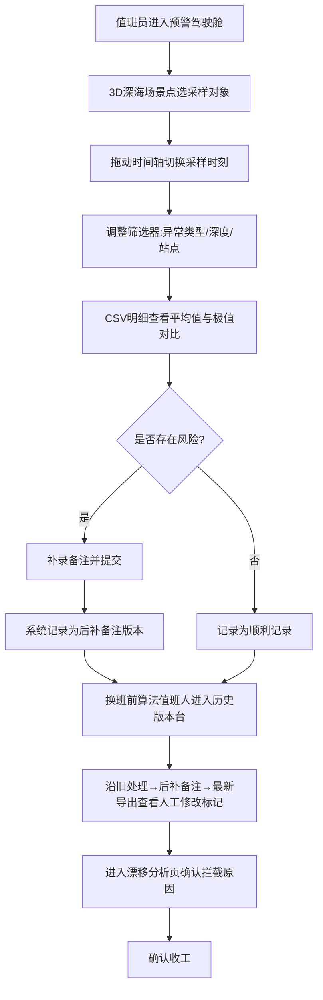

## 1. 产品概述

深海采样异常预警系统是一个面向海洋站值班员与算法值班人的 Web3D 工具，专门服务于"深海采样异常预警"判断。它解决遥感报告"只剩平均值、看不出风险"的痛点：把多维采样数据放进三维深海场景，让点选对象、时间轴、筛选器与 CSV 明细四向联动；并把"旧处理、后补备注、最新导出"留在历史里，使算法值班人能在换班前一眼看出哪一步被人工改过、为什么被拦截。

- 解决问题：平均值报告掩盖风险、历史只有最终值、传感器漂移无人解释、换班无法追溯人工修改。
- 目标用户：海洋站值班员小宋（操作判定）、算法值班人（追溯审计）。
- 产品价值：把"看报告"升级为"在三维海里点对象、看漂移、查版本"，一条传感器漂移也能说清为什么被拦住。

## 2. 核心功能

### 2.1 用户角色

| 角色 | 注册方式 | 核心权限 |
|------|----------|----------|
| 海洋站值班员 | 内部分配 | 浏览 Web3D 场景、点选对象、切时间轴、筛选、导出 CSV 明细、补录备注 |
| 算法值班人 | 内部分配 | 查看三层历史版本、追溯人工修改标记、审阅传感器漂移与拦截原因 |

### 2.2 功能模块

1. **预警驾驶舱（主页）**：Web3D 深海场景、采样对象点选、时间轴、筛选器、CSV 明细，四向联动。
2. **历史版本台**：旧处理 / 后补备注 / 最新导出三层视图、人工修改步骤高亮、版本对比。
3. **漂移分析页**：传感器漂移趋势曲线、拦截原因卡片、漂移阈值标线。

### 2.3 页面详情

| 页面名称 | 模块名称 | 功能描述 |
|----------|----------|----------|
| 预警驾驶舱 | Web3D 深海场景 | 三维渲染采样站点、传感器节点、洋流粒子；点选对象高亮并联动右侧面板 |
| 预警驾驶舱 | 时间轴 | 拖动时间轴切换采样时刻，3D 场景、筛选结果、CSV 明细同步刷新 |
| 预警驾驶舱 | 筛选器 | 按异常类型、深度区间、站点筛选对象，与场景高亮联动 |
| 预警驾驶舱 | CSV 明细 | 当前时间点+筛选条件下的明细表，一键导出 CSV，附平均值与极值对比 |
| 预警驾驶舱 | 对象详情面板 | 选中对象的逐时刻数值、漂移状态、历史备注入口 |
| 历史版本台 | 版本时间线 | 旧处理 / 后补备注 / 最新导出分层时间线，标注人工修改步骤 |
| 历史版本台 | 人工修改标记 | 高亮被人工改过的步骤，显示改动前后值与改动人 |
| 历史版本台 | 版本对比 | 两个版本并排对比，差异行高亮 |
| 漂移分析页 | 漂移曲线 | 传感器漂移趋势曲线，阈值标线与拦截区间 |
| 漂移分析页 | 拦截原因 | 卡片说明为什么被拦截（漂移超限/突跳/丢失），含可复算的判据 |

## 3. 核心流程

值班员打开驾驶舱 → 在 3D 深海场景点选采样对象 → 拖动时间轴切换时刻 → 调整筛选器 → 在 CSV 明细中确认风险 → 补录备注 → 系统记录为"后补备注"版本。换班前，算法值班人进入历史版本台，沿"旧处理→后补备注→最新导出"时间线查看，人工修改步骤高亮；进入漂移分析页确认拦截原因。重跑同一材料时，工具按版本标签区分旧处理、后补备注与最新导出。

## 4. 用户界面设计

### 4.1 设计风格

- **主题**：深渊指挥舱（Abyssal Command）—— 深海科技感，幽蓝生物荧光 + 琥珀警示。
- **主色**：深海青墨 `#06141F` / `#0A2540` 为底，青蓝荧光 `#22D3EE`、`#38BDF8` 为主交互色。
- **辅助色**：琥珀 `#F59E0B` 标注异常与人工修改，翡翠 `#34D399` 标注顺利，珊瑚红 `#FB7185` 标注拦截。
- **按钮**：玻璃拟态，半透明描边 + 内发光，圆角 `rounded-xl`。
- **字体**：标题用 `Syncopate` / `Orbitron` 几何感展示字，正文用 `IBM Plex Sans` / `Noto Sans SC`。
- **布局**：驾驶舱为左 3D 画布 + 右控制面板的经典指挥台双栏，顶栏导航 + 底栏状态。
- **图标**：lucide-react 线性图标，与荧光描边统一。

### 4.2 页面设计概述

| 页面名称 | 模块名称 | UI 元素 |
|----------|----------|----------|
| 预警驾驶舱 | Web3D 深海场景 | 深蓝渐变背景、洋流粒子、荧光采样点、悬浮玻璃工具栏 |
| 预警驾驶舱 | 时间轴 | 底部全宽玻璃滑轨、时刻刻度、异常点琥珀标记 |
| 预警驾驶舱 | 筛选器 | 右侧面板分段控件、深度滑块、站点芯片多选 |
| 预警驾驶舱 | CSV 明细 | 右下抽屉表格、平均值/极值对比列、导出按钮 |
| 历史版本台 | 版本时间线 | 左侧垂直时间轴、三层色带（旧/补/新） |
| 漂移分析页 | 漂移曲线 | 暗底折线图、阈值虚线、拦截区间琥珀填充 |

### 4.3 响应式

桌面优先（指挥台双栏），平板自适应折叠为单栏滚动，触控优化时间轴与筛选器手势。

### 4.4 3D 场景指引

- **环境**：深海 HDRI 氛围，幽蓝体积光自上而下衰减，营造深渊感。
- **光照**：上方冷色定向光模拟海面透光 + 采样点生物荧光点光源（青蓝/琥珀随状态变化）。
- **相机**：环绕轨道控制，可缩放至单个传感器，默认俯瞰全景。
- **构图与焦点**：采样站点为焦点，洋流粒子引导视线流动，选中对象光环放大。
- **交互与动画**：点选高亮+脉冲光环、时间轴切换时数据点缓动更新、漂移节点琥珀呼吸光。
- **后处理**：Bloom 荧光辉光、Vignette 边缘压暗增强纵深、噪声颗粒模拟水下微粒。
- **资产与性能**：程序化生成几何体（无外部模型），粒子数量受控，启用按需渲染。
