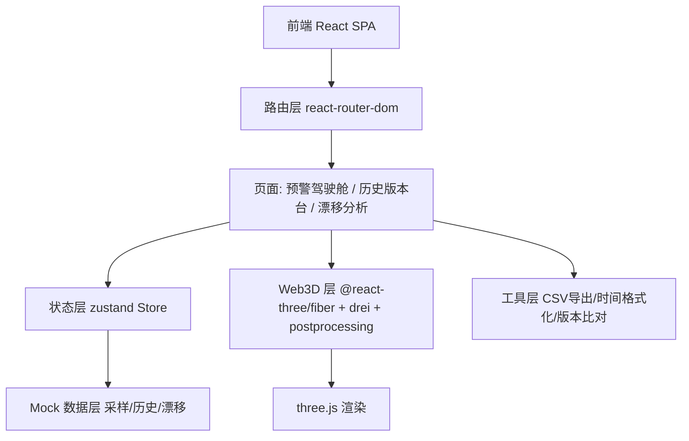
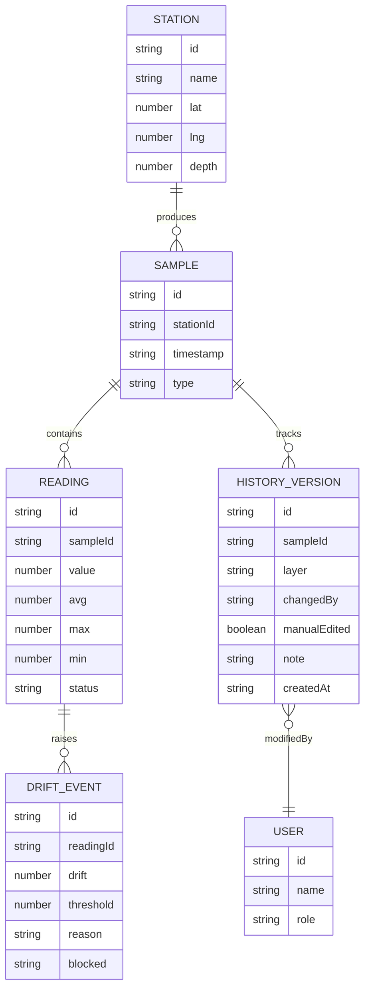

## 1. 架构设计

纯前端单页应用，无后端服务。所有采样数据、历史版本、漂移记录以 mock 数据驻留前端，状态由 zustand 管理。Web3D 由 @react-three/fiber 驱动 three.js。



## 2. 技术说明

- **前端**：React@18 + TypeScript + tailwindcss@3 + vite
- **初始化工具**：vite-init（react-ts 模板，含 react-router-dom、tailwind、zustand）
- **3D**：three、@react-three/fiber、@react-three/drei、@react-three/postprocessing
- **状态管理**：zustand
- **后端**：无（纯前端，mock 数据）
- **数据**：前端 mock 数据，含 3-4 条采样记录（顺利记录、补录记录、异常记录）

## 3. 路由定义

| 路由 | 用途 |
|-------|------|
| `/` | 预警驾驶舱：Web3D 场景 + 时间轴 + 筛选器 + CSV 明细 |
| `/history` | 历史版本台：旧处理/后补备注/最新导出三层 + 人工修改标记 |
| `/drift` | 漂移分析页：漂移曲线 + 拦截原因 |

## 4. API 定义

无后端 API。前端通过 zustand store 直接消费 mock 数据模块 `src/data/`。

## 5. 服务端架构

无后端服务。

## 6. 数据模型

### 6.1 数据模型定义



### 6.2 数据定义语言

前端 mock，以 TypeScript 类型 + 常量定义于 `src/data/types.ts` 与 `src/data/mock.ts`。关键类型：

```typescript
type VersionLayer = 'legacy' | 'note' | 'latest';
// legacy=旧处理 note=后补备注 latest=最新导出
type RecordKind = 'smooth' | 'supplement' | 'anomaly';
// smooth=顺利记录 supplement=补录记录 anomaly=异常记录
```

初始数据含 3-4 条采样记录，分别覆盖顺利、补录、异常三类，并各带一条传感器漂移事件与历史版本链，确保算法值班人能照着走一遍完整流程。
