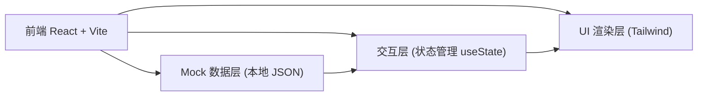
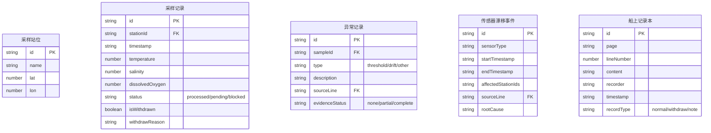

## 1. 架构设计


## 2. 技术描述
- 前端：React@18 + TypeScript + Vite
- 样式：TailwindCSS@3
- 图表：原生 SVG 绘制时序图（轻量、可控、无额外依赖）
- 状态管理：React useState / useReducer（单页工具，无需 Redux）
- 数据：本地 Mock JSON，模拟船上记录本、采样时序、异常、撤回、漂移
- 后端：无（纯前端交班工具）

## 3. 路由定义
| 路由 | 用途 |
|------|------|
| / | 主界面（含汇总 + 时序回放 + 追溯链路） |
| /report | 项目经理进展交代视图 |

## 4. 数据模型


### 数据说明
- STATION：深海采样站位的空间位置
- SAMPLE：单条时序采样记录（带状态、是否撤回）
- ANOMALY：异常标记，关联采样记录与记录本来源行
- DRIFT：传感器漂移事件，含影响范围和来源行
- LOGBOOK：船上记录本原始条目（含撤回记录专门标记）

## 5. 接口定义（前端导出数据结构，用于沟通/交班）

```typescript
interface HandoverReport {
  generatedAt: string;
  shift: string;
  summary: {
    processed: number;
    pendingEvidence: number;
    blocked: number;
    anomalies: number;
    withdrawn: number;
    driftEvents: number;
  };
  blockedItems: Array<{
    id: string;
    station: string;
    timestamp: string;
    description: string;
    blocker: string;
    logbookSource: { page: string; line: number; content: string };
  }>;
  pendingItems: Array<{
    id: string;
    station: string;
    description: string;
    missingEvidence: string[];
    logbookSource: { page: string; line: number; content: string };
  }>;
}
```
