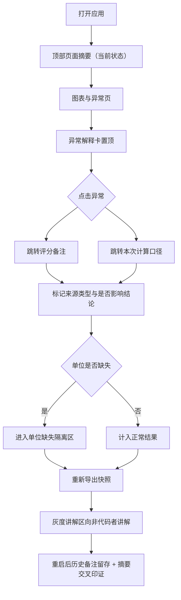

# 矩阵分解图表解释 — 产品需求文档（PRD）

## 1. 产品概述

面向推荐系统 / 协同过滤场景的"矩阵分解图表解释"工具，把原本靠人脑记忆的"评分备注、边界样本直觉、计算口径"外化为可持久、可溯源、可交接的数字资产。

- 解决问题：矩阵分解结果（预测评分矩阵）出现异常时，结论到底被哪些备注/记录影响、数字从哪来、单位缺失是否被揉进了正常结果，目前全靠值班人记着，太累且重启即丢。
- 目标用户：数学老师老叶（关注边界样本与直觉留存）、算法值班人（关注异常定位、单位缺失隔离、交接）、灰度发布评审中不看代码的同事（关注数字来源可解释）。
- 价值：把"解释能力"固化成产品，异常先讲清、来源可回溯、历史不丢、交接零问答。

## 2. 核心功能

### 2.1 用户角色

| 角色 | 关注点 | 核心权限 |
|------|--------|----------|
| 数学老师老叶 | 边界样本少时凭感觉的关系留存 | 评分备注增改、边界样本标注直觉 |
| 算法值班人 | 异常定位、单位缺失隔离、交接 | 异常查看、隔离决策、导出、口径维护 |
| 灰度评审（非代码） | 数字从哪来、能否讲清 | 只读讲解区、溯源线索 |

### 2.2 功能模块

1. **图表与异常页**：预测评分矩阵热力图，异常优先讲清，点击异常回溯评分备注与本次计算口径。
2. **评分备注与材料页**：备注版本管理（旧版/正常/口头备注分类），边界样本直觉留存，材料投放区。
3. **隔离与溯源页**：单位缺失记录单独隔离区、数字来源溯源线索、重新导出入口。
4. **交接与讲解页**：交接三区指引（放材料/看异常/重新导出）、灰度发布讲解、页面摘要交叉印证。

### 2.3 页面详情

| 页面名称 | 模块名称 | 功能描述 |
|----------|----------|----------|
| 图表与异常 | 预测矩阵热力图 | 用户×物品预测评分热力图，异常格高亮，色阶图例 |
| 图表与异常 | 异常解释卡（置顶） | 进入页面先看到异常清单与一句话解释，点击跳转备注与口径 |
| 图表与异常 | 计算口径条 | 展示本次 run 的 k、正则、迭代、学习率与口径说明 |
| 评分备注与材料 | 备注列表 | 按来源类型（旧版/正常/口头）分组，标记是否影响结论 |
| 评分备注与材料 | 边界样本区 | 边界样本列表，样本少时标注"凭感觉"，关联备注 |
| 评分备注与材料 | 材料投放区 | 上传/粘贴材料，绑定到口径与备注 |
| 隔离与溯源 | 单位缺失隔离区 | 单独列出单位缺失记录，标注为何被隔离、是否恢复 |
| 隔离与溯源 | 数字溯源线索 | 每个关键数字展示来源链：口径→备注→记录 |
| 隔离与溯源 | 重新导出 | 一键导出当前解释快照（含备注与口径），导出历史 |
| 交接与讲解 | 交接三区指引 | 放材料/看异常/重新导出三个入口的明确说明 |
| 交接与讲解 | 灰度讲解区 | 面向非代码者的纯文字讲解，数字来源有线索 |
| 交接与讲解 | 页面摘要 | 当前状态汇总，与各页数据互相印证 |

## 3. 核心流程

主流程：打开应用 → 顶部摘要展示当前状态 → 图表与异常页置顶异常解释 → 点击异常 → 跳转对应评分备注与本次计算口径 → 判定来源（旧版/正常/口头）是否影响结论 → 若单位缺失则进隔离区 → 导出快照供灰度评审 → 重启后历史备注仍在，摘要与各页互相印证。

## 4. 用户界面设计

### 4.1 设计风格

- **设计方向**：精密仪表盘 × 田野笔记（Technical Atlas）。信息密集但层级清晰，像一本可被算法值班人和数学老师共同翻阅的精密记录册。
- **主色/辅色**：暖纸墨底（浅色）+ 深墨底（深色）双主题；语义色——异常=琥珀橙、单位缺失=绯红（隔离）、旧版=紫罗兰、正常=翡翠青、口头备注=金棕。
- **按钮风格**：紧凑直角微圆角，主操作实色，次操作描边，危险操作（隔离/恢复）绯红描边。
- **字体**：标题用具有性格的衬线/展示字体（Fraunces），数据用等宽（JetBrains Mono），正文用清爽无衬线。
- **布局风格**：左侧固定导航 + 顶部常驻摘要条 + 主内容区精密栅格，刻意保留呼吸感与数据密度对比。
- **图标/emoji**：使用 lucide-react 线性图标，克制使用。

### 4.2 页面设计概览

| 页面名称 | 模块名称 | UI 元素 |
|----------|----------|----------|
| 图表与异常 | 预测矩阵热力图 | 色阶热力网格，异常格描边脉冲，悬浮显示预测值/误差/来源 |
| 图表与异常 | 异常解释卡 | 置顶卡片，异常清单 + 一句话成因 + 跳转按钮 |
| 评分备注与材料 | 备注分组列表 | 三色来源标签，影响结论开关，版本徽标 |
| 隔离与溯源 | 隔离区 | 红色描边卡片，隔离原因与恢复按钮 |
| 交接与讲解 | 页面摘要 | 关键指标卡片，与各页数据呼应（互相印证） |

### 4.3 响应式

桌面优先（值班台 1440px+ 为主），平板自适应折叠侧栏，移动端只读讲解区与摘要可用。

## 5. 关键交互细节

- **异常优先**：进入图表页，异常解释卡置顶且默认展开；正常格在异常未处理时降饱和。
- **溯源回链**：异常卡与热力格均带"看备注""看口径"双跳转；备注卡带"看异常""看口径"反向跳转。
- **来源分类影响结论**：每条备注可勾选"是否影响本次结论"，顶部摘要按来源类型统计影响结论的条数。
- **单位缺失隔离**：单位缺失记录默认不计入正常结果统计，单独列出并允许"恢复为正常"（需填写理由）。
- **持久化与交叉印证**：所有备注、口径、隔离决策写入 localStorage；顶部摘要由持久数据实时重算，与各页计数一致即"互相印证"，不一致时高亮提示。
- **交接零问答**：交接页用三张卡片明确"放材料 / 看异常 / 重新导出"入口与一句话说明。
