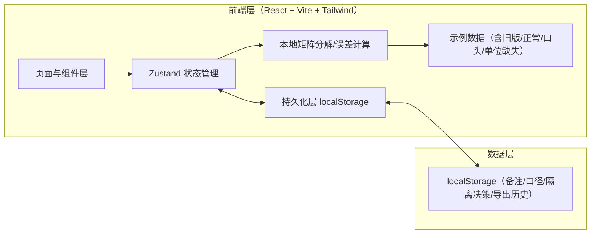
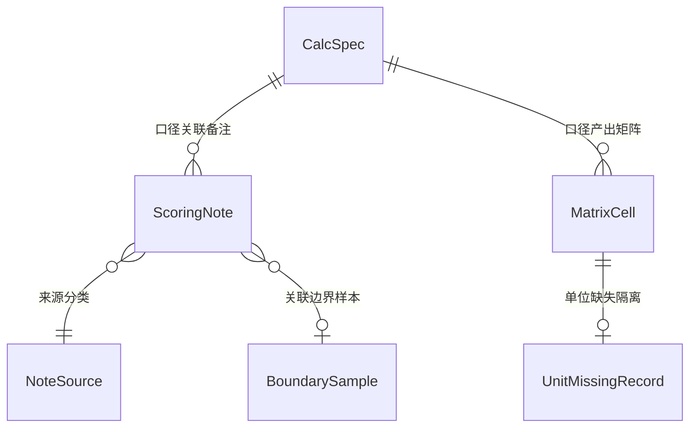

# 矩阵分解图表解释 — 技术架构文档

## 1. 架构设计

纯前端单页应用（无后端依赖），持久化基于浏览器 localStorage，保证"重启后历史备注不丢"。矩阵分解结果以示例数据 + 本地轻量计算的方式呈现，重点在"解释、溯源、隔离、交接"而非算法本身。



## 2. 技术选型

- 前端：React@18 + TypeScript + tailwindcss@3 + vite
- 初始化工具：vite-init（react-ts 模板，纯前端）
- 状态管理：Zustand（含 persist 中间件实现 localStorage 持久化）
- 路由：react-router-dom
- 图标：lucide-react
- 图表：自研 SVG 热力图（无需重型图表库，保证异常描边/交互可控）
- 后端：无（纯前端，数据内置于示例 + 用户输入持久化）
- 数据库：无（localStorage 即数据层）

## 3. 路由定义

| 路由 | 页面 | 用途 |
|------|------|------|
| `/` | 图表与异常 | 预测矩阵热力图 + 异常解释置顶 + 计算口径条 |
| `/notes` | 评分备注与材料 | 备注版本/来源分类 + 边界样本 + 材料投放 |
| `/quarantine` | 隔离与溯源 | 单位缺失隔离区 + 数字溯源线索 + 重新导出 |
| `/handover` | 交接与讲解 | 交接三区指引 + 灰度讲解 + 页面摘要 |

## 4. 数据模型

### 4.1 数据模型定义



### 4.2 类型定义

```typescript
// 计算口径（每次 run）
interface CalcSpec {
  id: string;
  runId: string;
  name: string;          // 如 "2026-06 矩阵分解 v3"
  basis: string;         // 计算口径说明
  factors: number;       // k
  regularization: number;
  iterations: number;
  learningRate: number;
  createdAt: string;
}

// 矩阵单元
interface MatrixCell {
  userId: string;
  itemId: string;
  actualRating?: number;   // 观测评分（可能缺失）
  predictedRating: number; // 分解预测
  error: number;           // |actual - predicted|
  hasUnit: boolean;        // 单位是否缺失
  sourceType: NoteSourceType;
  anomaly: boolean;        // 误差超阈值或被标记
}

// 来源类型：评分备注旧版 / 正常记录 / 口头备注
type NoteSourceType = 'oldVersion' | 'normal' | 'verbal';

interface ScoringNote {
  id: string;
  cellKey?: string;            // userId:itemId
  boundarySampleId?: string;
  content: string;
  sourceType: NoteSourceType;
  sourceLabel: string;
  calcSpecId: string;
  influencesConclusion: boolean;
  author: string;
  createdAt: string;
  version: number;             // 旧版=低版本号
}

interface BoundarySample {
  id: string;
  label: string;
  description: string;
  intuitionBased: boolean;     // 凭感觉
  noteIds: string[];
}

interface UnitMissingRecord {
  id: string;
  cellKey: string;
  reason: string;             // 为何判定单位缺失
  quarantinedAt: string;
  restored: boolean;
  restoreReason?: string;
}

interface ExportSnapshot {
  id: string;
  createdAt: string;
  summary: PageSummary;
  calcSpecId: string;
}

// 页面摘要（交叉印证用）
interface PageSummary {
  totalCells: number;
  anomalyCount: number;
  unitMissingCount: number;
  notesBySource: Record<NoteSourceType, number>;
  conclusionInfluencingBySource: Record<NoteSourceType, number>;
  currentCalcSpecId: string;
  lastSavedAt: string;
}
```

### 4.3 持久化策略

- Zustand `persist` 中间件持久化：备注、口径、隔离决策、边界样本、导出历史、当前选中口径。
- 矩阵单元与示例数据为派生/种子数据，部分持久化（隔离与标记状态）。
- 顶部 `PageSummary` 由持久数据实时重算，与各页计数比对；不一致时高亮"印证失败"，提示值班人核对。
- Schema 版本号随存储写入，升级时做迁移兜底。

## 5. 关键模块

- `src/store/useExplanationStore.ts`：Zustand 全局状态（备注、口径、隔离、摘要、导出），含 persist。
- `src/data/sample.ts`：示例矩阵分解数据，刻意混入旧版/正常/口头/单位缺失四类来源。
- `src/utils/matrix.ts`：误差与异常阈值计算、摘要重算、交叉印证校验。
- `src/components/heatmap/PredictionHeatmap.tsx`：自研 SVG 热力图，异常描边脉冲与回链。
- `src/components/anomaly/AnomalyExplainer.tsx`：置顶异常解释卡，跳转备注/口径。
- `src/components/notes/*`：备注分组列表、来源标签、影响结论开关。
- `src/components/quarantine/*`：单位缺失隔离区、数字溯源线索。
- `src/components/handover/*`：交接三区、灰度讲解、页面摘要。
- `src/components/layout/*`：侧栏导航、顶部常驻摘要条。

## 6. 交叉印证与交接约定

- **交叉印证**：`PageSummary` 字段由 `utils/matrix.ts` 的 `computeSummary` 从持久态重算；各页头部展示本地计数；二者不一致即标记"印证失败"。
- **交接三区**：侧栏与交接页均明确——放材料=`/notes`、看异常=`/`、重新导出=`/quarantine`（导出按钮）。
- **数字来源线索**：每个关键数字旁附"来源"图标，展开显示口径→备注→记录链。
