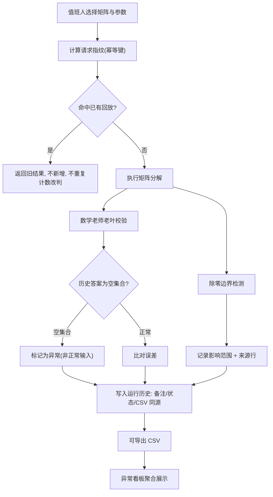

# 矩阵分解参数回放系统 — 产品需求文档（PRD）

## 1. 产品概述

- 矩阵分解参数回放系统是面向算法团队的**参数回放与回归校验工具**。它解决一线长期卡住的一类问题：历史答案里的**空集合被当成正常输入**导致校验（代号"数学老师老叶"）卡死、**重复提交把一条人工改判算成两份**、**除零边界靠人眼扫描**、数字**来源无法追溯**、重跑后**备注/状态/CSV 断线**、值班人接手**摸不着头脑**。
- 目标用户：算法值班人（一线）、复盘评审人（次日复盘，可能不看代码）。产品价值：让每一次参数回放**可复现、可追溯、可交接**——任何接手者不用问人，也知道哪里放材料、哪里看异常、哪里重新导出。

## 2. 核心功能

### 2.1 用户角色

| 角色 | 进入方式 | 核心权限 |
|------|----------|----------|
| 算法值班人 | 默认身份 | 投放材料、触发回放、标记人工改判、写后补说明、查看异常、重新导出 CSV |
| 复盘评审人 | 只读身份 | 查看总览与追溯线索、阅读交接说明、按线索复核数字来源、导出 CSV |

### 2.2 功能模块

1. **回放控制台（Console）**：提交回放请求；幂等校验（相同请求重复提交不产生新结果、不重复计数人工改判）；除零边界面板（影响范围 + 来源行）；实时回放结果与误差。
2. **材料与历史（Materials & History）**：材料库（历史答案 + 现场痕迹）；人工改判记录；后补说明；运行历史（备注 / 状态 / CSV 三者联动不断线）。
3. **异常看板（Anomaly Board）**：异常汇总；空集合告警；除零边界事件；改判待复核清单。
4. **值班交接（Handoff）**：三区指引（哪里放材料 / 哪里看异常 / 哪里重新导出）；数字追溯说明；面向不看代码者的讲解。

### 2.3 页面详情

| 页面名称 | 模块名称 | 功能描述 |
|----------|----------|----------|
| 回放控制台 | 请求提交区 | 选择矩阵与分解参数（方法、主元策略、容差），提交回放；显示本次请求指纹（幂等键） |
| 回放控制台 | 幂等状态条 | 相同请求第二次提交时提示"命中已有回放"，不新增记录、不重复计数改判 |
| 回放控制台 | 除零边界面板 | 列出每次除零/近零事件：发生位置、影响范围（受波及的行/列）、来源行（算法源码行号） |
| 回放控制台 | 结果与误差 | 回放结果矩阵、与历史答案的误差、是否通过"数学老师老叶"校验 |
| 材料与历史 | 材料库 | 历史答案列表，每条带现场痕迹（产生时间、参数快照、环境标记、来源行） |
| 材料与历史 | 人工改判 | 对单条结果标记人工改判（仅计一次），附改判理由 |
| 材料与历史 | 后补说明 | 在改判之后追加补充说明，与改判保持关联且可独立编辑 |
| 材料与历史 | 运行历史 | 每次回放一行：备注 + 状态 + CSV 明细，三者同源联动，重跑后不丢失旧备注 |
| 异常看板 | 异常汇总 | 按类型聚合：空集合、除零边界、改判待复核、误差超阈 |
| 异常看板 | 空集合告警 | 明确区分"空集合"与"正常空输入"，前者置为需处理异常而非静默通过 |
| 值班交接 | 三区指引 | 固定卡片：①放材料→材料库 ②看异常→异常看板 ③重新导出→控制台导出按钮 |
| 值班交接 | 追溯说明 | 解释"数字从哪来"的线索链：请求指纹→历史答案→现场痕迹→来源行→CSV |

## 3. 核心流程

**主流程（值班人提交回放）**：值班人在控制台选择矩阵与参数 → 系统计算请求指纹并查幂等表 → 若命中已有回放则直接返回旧结果且不计数 → 否则执行分解 → "数学老师老叶"校验（空集合判为异常而非正常输入）→ 检测除零边界并记录影响范围与来源行 → 写入运行历史（备注/状态/CSV 同源）→ 结果可导出 CSV。

**改判流程**：在材料库对某条结果标记人工改判（按结果主键去重，仅计一次）→ 可追加后补说明 → 异常看板进入"改判待复核" → 重跑后改判与说明随主键保留、不断线。

## 4. 用户界面设计

### 4.1 设计风格

- **气质方向**：精密仪表 / 工业控制台（industrial utilitarian）。深色底 + 单一锐利强调色（琥珀/青），强调"可读、可追溯、不花哨"，契合算法值班与复盘场景。
- **主色与辅色**：底色 `#0E1116` 深石墨；面板 `#161B22`；主强调色琥珀 `#F2B441`（用于幂等命中、来源行高亮）；辅强调色青 `#3DD6C0`（用于通过/正常）；告警红 `#F26B6B`（除零、空集合）。
- **按钮风格**：直角微圆角（2px），主操作琥珀实心，次操作描边；禁用态灰且带"已命中幂等"提示。
- **字体**：显示字体用等宽工程感字体（如 `JetBrains Mono` / `Space Mono` 用于数字、指纹、来源行）；正文用清晰无衬线（如 `Manrope`）。数字一律等宽对齐。
- **布局风格**：左侧固定侧边导航（四大区 + 状态总览），主区域顶部状态条 + 卡片网格。来源行/指纹以"标签 + 等宽"呈现，便于复制追溯。
- **图标/标记**：用极简线性图标 + 状态色点（绿=通过、琥珀=幂等/待复核、红=异常）。现场痕迹用"痕迹条"（trace chip）展示。

### 4.2 页面设计概览

| 页面名称 | 模块名称 | UI 元素 |
|----------|----------|----------|
| 回放控制台 | 请求提交区 | 参数表单（方法下拉、主元策略、容差输入）、矩阵编辑器、提交按钮、请求指纹标签 |
| 回放控制台 | 幂等状态条 | 命中提示横幅、命中已有回放的时间、去查看按钮 |
| 回放控制台 | 除零边界面板 | 事件卡片：位置/影响范围/来源行(可点击溯源)、红色边框 |
| 回放控制台 | 结果与误差 | 结果矩阵网格、误差数值、校验状态色点 |
| 材料与历史 | 材料库 | 历史答案行 + 痕迹条（时间/参数快照/环境/来源行） |
| 材料与历史 | 人工改判 | 改判按钮（已改判则锁定，仅一次）、理由输入、改判时间 |
| 材料与历史 | 后补说明 | 说明文本块、编辑入口、与改判关联标识 |
| 材料与历史 | 运行历史 | 行表格：备注 | 状态 | CSV 下载，行内联动跳转 |
| 异常看板 | 异常汇总 | 类型分组卡片 + 计数徽标 |
| 异常看板 | 空集合告警 | 红色卡片，区分空集合 vs 正常空输入 |
| 值班交接 | 三区指引 | 三张大卡片：放材料 / 看异常 / 重新导出，含跳转 |
| 值班交接 | 追溯说明 | 线索链可视化：指纹→历史答案→痕迹→来源行→CSV |

### 4.3 响应式

- 桌面优先（值班工位大屏/复盘投屏）。中等屏自适应折叠侧边栏为顶部导航；表格在窄屏横向滚动保留等宽数字列；触控优化按钮命中区 ≥ 40px。

### 4.4 3D 场景指引

- 不适用（本产品为数据/控制台类，无 3D 场景）。
