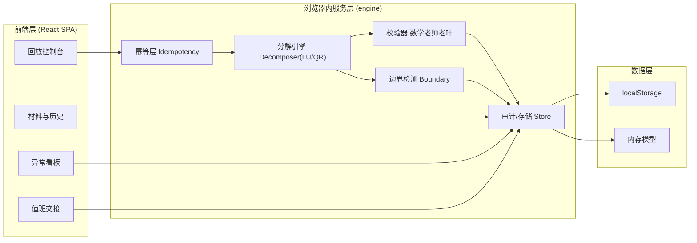
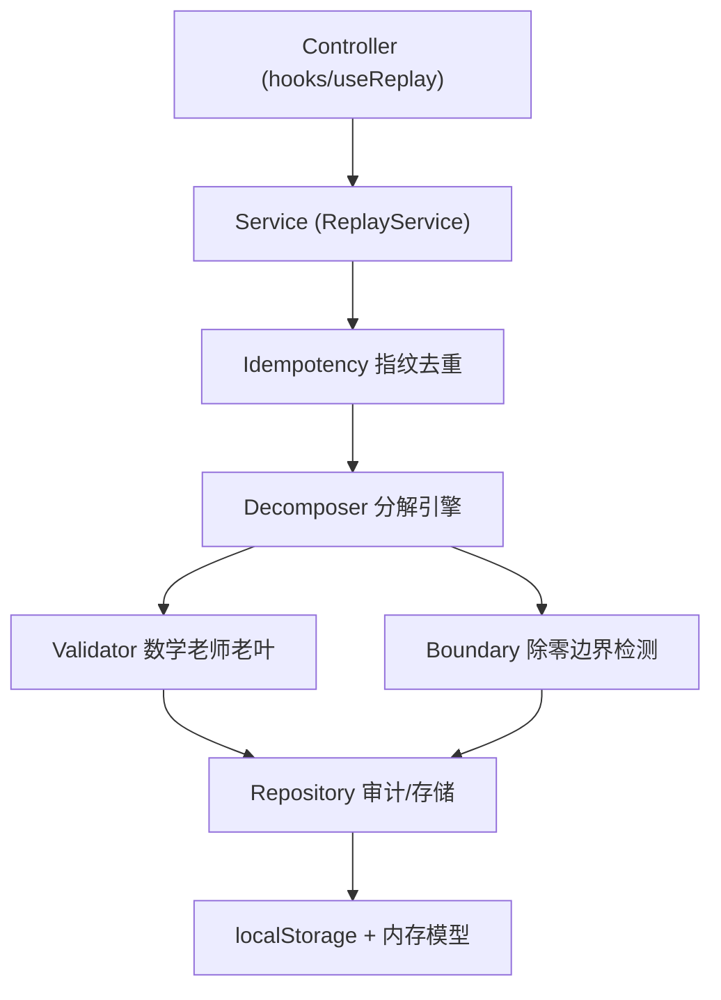
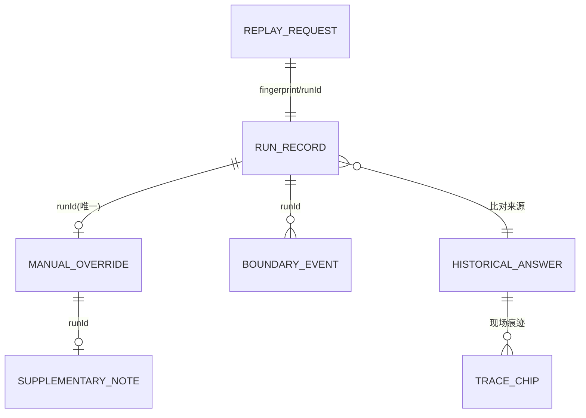

# 矩阵分解参数回放系统 — 技术架构文档

## 1. 架构设计

前端单页应用 + 浏览器内回放引擎，不引入外部服务（遵循"最小化外部服务"原则）。引擎层模拟回放服务端：幂等去重、矩阵分解、除零边界检测、审计存储（localStorage 持久化）。这样保证可复现、可追溯、可交接，且可独立预览运行。



## 2. 技术说明

- **前端**：React@18 + TypeScript + tailwindcss@3 + vite
- **初始化工具**：vite（`npm create vite@latest`，react-ts 模板）
- **后端**：无（浏览器内服务层替代，避免外部依赖，便于预览与交接）
- **持久化**：localStorage（运行历史、材料库、人工改判、后补说明、备注）
- **矩阵运算**：自实现 LU 分解（部分主元法）/ QR（Householder），含容差与近零检测
- **幂等**：对请求载荷做规范化后求指纹（djb2/hash），作为幂等键；相同键命中即返回旧结果、不新增、不重复计数改判
- **CSV**：客户端生成（按 RFC4180 转义），含来源行/痕迹列，保证导出与界面同源

## 3. 路由定义

| 路由 | 用途 |
|------|------|
| `/console` | 回放控制台：提交、幂等、除零边界、结果 |
| `/materials` | 材料与历史：材料库、人工改判、后补说明、运行历史 |
| `/anomalies` | 异常看板：空集合、除零边界、改判待复核、误差超阈 |
| `/handoff` | 值班交接：三区指引 + 数字追溯线索链 |

## 4. API 定义（浏览器内服务层接口）

核心服务对象 `ReplayService`，前端通过 hook 调用：

```ts
// 幂等键与请求
type DecomposeMethod = 'LU' | 'QR' | 'CHOLESKY';
type PivotStrategy = 'partial' | 'none';
interface ReplayRequest {
  matrixId: string;
  matrix: number[][];
  method: DecomposeMethod;
  pivot: PivotStrategy;
  tolerance: number;        // 近零/除零阈值
}
interface IdempotencyKey { fingerprint: string; }   // 规范化后哈希

// 回放结果
interface ReplayResult {
  runId: string;            // 与请求绑定，幂等命中时复用
  fingerprint: string;
  factors: { L?: number[][]; U?: number[][]; Q?: number[][]; R?: number[][] };
  residual: number;        // 与历史答案误差
  verified: boolean;       // 数学老师老叶校验
  emptySetFlag: 'EMPTY_ANOMALY' | 'NORMAL_EMPTY' | 'NONE';
  boundaries: BoundaryEvent[];
  sourceLines: number[];   // 来源行（算法源码行号）
  createdAt: number;
}

// 除零边界
interface BoundaryEvent {
  id: string;
  position: { row: number; col: number };
  pivotValue: number;
  impactRange: { rows: number[]; cols: number[] };  // 影响范围
  sourceLine: number;        // 来源行
  severity: 'div_zero' | 'near_zero';
}

// 人工改判（按 runId 去重，仅一次）
interface ManualOverride {
  runId: string;            // 主键，幂等
  reason: string;
  overriddenAt: number;
  by: string;
}
interface SupplementaryNote { runId: string; note: string; updatedAt: number; }

// 运行历史（备注/状态/CSV 同源）
interface RunRecord {
  runId: string; fingerprint: string;
  status: 'pass' | 'fail' | 'override' | 'pending_review';
  note: string;             // 备注，重跑后保留
  csvToken: string;         // CSV 明细 token，与 runId 绑定
  createdAt: number; rerunOf?: string;
}
```

## 5. 服务端架构图（浏览器内服务层分层）



## 6. 数据模型

### 6.1 数据模型定义



### 6.2 数据定义语言（localStorage 键约定）

```sql
-- localStorage 键（JSON 序列化）
-- "mfpr.runs"           : RunRecord[]          运行历史(备注/状态/CSV)
-- "mfpr.results"        : Record<runId, ReplayResult>
-- "mfpr.overrides"      : Record<runId, ManualOverride>   按runId去重
-- "mfpr.notes"          : Record<runId, SupplementaryNote>
-- "mfpr.materials"      : HistoricalAnswer[]    历史答案+现场痕迹
-- "mfpr.idempotency"    : Record<fingerprint, runId>     幂等索引

-- 初始种子数据：历史答案留现场痕迹 + 1 条人工改判 + 1 条后补说明
-- 含一个会触发除零边界的奇异矩阵样例（pivot≈0），用于演示影响范围+来源行
```
