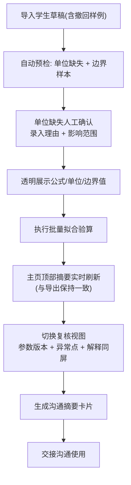

## 1. 产品概述

面向竞赛教练阿乔的曲线拟合批量验算工具，核心解决教练交接时的信息黑洞问题——让边界样本、公式细节、单位处理、异常追溯全部透明化，不再凭感觉埋在学生草稿里。产品以"可沟通的验算摘要"为最终输出，而非冷冰冰的功能清单。

## 2. 核心功能

### 2.1 用户角色
| 角色 | 使用场景 | 核心诉求 |
|------|----------|----------|
| 竞赛教练（当前） | 批量验算学生提交的曲线拟合草稿 | 透明、可追溯、异常明确 |
| 交接教练（继任） | 复核前人验算结果，快速接手 | 参数版本、异常点、解释同页可见 |
| 辅助人工 | 处理单位缺失等需确认的异常 | 记录确认理由与影响范围 |

### 2.2 功能模块
1. **批量验算主页**：数据导入区、公式/单位/边界值透明展示、实时验算面板、页面摘要
2. **学生草稿管理**：数据行列表（含撤回记录行）、单行详情、异常标记
3. **单位缺失处理**：人工确认弹窗、理由录入、影响范围标注
4. **复核视图**：参数版本切换、异常点聚合、验算解释同屏
5. **沟通摘要导出**：一键生成可直接拿去沟通的摘要卡片

### 2.3 页面详情
| 页面名称 | 模块名称 | 功能描述 |
|----------|----------|----------|
| 批量验算主页 | 顶部摘要栏 | 固定显示：样本总数、异常数、边界样本数、当前参数版本、判断结论——与后续导出摘要严格一致 |
| 批量验算主页 | 透明公式区 | 显式展示拟合公式（含完整数学符号）、变量定义、单位对照表、边界阈值表 |
| 批量验算主页 | 草稿数据区 | 学生数据行列表，其中预置一条撤回记录行以展示异常处理样式，每行显示原始值、拟合值、偏差、状态标记 |
| 批量验算主页 | 单位缺失处理 | 自动检测单位缺失行，弹出确认面板，录入确认理由与影响行范围，结果留存于验算输出 |
| 批量验算主页 | 验算结果面板 | 不仅吐最终数字，同步展示：中间计算过程、残差、R²、边界命中情况 |
| 复核视图 | 参数版本区 | 历史参数版本列表，可切换对比，高亮差异项 |
| 复核视图 | 异常点聚合 | 将撤回记录、单位缺失、边界越界、拟合偏差过大等异常集中展示，附原始解释 |
| 复核视图 | 同屏解释 | 每个结论旁附"为什么"按钮，展开显示推导链路和决策依据 |
| 沟通摘要卡片 | 摘要头部 | 项目名、教练、验算日期、参数版本、一句话结论（与主页判断一致） |
| 沟通摘要卡片 | 核心数据 | 边界样本处理说明、异常处理摘要、单位确认摘要 |
| 沟通摘要卡片 | 交接备注 | 供接手人快速理解的要点清单，附详细页面跳转锚点 |

## 3. 核心流程

竞赛教练登录 → 导入/载入学生草稿（含一条撤回样例） → 系统自动检测单位缺失与边界样本 → 确认单位缺失（录入理由与影响范围） → 透明展示公式/单位/边界值 → 执行批量拟合验算 → 主页顶部摘要实时刷新（与导出一致） → 切换复核视图查看参数版本/异常点/解释同屏 → 生成沟通摘要卡片 → 一键复制/导出给交接方

## 4. 用户界面设计

### 4.1 设计风格
- **主色调**：墨蓝（#1e3a5f）+ 暖橙（#e07b39），墨蓝体现学术严谨，暖橙标记异常与重点
- **辅助色**：石板灰（#5a6b7c）用于次级信息，浅米（#faf8f4）背景减少视觉疲劳
- **按钮风格**：矩形微圆角 3px，主按钮实心墨蓝白字，危险按钮橙底白字，次级按钮描边
- **字体**：标题用思源宋体（学术感），正文用思源黑体，数字/公式区域用 JetBrains Mono 等宽
- **布局**：顶部固定摘要栏 + 左侧透明公式/参数侧栏 + 中部草稿数据表格 + 右侧验算结果面板
- **视觉重点**：边界样本行用左侧 3px 暖橙竖条标记，撤回记录行用浅灰斜体+删除线样式
- **图标**：线性简洁图标，避免花哨；异常用⚠️，边界用🔖，撤回用↩️，确认用✅

### 4.2 页面设计概览
| 页面名称 | 模块名称 | UI 元素要点 |
|----------|----------|-------------|
| 验算主页 | 顶部固定摘要栏 | 墨蓝底白字，6 个关键指标横排：样本数/异常数/边界数/参数版本/判断结论/导出按钮 |
| 验算主页 | 左侧透明公式侧栏 | 可折叠，公式用 KaTeX 渲染，单位对照表与边界阈值表并排，卡片式微阴影 |
| 验算主页 | 中部数据表格 | 斑马纹，边界行左侧橙条，撤回行灰底斜体删除线，行高 44px，悬停高亮 |
| 验算主页 | 单位缺失弹窗 | 居中模态，顶部红色⚠️条，理由输入框（必填），影响范围多选，确认后不可更改 |
| 验算主页 | 右侧结果面板 | 分三段：中间过程 → 最终数值 → 拟合质量评估，每段有可展开的解释 |
| 复核视图 | 参数版本对比 | 左右分栏 vs 列表切换，差异项高亮黄底，一键回滚但提示需重新验算 |
| 复核视图 | 异常聚合卡片 | 按类型分组（撤回/单位缺失/边界/偏差），每组统计数字 + 展开明细 |
| 沟通摘要 | 卡片式设计 | 白底 8px 圆角 + 浅灰边框，可打印/复制为图片/复制为纯文本，顶部二维码链接回详细页面 |

### 4.3 响应式
- 桌面端（≥1280px）：三栏布局，侧栏固定 280px + 数据区弹性 + 结果面板 320px
- 平板（768–1279px）：侧栏可收起为图标，结果面板改为底部抽屉
- 移动端（<768px）：单栏瀑布流，摘要栏粘性顶部，表格横向滚动
- 所有弹窗可触摸关闭，表格支持手势横向滑动

### 4.4 细节体验
- 首次进入时自动载入演示数据（含 5 条标准行 + 1 条撤回记录行 + 1 条单位缺失行 + 2 条边界样本行），让教练直接看到异常处理效果
- 表格列支持自定义显示/隐藏，配置保存在 localStorage
- 公式侧栏支持点击变量高亮对应数据列
- 摘要栏判断结论文字颜色与状态一致（绿/橙/红），与导出摘要卡片完全同文案同色
