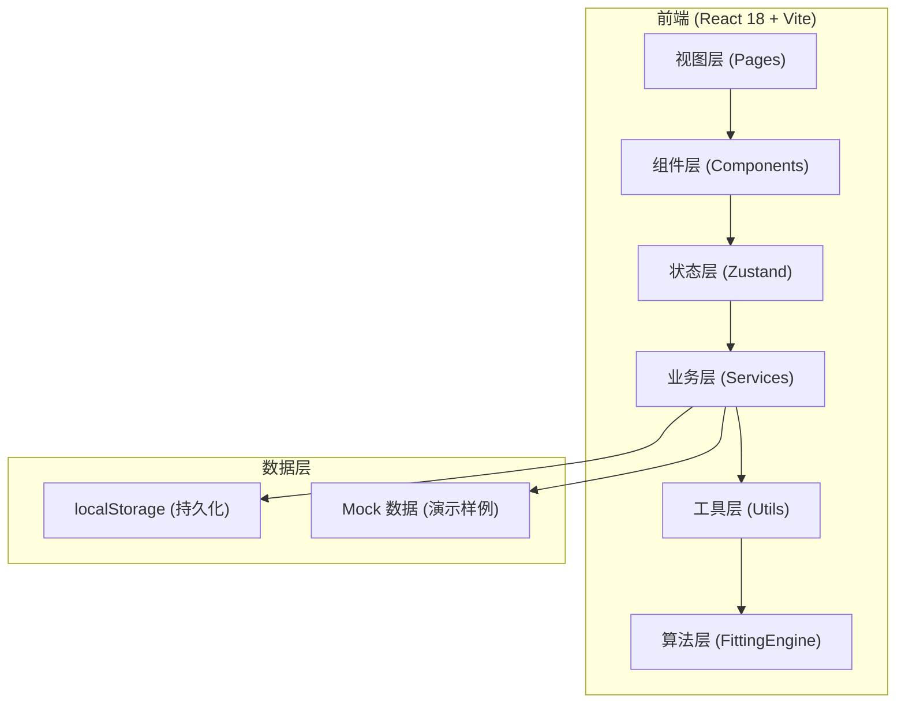

## 1. 架构设计



## 2. 技术选型说明
- **前端框架**：React@18 + TypeScript，强类型保证验算过程不易出错
- **构建工具**：Vite@5，冷启动快，HMR 体验好
- **样式方案**：Tailwind CSS@3 + CSS 变量，组件内原子化 + 主题色统一
- **状态管理**：Zustand@4，轻量不臃肿，适合中后台工具场景
- **数学渲染**：KaTeX，渲染公式比 MathJax 更快
- **表格组件**：TanStack Table@8，灵活可定制，支持列显隐/排序/固定
- **曲线绘制**：recharts@2，React 生态图表库，拟合曲线与散点同屏
- **图标**：@phosphor-icons/react，线性风格符合学术工具调性

## 3. 路由定义
| Route | 页面 | 核心职责 |
|-------|------|----------|
| `/` | 批量验算主页 | 数据导入、透明公式、草稿表格、单位缺失处理、实时验算、顶部摘要 |
| `/review` | 复核视图 | 参数版本切换、异常聚合、解释同屏展示 |
| `/summary` | 沟通摘要卡片 | 可打印/复制的完整摘要，含锚点跳转回详细页 |

## 4. 核心模块划分与文件结构
```
src/
├── main.tsx                 # 入口
├── App.tsx                  # 路由 + 全局布局
├── stores/
│   └── fittingStore.ts      # Zustand：验算数据、参数版本、异常、摘要
├── engine/
│   ├── curveFitting.ts      # 曲线拟合算法（最小二乘、线性/多项式/指数）
│   ├── preflight.ts         # 预检：单位缺失检测、边界样本识别
│   └── metrics.ts           # 拟合质量：R²、残差、RMSE
├── components/
│   ├── layout/
│   │   ├── TopSummaryBar.tsx    # 顶部固定摘要栏（与导出一致）
│   │   └── FormulaSidebar.tsx   # 左侧公式/单位/边界值侧栏
│   ├── table/
│   │   ├── DraftDataTable.tsx   # 学生草稿表格（含撤回行样式）
│   │   └── DraftRow.tsx         # 单行组件（边界/撤回/异常标记）
│   ├── dialogs/
│   │   └── UnitMissingDialog.tsx # 单位缺失人工确认弹窗
│   ├── panels/
│   │   ├── ResultPanel.tsx      # 右侧验算结果面板（过程+数值+评估）
│   │   └── ExceptionPanel.tsx   # 异常点聚合卡片
│   ├── review/
│   │   ├── ParamVersionList.tsx # 参数版本对比
│   │   └── ExplainBlock.tsx     # 结论解释展开块
│   └── summary/
│       └── SummaryCard.tsx      # 沟通摘要卡片
├── pages/
│   ├── FittingPage.tsx      # / 主页
│   ├── ReviewPage.tsx       # /review 复核页
│   └── SummaryPage.tsx      # /summary 摘要页
├── mock/
│   └── demoDataset.ts       # 演示数据：含撤回记录/单位缺失/边界样本
├── types/
│   └── index.ts             # 全局类型定义
└── utils/
    ├── export.ts            # 摘要导出（文本/图片/打印）
    └── consistency.ts       # 摘要一致性校验工具
```

## 5. 数据模型

```mermaid
erDiagram
    FITTING_SESSION {
        string id PK "验算会话ID"
        string coachName "教练姓名"
        string createdAt "创建时间"
        string conclusion "判断结论（与摘要一致）"
        string paramVersionId FK "当前参数版本"
    }
    PARAM_VERSION {
        string id PK
        string name "版本名称，如 v1.2-阿乔"
        string formula "拟合公式类型"
        json formulaParams "公式具体参数"
        json unitTable "单位对照表"
        json boundaryTable "边界阈值表"
        string note "版本备注"
    }
    DRAFT_ROW {
        string id PK
        string sessionId FK
        int seqNo "行号"
        string studentId "学生标识"
        number x "自变量原始值"
        string xUnit "自变量单位（可空=缺失）"
        number y "因变量原始值"
        string yUnit "因变量单位（可空=缺失）"
        string status "normal/boundary/withdrawn/unit_missing"
        string withdrawReason "撤回理由（如有）"
        string unitConfirmReason "单位确认理由（如有）"
        string unitConfirmScope "影响范围（如有）"
    }
    FITTING_RESULT {
        string rowId PK FK
        number fittedY "拟合值"
        number residual "残差"
        number deviation "偏差%"
        boolean hitBoundary "是否命中边界"
        string boundaryDetail "边界命中说明"
    }
    SUMMARY_SNAPSHOT {
        string sessionId PK FK
        json payload "摘要快照（用于导出时一致性校验）"
        string hash "摘要内容哈希"
    }
    FITTING_SESSION ||--|| PARAM_VERSION : "uses"
    FITTING_SESSION ||--o{ DRAFT_ROW : "contains"
    DRAFT_ROW ||--o| FITTING_RESULT : "produces"
    FITTING_SESSION ||--|| SUMMARY_SNAPSHOT : "has"
```

## 6. 关键算法与业务约束
### 6.1 曲线拟合算法
- 支持：线性 y=ax+b、二次多项式 y=ax²+bx+c、指数 y=a·e^(bx)
- 实现：基于最小二乘法（normal equation），必要时对指数模型做线性化取 log
- 所有中间过程（Σx、Σy、Σxy、Σx²、行列式等）需记录在 ResultPanel 中间过程区

### 6.2 预检规则
- 单位缺失：xUnit 或 yUnit 为空 → 标记，需人工确认
- 边界样本：x 或 y 接近阈值 ±5% → 左侧橙条 + boundary 状态
- 撤回记录：status=withdrawn → 浅灰斜体删除线样式，不参与拟合，但保留在表中

### 6.3 摘要一致性（核心约束）
- 顶部摘要栏、沟通摘要卡片、导出文本三者共享同一份状态树中的 `summarySnapshot`
- 任何导致结论变化的操作（参数变更、单位确认、数据增删）必须先更新 `summarySnapshot`，再分别渲染三处
- 提供 `consistencyCheck()` 工具函数，进入 `/summary` 页时自动校验哈希，不一致则红条告警

## 7. Mock 演示数据规格
`demoDataset.ts` 需提供 9 行样例：
- 5 条标准正常行（x/y 带单位，不越界）
- 1 条撤回记录行（status=withdrawn，附撤回理由"计算重复，已作废"）
- 1 条单位缺失行（xUnit 为空，等待人工确认）
- 2 条边界样本行（x 或 y 在阈值 ±5% 内）
- 参数版本预置 v1.0（线性）、v1.1（二次）两条，支持切换
