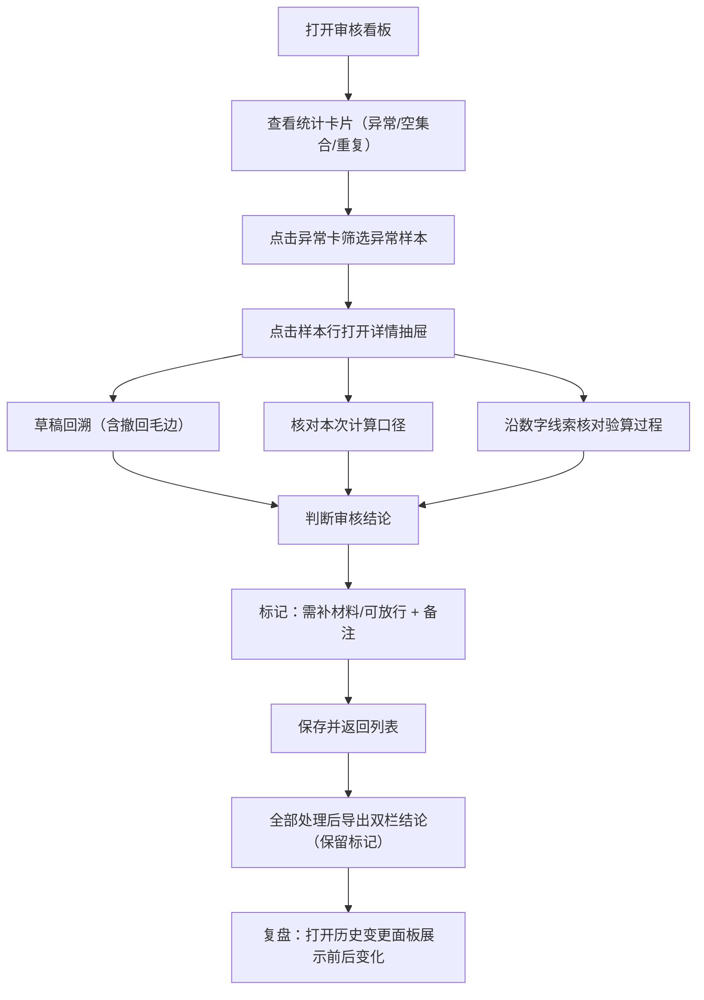

## 1. 产品概述
面向高中数学教研组的图论路径作业批量验算与审核系统。解决数学老师老叶在批改学生图论路径作业时的痛点：空集合判定不直观、异常样本需反复翻查草稿与计算口径、重复样本淹没在正常材料中、审核结论难以追溯人工确认前后变化、复盘时缺乏面向非技术人员的数字线索。

- 核心目标：让复核人在一张看板内完成异常定位→草稿回溯→口径核对→标记放行/退回→导出复盘材料的完整流程
- 目标用户：数学老师老叶（审核人）、教研组长/项目经理（复盘听众）

## 2. 核心特性

### 2.1 用户角色
| 角色 | 使用场景 | 核心权限 |
|------|---------|---------|
| 审核人（老叶） | 日常批改图论路径作业、标记异常、出具审核结论 | 查看全部样本、编辑审核状态、导出结果、查看历史变更 |
| 复盘听众（项目经理/教研组长） | 第二天复盘会查阅数据来源与变更轨迹 | 只读浏览看板、查看数字来源线索、查阅历史确认记录 |

### 2.2 功能模块
1. **审核看板主页**：异常概览统计卡、样本筛选列表、快捷筛选条件
2. **样本详情抽屉**：学生草稿回溯（含撤回记录等毛边）、本次计算口径说明、验算过程与数字来源线索
3. **历史变更面板**：人工确认前后状态对比、操作人时间戳、变更备注
4. **导出与结论**：重复样本标记保留导出、"需补材料/可放行"双栏结论清单

### 2.3 页面详情
| 页面名称 | 模块名称 | 功能描述 |
|---------|---------|---------|
| 审核看板 | 顶部统计卡片 | 展示：总样本数、异常数、空集合数（含说明tooltip）、重复样本数、待确认数、已放行数 |
| 审核看板 | 筛选工具栏 | 按状态筛选（全部/异常/空集合/重复/待确认/已放行）、按学号/姓名搜索、按提交批次过滤 |
| 审核看板 | 样本列表行 | 每行展示学号、姓名、题目、结果摘要、状态标签（异常/空集合/重复/待确认/已放行）、重复标记角标、操作按钮 |
| 样本详情抽屉 | 草稿回溯区 | 渲染学生手写/输入草稿，展示一条撤回记录（划掉样式+撤回说明），保留现场毛边感 |
| 样本详情抽屉 | 计算口径区 | 明确本次验算规则、空集合判定标准说明、算法版本、输入参数取值 |
| 样本详情抽屉 | 验算过程区 | 每一步结果标注数字来源（从草稿哪一行/哪个公式推导），用彩色线索串联 |
| 样本详情抽屉 | 审核操作区 | 标记为"需补材料"/"可放行"、填写审核备注、保存 |
| 历史变更面板 | 时间线列表 | 每条变更展示：变更时间、操作人、变更前状态→变更后状态、变更备注、对比差异高亮 |
| 导出结论 | 双栏清单 | 左栏"需补材料"清单（含缺失项说明）、右栏"可放行"清单，导出CSV/打印视图均保留重复样本标记与空集合标注 |

## 3. 核心流程
审核人老叶打开看板 → 从统计卡看到异常数量与空集合分布 → 点击异常卡筛选出异常样本 → 点击某一行打开详情抽屉 → 先看草稿（含撤回毛边）定位学生原始思路 → 对照计算口径确认本次规则 → 沿数字线索核对每一步验算 → 判断是否异常 → 标记"需补材料"或"可放行"并填写备注 → 返回列表继续处理 → 处理完毕后导出双栏结论清单（保留重复标记与空集合标注）→ 第二天复盘时打开历史变更面板向项目经理展示人工确认前后的变化。

## 4. 用户界面设计
### 4.1 设计风格
- 主色调：深靛蓝 #1e3a5f（学术严谨感），辅色：琥珀橙 #f59e0b（异常标记）、翡翠绿 #10b981（可放行）、珊瑚红 #ef4444（需补材料）
- 中性色：石板灰系列（slate 50/100/200/500/700/900）
- 按钮风格：微圆角（rounded-md），hover时轻微上浮阴影（hover:shadow-md hover:-translate-y-0.5），过渡150ms
- 字体：标题用 Fraunces（衬线，有学术手稿气质），正文用 Source Sans 3（清晰易读的无衬线）
- 布局风格：左窄筛选栏 + 中央列表区 + 右侧抽屉式详情；卡片式分组，卡片间有细微边框分隔
- 图标风格：Lucide 线性图标，异常/警告类用琥珀色，正常/通过用翡翠绿

### 4.2 页面设计概览
| 页面名称 | 模块名称 | UI 元素 |
|---------|---------|---------|
| 审核看板 | 统计卡片 | 6张卡片横排，数值大字+小字标签，空集合卡片附tooltip说明"空集合∅在图论中为合法输入，表示没有可达路径，属正常情况" |
| 审核看板 | 筛选工具栏 | 左侧搜索框，右侧筛选徽章（异常/空集合/重复/待确认/可放行），点击切换active状态（琥珀/靛蓝背景） |
| 审核看板 | 样本列表 | 表格布局，斑马纹行，状态标签用彩色pill，重复样本行左侧加琥珀色竖条+⚠角标 |
| 详情抽屉 | 草稿区 | 仿作业本米色背景（#faf8f3），有手写感字体，撤回记录用删除线+浅灰+小标签"已撤回 14:23"，右下角有墨迹感装饰 |
| 详情抽屉 | 计算口径 | 青蓝边框卡片，标题"本次计算口径"，规则编号列表，空集合判定单独高亮 |
| 详情抽屉 | 验算过程 | 步骤条样式，每步数字旁有彩色小圆圈（线索色），hover时草稿对应行高亮 |
| 历史变更面板 | 时间线 | 左侧时间轴，每条变更用对比色块展示"变更前→变更后"，差异文字高亮 |
| 导出结论 | 双栏 | 左右分栏，左栏珊瑚红表头"需补材料"，右栏翡翠绿表头"可放行"，每行末尾保留重复标记 |

### 4.3 响应式
桌面优先设计（≥1280px）。在中等屏（768-1280px）统计卡折为2行×3列；小屏（<768px）筛选栏折叠为顶部下拉、详情抽屉改为全屏。

### 4.4 动效与微交互
- 页面加载：统计卡片从下往上 staggered fade-in（每张间隔 80ms）
- 抽屉展开：右侧滑入（translate-x-full → translate-x-0，250ms ease-out）
- 状态标签切换：颜色渐变过渡，数字轻微弹跳
- 线索hover：草稿对应行淡黄色脉冲高亮（animate-pulse 1次）
