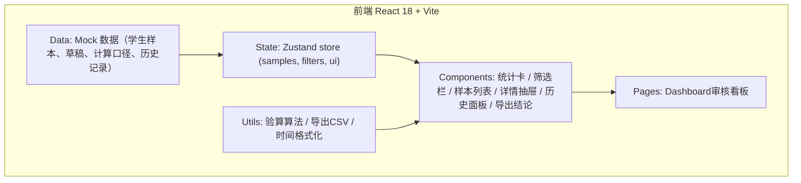
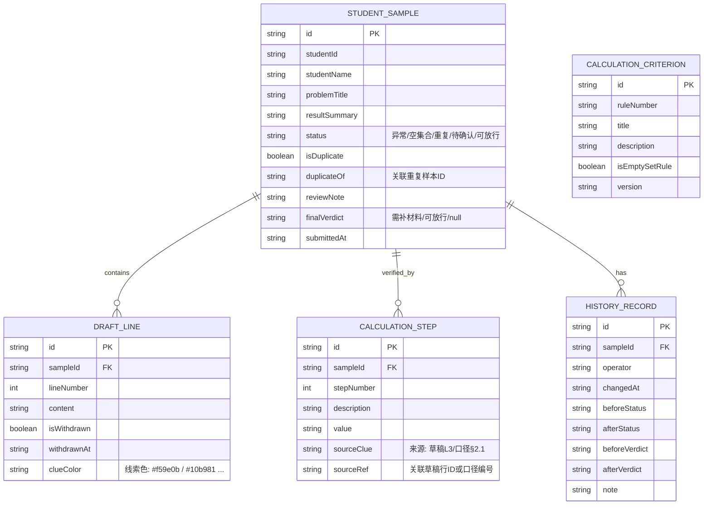

## 1. 架构设计



## 2. 技术描述
- 前端框架：React 18 + TypeScript
- 初始化工具：vite-init（react-ts 模板）
- 构建工具：Vite 5
- 样式：Tailwind CSS 3 + CSS 变量（设计令牌）
- 状态管理：Zustand 4（样本数据、筛选条件、UI 抽屉状态）
- 路由：React Router DOM 6（单页，Dashboard 为主路由）
- 图标：Lucide React
- 后端：无。全部数据使用 Mock 数据存储在前端 `src/data/mockData.ts`，模拟真实批改场景
- 导出：原生 CSV 生成（Blob + URL.createObjectURL）

## 3. 路由定义
| 路由 | 用途 |
|-----|------|
| `/` | 审核看板主页（Dashboard），含统计卡、筛选、列表、抽屉式详情、历史面板入口、导出按钮 |

应用为单页架构，详情抽屉与历史面板以覆盖层形式呈现，不使用嵌套路由。

## 4. 数据模型
### 4.1 数据模型定义



### 4.2 TypeScript 类型定义

```typescript
type SampleStatus = '异常' | '空集合' | '重复' | '待确认' | '可放行';
type Verdict = '需补材料' | '可放行' | null;

interface DraftLine {
  id: string;
  sampleId: string;
  lineNumber: number;
  content: string;
  isWithdrawn: boolean;
  withdrawnAt?: string;
  clueColor?: string;
}

interface CalculationStep {
  id: string;
  sampleId: string;
  stepNumber: number;
  description: string;
  value: string;
  sourceClue: string;
  sourceRef: string;
}

interface HistoryRecord {
  id: string;
  sampleId: string;
  operator: string;
  changedAt: string;
  beforeStatus: SampleStatus;
  afterStatus: SampleStatus;
  beforeVerdict: Verdict;
  afterVerdict: Verdict;
  note: string;
}

interface CalculationCriterion {
  id: string;
  ruleNumber: string;
  title: string;
  description: string;
  isEmptySetRule: boolean;
  version: string;
}

interface StudentSample {
  id: string;
  studentId: string;
  studentName: string;
  problemTitle: string;
  resultSummary: string;
  status: SampleStatus;
  isDuplicate: boolean;
  duplicateOf?: string;
  reviewNote?: string;
  finalVerdict: Verdict;
  submittedAt: string;
  draftLines: DraftLine[];
  calculationSteps: CalculationStep[];
  history: HistoryRecord[];
}
```

## 5. 目录结构

```
src/
├── components/
│   ├── StatCard.tsx          # 统计卡片
│   ├── FilterToolbar.tsx     # 筛选工具栏
│   ├── SampleTable.tsx       # 样本列表
│   ├── SampleRow.tsx         # 单条样本行
│   ├── DetailDrawer.tsx      # 详情抽屉
│   │   ├── DraftSection.tsx  # 草稿回溯
│   │   ├── CriterionSection.tsx # 计算口径
│   │   └── CalculationSteps.tsx # 验算过程+线索
│   ├── HistoryPanel.tsx      # 历史变更面板
│   ├── VerdictExport.tsx     # 双栏结论与导出
│   └── StatusBadge.tsx       # 状态标签
├── data/
│   └── mockData.ts           # Mock学生样本/草稿/口径/历史
├── store/
│   └── useSampleStore.ts     # Zustand状态管理
├── utils/
│   ├── graphVerifier.ts      # 图论验算算法（空集合/重复检测）
│   ├── csvExport.ts          # CSV导出（保留标记）
│   └── format.ts             # 时间/数字格式化
├── pages/
│   └── Dashboard.tsx         # 主页面
├── App.tsx
├── main.tsx
└── index.css                 # Tailwind + 设计令牌 + 字体
```

## 6. 关键实现要点

1. **空集合标注**：状态为"空集合"的样本在列表中显示特殊徽章，并在统计卡 tooltip 中解释："空集合∅为图论合法输入，表示不存在从起点到终点的可达路径，属正常情况，需确认学生是否正确识别此情形"。

2. **草稿毛边（撤回记录）**：`DraftLine.isWithdrawn=true` 时，渲染为删除线样式 + 浅灰文字 + 右上角小标签"已撤回 HH:mm"，卡片背景带轻微纹理模拟作业本。

3. **重复样本标记**：`isDuplicate=true` 时，列表行左侧加琥珀色 3px 竖条 + ⚠ 角标；导出 CSV 时在最末列写入 `[重复]` 标记。

4. **数字线索追溯**：验算步骤 `sourceRef` 指向草稿行ID或口径编号；hover 验算步骤时草稿对应行高亮脉冲，同时在步骤右侧显示"来源：草稿第3行"小标签。

5. **历史变更对比**：每条 `HistoryRecord` 渲染为时间线节点，before→after 状态用 diff 色块展示，差异文字高亮。

6. **双栏结论导出**：按 `finalVerdict` 分组为"需补材料"和"可放行"两栏，CSV 文件名含批次号与导出时间，所有标记字段保留。
