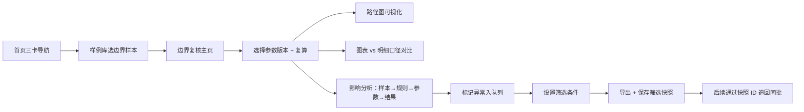

## 1. 产品概述
图论路径边界复核工具 — 面向数据分析人员的参数校验与边界分析平台。解决参数表分批录入追溯难、空集合误判正常、边界样本影响结论说不清、异常队列无法回溯筛选等痛点。
- 目标用户：数据分析岗（小孟等复核人员）
- 核心价值：一条边界样本为何影响结论讲得清，参数变更可追溯，异常筛选可复现，交接只需看三个入口。

## 2. 核心特性

### 2.1 功能模块
1. **参数表管理**：分批录入、版本快照、变更对比、空值/单位缺失高亮追溯
2. **边界复核主页**：样本输入、一键复算、路径图可视化、图表与明细口径对比
3. **影响分析面板**：单条边界样本逐条拆解"为什么改变结论"
4. **异常队列**：筛选条件持久化、导出携带筛选快照、同批记录可追回
5. **快速导航**：首页三卡片直达 — 样例在哪 / 异常在哪 / 结果怎么导出

### 2.2 页面详情
| 页面名称 | 模块名称 | 功能描述 |
|----------|----------|----------|
| 首页（快速导航） | 三卡面板 | 样例库入口、异常队列入口、导出记录入口；当前批次概览数 |
| 参数表管理 | 参数列表 | 按批次分组展示，版本切换，变更记录时间线 |
| 参数表管理 | 参数详情 | 单条参数原值/现值对比，空集合告警链接到原始说法，单位缺失定位到录入批次 |
| 边界复核主页 | 样本输入区 | 粘贴/上传一条边界样本，选择参数版本，触发复算 |
| 边界复核主页 | 路径图区 | 图论路径可视化，高亮受边界样本影响的节点与边 |
| 边界复核主页 | 口径对比区 | 图表聚合值 vs 明细逐行值，差异行红色标记 |
| 影响分析面板 | 影响拆解 | 因果链展示：样本 → 触发哪条规则 → 改变哪个参数 → 路径重算结果对比 |
| 异常队列 | 列表+筛选 | 多条件筛选，筛选条件序列化保存为快照 |
| 异常队列 | 导出中心 | 导出 CSV/JSON，文件名携带筛选快照 ID，可通过快照 ID 恢复筛选 |

## 3. 核心流程
复核人（小孟）打开首页 → 从"样例在哪"选择一条边界样本 → 进入边界复核主页 → 自动加载样本与对应参数版本 → 点击"复算" → 路径图与口径对比区刷新 → 右侧影响分析面板逐条解释"为什么结论变了" → 如发现异常，标记入异常队列 → 设置筛选条件 → 导出（携带筛选快照）→ 下次打开可通过快照 ID 恢复同一批记录。

## 4. 用户界面设计
### 4.1 设计风格
- **主色**：深海蓝 `#1e3a5f`（专业数据分析感）
- **辅色**：琥珀橙 `#d97706`（告警/异常高亮）、翠绿 `#059669`（正常/通过）
- **中性色**：石板灰系列（slate-50 到 slate-900）
- **按钮风格**：直角方头、2px 描边、hover 时轻微下沉阴影
- **字体**：标题用思源宋体 SC（衬线增加数据分析的严谨感），正文/数据用 JetBrains Mono（等宽对齐数字）
- **布局**：左侧垂直导航（窄 64px 图标模式），主区卡片栅格，强调数据表格的边框分隔
- **图标**：lucide-react 线性图标，异常类图标统一用琥珀色描边

### 4.2 页面设计概览
| 页面名称 | 模块名称 | UI 元素 |
|----------|----------|----------|
| 首页 | 三卡面板 | 每张卡 180×180px，左上角大图标，底部数字+跳转箭头，hover 时卡片上浮 4px |
| 参数表管理 | 参数列表 | 斑马纹表格，变更单元格右上角琥珀色角标，点击展开版本时间线 |
| 边界复核主页 | 三栏布局 | 左：样本输入；中：路径图（SVG/ECharts）；右：影响分析时间线 |
| 影响分析面板 | 因果链 | 竖向时间线节点，每个节点配"改前/改后"数值对，红色箭头标注差值 |
| 异常队列 | 筛选条 | 标签式筛选器，右侧"保存快照"按钮，导出按钮旁显示快照 ID |

### 4.3 响应式
桌面端优先（≥1280px），平板端（≥768px）三栏折叠为两栏，移动端（<768px）单列纵向堆叠，路径图简化为表格展示。
