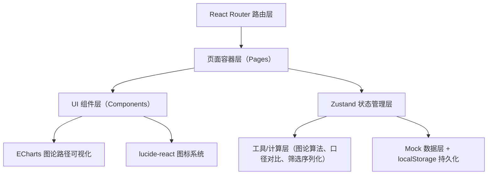
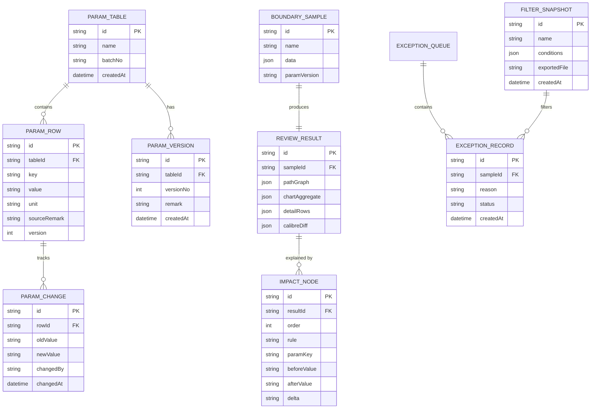

## 1. 架构设计
纯前端单页应用（SPA），数据层使用 localStorage + 内存 mock，不依赖后端服务。整体分层：UI 组件层 → 页面容器层 → 状态管理层（zustand）→ 工具/计算层 → Mock 数据层。



## 2. 技术描述
- **前端框架**：React@18 + TypeScript
- **构建工具**：Vite@5
- **样式方案**：Tailwind CSS@3（slate 色板为主，自定义 amber/emerald 语义色）
- **状态管理**：zustand（参数表状态、边界样本状态、异常队列状态、筛选快照状态）
- **路由**：react-router-dom@6
- **图表可视化**：echarts@5 + echarts-for-react（图论路径 graph 布局）
- **图标**：lucide-react
- **数据持久化**：localStorage（封装工具函数自动序列化/反序列化）
- **后端/数据库**：无，纯前端 mock 数据

## 3. 路由定义
| 路由 | 用途 |
|------|------|
| `/` | 首页 — 三卡快速导航（样例/异常/导出） |
| `/params` | 参数表管理 — 分批录入、版本追溯、空值/单位检查 |
| `/review` | 边界复核主页 — 样本输入、复算、路径图、口径对比、影响分析 |
| `/exceptions` | 异常队列 — 筛选、快照、导出 |
| `/samples` | 样例库 — 边界样本列表，点选后跳转 `/review` 并预填 |

## 4. 数据模型

### 4.1 数据模型定义


### 4.2 核心类型定义（TypeScript）
```typescript
interface ParamRow {
  id: string;
  key: string;
  value: string | null;
  unit: string | null;
  sourceRemark: string;
  version: number;
  isEmptySet: boolean;
  missingUnit: boolean;
}

interface BoundarySample {
  id: string;
  name: string;
  data: Record<string, number | string>;
  paramVersion: number;
}

interface ImpactNode {
  order: number;
  rule: string;
  paramKey: string;
  before: string;
  after: string;
  delta: string;
}

interface FilterSnapshot {
  id: string;
  name: string;
  conditions: Record<string, string | string[]>;
  exportedAt?: string;
}
```

## 5. 核心算法
- **图论路径计算**：Dijkstra 最短路径 + 阈值规则引擎（边界样本触发参数变更 → 边权重重算 → 路径重选）
- **口径对比**：图表聚合值（sum/avg）与明细逐行累计值做浮点误差校验，差异 > 0.01% 标记
- **筛选序列化**：JSON.stringify 条件对象 + Base64 编码生成快照 ID，导出文件名嵌入快照 ID
