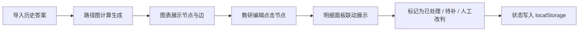
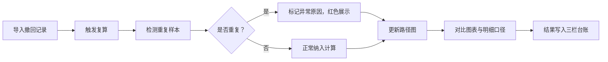

# 图论路径错题归因 · 产品需求文档

## 1. 产品概述

面向教研编辑的错题归因可视化工具，以路径图呈现学生错题的知识链路，并支持图表到明细的双向追溯。数据持久化存储，重启不丢进度，便于接手同事衔接工作。

- 目标用户：教研编辑（如阿宁）
- 核心痛点：图表好看但点不回明细、状态只在内存易丢失、撤回/补录/异常记录混杂难辨

## 2. 核心功能

### 2.1 用户角色

| 角色 | 登录方式 | 核心权限 |
|------|----------|----------|
| 教研编辑 | 本地浏览器访问 | 查看路径图、追溯明细、标记人工改判、导入撤回记录复算 |

### 2.2 功能模块

1. **路径图主面板**：以图论节点-边展示知识路径，节点大小映射错误频次，颜色映射归因类型
2. **三栏记录台账**：已处理记录、待补材料、人工改判并列展示
3. **明细追溯面板**：点击图中节点/边，下方联动展示对应错题明细
4. **撤回复算**：支持将撤回记录重新纳入计算，验证图表与明细口径一致
5. **重复样本异常**：重复样本自动标记异常原因，不伪装成顺利通过
6. **数据持久化**：所有状态存入 localStorage，刷新/重启不丢失

### 2.3 页面详情

| 页面名称 | 模块名称 | 功能描述 |
|----------|----------|----------|
| 主工作台 | 路径图区 | SVG 绘制知识路径图，节点可点击，高亮联动明细 |
| 主工作台 | 三栏台账 | 左：已处理记录；中：待补材料；右：人工改判 |
| 主工作台 | 明细抽屉 | 点击节点/边后从下方滑出，展示错题详情、学生回答、归因标签 |
| 主工作台 | 顶栏操作区 | 撤回记录导入、复算按钮、重置演示数据、导出截图说明 |

## 3. 核心流程

### 3.1 正常归因流程

### 3.2 撤回复算流程

## 4. 用户界面设计

### 4.1 设计风格

- **主色调**：墨青色 `#0F4C5C` 作为主色（教研专业感），赭石色 `#E36414` 作为异常强调色
- **辅助色**：米白 `#F5F0E1` 背景，营造纸张/卷宗质感
- **按钮风格**：微倒角矩形，实心填充，hover 有细微下沉动效
- **字体**：标题用「思源宋体」类衬线体凸显学术感，正文用无衬线体保证可读性
- **布局风格**：卷宗式三栏卡片布局，路径图悬浮居中，有轻微纸张纹理和阴影
- **图标风格**：线性细边图标，颜色与文字统一

### 4.2 页面设计概览

| 页面名称 | 模块名称 | UI 元素 |
|----------|----------|---------|
| 主工作台 | 路径图区 | SVG 图、节点悬停提示、点击高亮、动画过渡 |
| 主工作台 | 三栏台账 | 卡片式列表、状态色标、时间戳、操作按钮 |
| 主工作台 | 明细抽屉 | 滑入动画、错题卡片、归因标签、学生作答对比 |
| 主工作台 | 顶栏 | 品牌标识、操作按钮组、数据状态指示器 |

### 4.3 响应式

- 桌面端优先（≥1280px），三栏并排展示
- 平板端（768-1279px）三栏改为上下堆叠，路径图保持居中
- 移动端（<768px）路径图缩放，台账改为 Tab 切换

### 4.4 动效要点

- 页面加载：路径图节点按拓扑顺序渐次出现（stagger 动画）
- 节点点击：波纹扩散 + 明细抽屉平滑上滑
- 状态变更：卡片颜色渐变过渡，而非硬切
- 异常标记：轻微红色脉冲呼吸动效，吸引注意但不干扰
