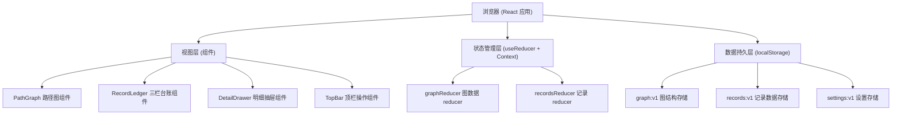
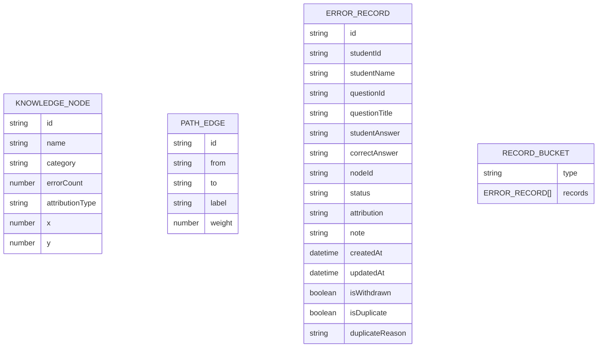

# 图论路径错题归因 · 技术架构文档

## 1. 架构设计



## 2. 技术描述

- **前端框架**：React@18 + TypeScript + Vite
- **样式方案**：TailwindCSS@3 + CSS 变量
- **图表绘制**：原生 SVG（路径图规模小，无需引入 D3/vis-network，保持轻量）
- **状态管理**：React Context + useReducer（规模适中，无需 Redux）
- **数据持久化**：localStorage + 版本化 key
- **图标方案**：SVG 内联图标，无第三方图标库
- **字体**：Google Fonts - Noto Serif SC（标题） + Noto Sans SC（正文）

## 3. 路由定义

| 路由 | 用途 |
|------|------|
| `/` | 主工作台（单页应用，唯一页面） |

## 4. 数据模型

### 4.1 数据模型定义



### 4.2 数据结构说明

**知识节点 (KnowledgeNode)**
- `id`: 节点唯一标识
- `name`: 知识点名称
- `category`: 知识分类（如"图论基础"、"最短路径"、"拓扑排序"）
- `errorCount`: 错误频次（映射节点大小）
- `attributionType`: 归因类型（映射节点颜色：概念误解/计算错误/思路偏差/审题不清）
- `x, y`: 节点坐标

**路径边 (PathEdge)**
- `id`: 边唯一标识
- `from, to`: 起止节点
- `label`: 边标签（如"前置依赖"）
- `weight`: 权重

**错题记录 (ErrorRecord)**
- `id`: 记录 ID
- `studentId / studentName`: 学生信息
- `questionId / questionTitle`: 题目信息
- `studentAnswer / correctAnswer`: 作答对比
- `nodeId`: 关联知识节点
- `status`: 记录状态（processed / pending / manual）
- `attribution`: 归因标签
- `note`: 人工备注
- `isWithdrawn`: 是否撤回记录
- `isDuplicate`: 是否重复样本
- `duplicateReason`: 异常原因

### 4.3 演示数据（小包材料）

共 4 条记录，覆盖三种类型：
1. **顺利记录**（2条）：正常归因，状态为 processed
2. **补录记录**（1条）：撤回后重新补录，状态为 pending
3. **异常记录**（1条）：重复样本，标记异常原因

## 5. 核心算法

### 5.1 撤回复算
- 输入：撤回记录 ID
- 流程：从已处理桶移除 → 重新计算节点 errorCount → 检测是否与现有记录重复（学生ID + 题目ID 双重校验）→ 若重复标记 isDuplicate 及原因 → 归入对应桶 → 更新路径图

### 5.2 重复样本检测
- 检测键：`studentId + questionId` 组合
- 若命中：标记 `isDuplicate = true`，`duplicateReason = "该学生此题已有记录，样本重复"`
- 展示：异常记录卡片带红色边框和脉冲动效，台账中单独标注

### 5.3 图表-明细口径校验
- 图表节点 errorCount = 该节点下所有记录（不含撤回、不含重复异常）的数量
- 明细列表筛选规则与图表计数规则一致
- 撤回复算后自动在界面上显示"口径校验通过"提示

## 6. 文件结构

```
src/
├── types/
│   └── index.ts          # 类型定义
├── data/
│   └── seedData.ts       # 演示种子数据
├── hooks/
│   ├── useLocalStorage.ts # 持久化 Hook
│   └── useGraphStore.ts  # 图状态 Hook
├── components/
│   ├── PathGraph/        # 路径图组件
│   ├── RecordLedger/     # 三栏台账
│   ├── DetailDrawer/     # 明细抽屉
│   └── TopBar/           # 顶栏
├── utils/
│   ├── graph.ts          # 图计算工具
│   └── dedup.ts          # 去重检测
├── App.tsx
├── main.tsx
└── index.css
```
