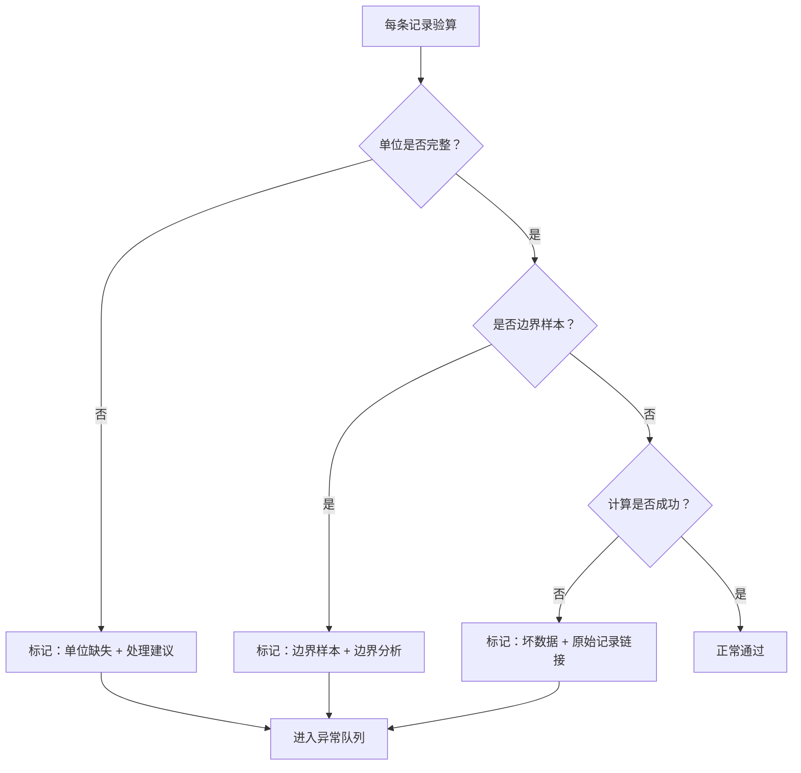

## 1. 产品概述

约束规划批量验算工具，面向数学教研场景，解决历史答案字段不一致、边界样本凭感觉、单位缺失被忽略、参数调整无法对比等问题。以**异常队列**为核心界面，提供从历史答案导入 → 字段映射 → 批量验算 → 异常标记 → 参数复算 → 对比报告的完整处理链。

- 目标用户：数学老师（如老叶）、教研复核人
- 核心价值：把零散的验算材料变成可沟通的异常队列，让边界样本、单位问题、坏数据都"跑不掉"

---

## 2. 核心功能

### 2.1 用户角色

| 角色 | 核心场景 | 核心权限 |
|------|----------|----------|
| 教研老师（老叶） | 导入历史答案、批量验算、调参复算、查看异常队列 | 全部功能 |
| 复核人 | 提交历史答案、查看处理状态 | 数据导入、状态查看 |

### 2.2 功能模块

1. **历史答案导入与字段映射**：支持字段名不一致的历史数据，自动映射+人工确认，保留来源与处理状态
2. **约束规划批量验算引擎**：公式计算+单位校验+边界样本识别，不吞掉单位缺失
3. **异常队列看板**：核心界面，按异常类型分组，筛选口径保留在队列中，支持导出
4. **参数复算与对比报告**：调一档参数重新验算，展示公式/单位/边界样本如何影响结果
5. **数据溯源**：每条异常都能指回历史答案原始记录，坏数据留住线索

### 2.3 页面详情

| 页面名称 | 模块名称 | 功能描述 |
|----------|----------|----------|
| 异常队列看板 | 统计概览 | 总数/异常数/各类异常占比，一眼看明白 |
| 异常队列看板 | 异常列表 | 按类型分组（单位缺失/边界样本/坏数据/计算异常），可筛选可搜索 |
| 异常队列看板 | 详情侧栏 | 点击异常项展开：原始记录、处理状态、处理建议、公式/单位/边界分析 |
| 历史答案导入 | 文件上传 | 拖拽上传 CSV/JSON，自动解析预览 |
| 历史答案导入 | 字段映射 | 自动识别字段名差异，可手动调整，映射方案可保存 |
| 验算配置 | 公式配置 | 约束规划公式编辑器，支持变量引用 |
| 验算配置 | 参数调整 | 关键参数滑块/输入，支持"调一档复算" |
| 对比报告 | 复算对比 | 两次验算结果并排对比，标注变化项，说明变化原因（公式/单位/边界） |
| 导出 | 异常导出 | 导出与屏幕数字一致，筛选口径保留在导出文件中 |

---

## 3. 核心流程

### 3.1 主流程

### 3.2 异常识别流程

---

## 4. 用户界面设计

### 4.1 设计风格

- **主色调**：深靛蓝（#1e3a5f）+ 琥珀色强调（#f59e0b），专业严谨又不失温度
- **辅助色**：
  - 单位缺失：橙红色（#ef4444）警示感
  - 边界样本：蓝紫色（#8b5cf6）需要关注
  - 坏数据：深灰色（#6b7280）已失效但保留
  - 正常通过：翠绿色（#10b981）
- **字体**：标题用 Source Serif Pro（学术感），正文用 Inter（清晰易读）
- **卡片风格**：微圆角（6px），细边框，轻阴影，信息密度适中
- **交互风格**：悬停微提亮，点击有轻微按压反馈，侧栏滑入动效

### 4.2 页面设计概览

| 页面名称 | 模块名称 | UI 元素 |
|----------|----------|---------|
| 异常队列看板 | 顶部统计条 | 4 个数字卡片（总数/异常数/待处理/已处理），带趋势小箭头 |
| 异常队列看板 | 筛选栏 | 异常类型标签、来源筛选、处理状态筛选、搜索框 |
| 异常队列看板 | 异常列表 | 分组折叠式列表，每组有计数徽章，列表项有异常标签 + 摘要 + 时间 |
| 异常队列看板 | 详情侧栏 | 从右侧滑入，分 Tab：原始记录、验算详情、处理建议、对比历史 |
| 历史答案导入 | 上传区 | 大拖拽区域，支持文件选择，上传后预览表格 |
| 历史答案导入 | 字段映射表 | 左列：原始字段名，右列：目标字段，下拉选择，自动高亮不匹配项 |
| 验算配置 | 公式编辑器 | 代码编辑器风格，语法高亮，变量自动补全 |
| 验算配置 | 参数面板 | 滑块 + 数值输入，"调一档"快捷按钮（上下各一档） |
| 对比报告 | 并排对比 | 左右两列，相同项灰色，变化项高亮，悬停显示变化原因 |
| 对比报告 | 变化原因汇总 | 顶部汇总：公式变化 X 条、单位变化 Y 条、边界样本影响 Z 条 |

### 4.3 响应式

- 桌面端优先（1280px+），主内容区 1200px 最大宽度
- 平板端（768-1279px）：侧栏改为底部弹层
- 移动端（<768px）：列表单列，统计卡片折行

### 4.4 设计亮点

1. **异常队列即首页**：打开就看到最需要关注的内容，不是功能菜单
2. **颜色编码系统**：四种异常类型四种颜色，贯穿整个应用（标签、统计、图标）
3. **溯源锚点**：每条异常都有"查看原始记录"按钮，一键跳转到历史答案对应行
4. **处理建议卡片**：单位缺失等异常有专门的建议区域，不是冷冰冰的错误码
5. **对比变化标注**：复算后变化的数字用琥珀色背景+小箭头标注，旁边有"为什么变了"的 tooltip
