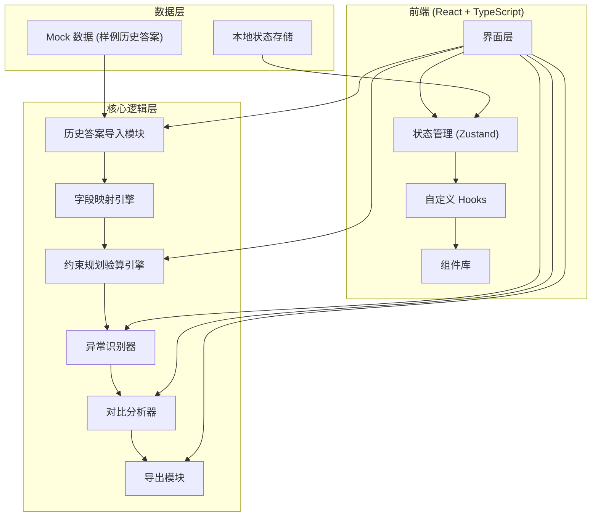
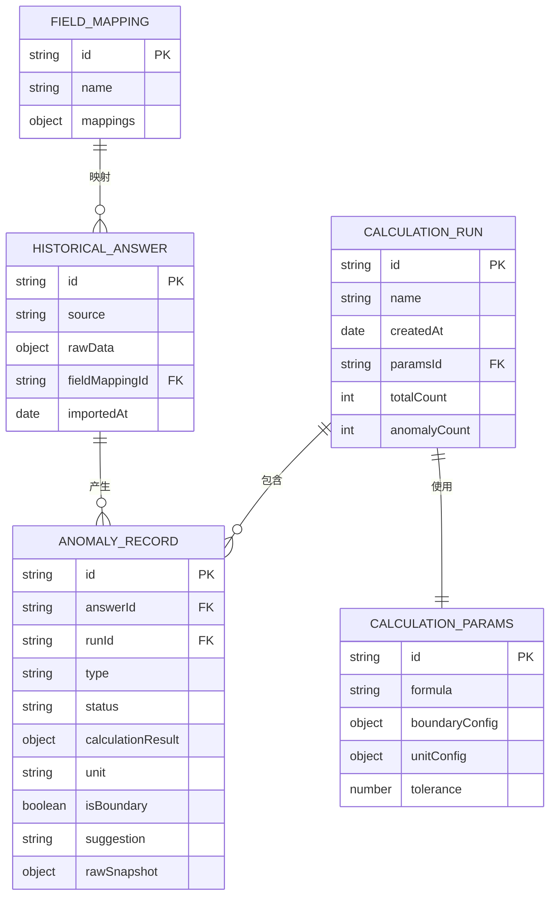

## 1. 架构设计



## 2. 技术描述

- **前端框架**：React 18 + TypeScript + Vite
- **样式方案**：Tailwind CSS 3
- **状态管理**：Zustand
- **图标库**：Lucide React
- **后端**：无（纯前端应用，数据本地处理）
- **数据来源**：内置 Mock 样例数据 + 文件上传导入

### 技术选型理由

1. **纯前端架构**：数据敏感性（教研答案），本地处理不上传服务器
2. **Zustand**：轻量状态管理，适合中小规模应用，API 简洁
3. **Tailwind CSS**：快速构建一致的设计系统，配合设计 tokens
4. **Lucide React**：图标风格统一，轻量

## 3. 路由定义

| 路由 | 页面 | 用途 |
|------|------|------|
| `/` | 异常队列看板 | 首页，展示异常队列与统计 |
| `/import` | 历史答案导入 | 上传数据，配置字段映射 |
| `/config` | 验算配置 | 公式编辑、参数调整 |
| `/compare` | 对比报告 | 两次验算结果对比 |

## 4. 核心数据模型

### 4.1 数据模型 ER 图



### 4.2 TypeScript 类型定义

```typescript
// 异常类型
export type AnomalyType = 'unit_missing' | 'boundary_sample' | 'bad_data' | 'calculation_error';

// 处理状态
export type ProcessingStatus = 'pending' | 'reviewing' | 'resolved' | 'ignored';

// 历史答案记录
export interface HistoricalAnswer {
  id: string;
  source: string;
  sourceBatch: string;
  rawData: Record<string, any>;
  importedAt: string;
  fieldMappingId: string;
}

// 验算结果
export interface CalculationResult {
  value: number | null;
  unit: string | null;
  formula: string;
  variables: Record<string, number>;
  success: boolean;
  errorMessage?: string;
}

// 异常记录
export interface AnomalyRecord {
  id: string;
  answerId: string;
  runId: string;
  type: AnomalyType;
  status: ProcessingStatus;
  calculation: CalculationResult;
  isBoundary: boolean;
  boundaryReason?: string;
  unitMissingFields?: string[];
  suggestion?: string;
  rawSnapshot: Record<string, any>;
  detectedAt: string;
}

// 验算运行
export interface CalculationRun {
  id: string;
  name: string;
  createdAt: string;
  params: CalculationParams;
  totalCount: number;
  anomalyCount: number;
  anomalies: AnomalyRecord[];
}

// 验算参数
export interface CalculationParams {
  id: string;
  formula: string;
  boundaryConfig: BoundaryConfig;
  unitConfig: UnitConfig;
  tolerance: number;
}

// 边界配置
export interface BoundaryConfig {
  minValue?: number;
  maxValue?: number;
  percentileThreshold?: number;
}

// 单位配置
export interface UnitConfig {
  requiredFields: string[];
  allowedUnits: string[];
}

// 字段映射
export interface FieldMapping {
  id: string;
  name: string;
  mappings: Record<string, string>;
}

// 筛选条件
export interface AnomalyFilter {
  types: AnomalyType[];
  statuses: ProcessingStatus[];
  sources: string[];
  searchKeyword: string;
}
```

## 5. 核心模块设计

### 5.1 字段映射引擎

- 支持模糊匹配字段名（如 "数值" / "值" / "result" 自动映射）
- 映射方案可保存、可复用
- 保留原始字段名，支持溯源

### 5.2 约束规划验算引擎

- 公式解析与执行（支持 +、-、*、/、括号、函数调用）
- 单位校验（必填单位检查、单位一致性检查）
- 边界样本识别（极值检测、百分位检测）
- 坏数据识别（空值、非数字、格式错误）

### 5.3 异常队列管理器

- 按类型分组展示
- 多维度筛选（类型、状态、来源、关键词）
- 状态流转（待处理 → 处理中 → 已解决/已忽略）
- 筛选口径与导出联动

### 5.4 对比分析器

- 两次运行结果并排对比
- 识别变化项（数值变化、状态变化、异常类型变化）
- 归因分析：公式变化 / 参数变化 / 单位变化 / 边界样本变化

### 5.5 导出模块

- 导出内容与当前筛选结果一致
- 导出格式：CSV / JSON
- 包含筛选口径元数据
- 数字与屏幕显示完全一致

## 6. 项目目录结构

```
src/
├── components/          # 通用组件
│   ├── ui/             # 基础 UI 组件
│   ├── layout/         # 布局组件
│   └── anomaly/        # 异常相关组件
├── pages/              # 页面
│   ├── Dashboard.tsx   # 异常队列看板
│   ├── Import.tsx      # 历史答案导入
│   ├── Config.tsx      # 验算配置
│   └── Compare.tsx     # 对比报告
├── hooks/              # 自定义 Hooks
│   ├── useAnomalies.ts
│   ├── useCalculation.ts
│   └── useFieldMapping.ts
├── store/              # Zustand stores
│   ├── anomalyStore.ts
│   ├── calculationStore.ts
│   └── importStore.ts
├── engine/             # 核心业务逻辑
│   ├── fieldMapper.ts
│   ├── calculator.ts
│   ├── anomalyDetector.ts
│   └── comparator.ts
├── utils/              # 工具函数
│   ├── formula.ts
│   ├── unit.ts
│   └── export.ts
├── types/              # TypeScript 类型
│   └── index.ts
├── data/               # Mock 数据
│   └── sampleData.ts
├── App.tsx
├── main.tsx
└── index.css
```
