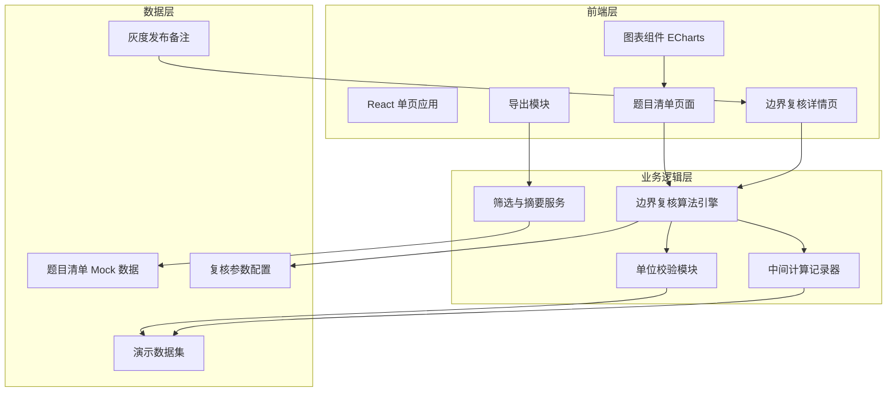
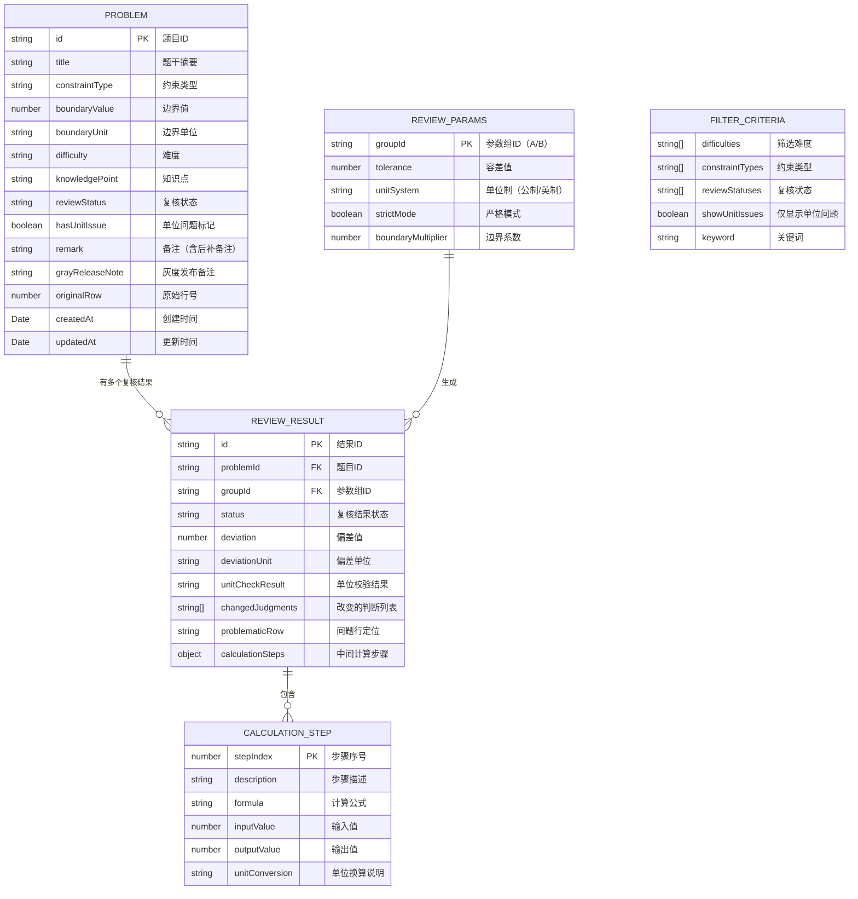

## 1. 架构设计



## 2. 技术描述

- **前端框架**：React@18 + TypeScript
- **构建工具**：Vite@5
- **样式方案**：TailwindCSS@3 + CSS Variables（主题系统）
- **图表库**：ECharts@5（散点图、分布图、对比图）
- **状态管理**：React Context + useReducer（轻量级，避免过度工程化）
- **路由**：React Router@6
- **数据导出**：SheetJS (xlsx) + file-saver
- **图标**：Lucide React + 自定义数学符号 SVG
- **字体**：Google Fonts (Playfair Display + JetBrains Mono)

## 3. 路由定义

| 路由 | 页面 | 用途 |
|------|------|------|
| / | 题目清单总览 | 题目列表、筛选摘要、统计卡片、边界分布图 |
| /review/:id | 边界复核详情 | 单题复核、A/B组参数对照、中间计算过程、单位校验 |
| /demo | 演示数据中心 | 混合样例集、脏数据预览、一键加载演示数据 |
| /export | 导出预览 | 数据预览、筛选口径、问题行定位、下载导出 |

## 4. 数据模型

### 4.1 数据模型定义



### 4.2 TypeScript 类型定义

```typescript
// 题目
interface Problem {
  id: string;
  title: string;
  constraintType: 'linear' | 'nonlinear' | 'integer' | 'binary';
  boundaryValue: number;
  boundaryUnit: string | null;
  difficulty: 'easy' | 'medium' | 'hard' | 'expert';
  knowledgePoint: string;
  reviewStatus: 'pending' | 'normal' | 'abnormal' | 'unit_issue';
  hasUnitIssue: boolean;
  remark: string;
  grayReleaseNote?: string;
  originalRow: number;
  createdAt: string;
  updatedAt: string;
}

// 复核参数组
interface ReviewParams {
  groupId: 'A' | 'B';
  tolerance: number;
  unitSystem: 'metric' | 'imperial';
  strictMode: boolean;
  boundaryMultiplier: number;
}

// 复核结果
interface ReviewResult {
  id: string;
  problemId: string;
  groupId: 'A' | 'B';
  status: 'normal' | 'abnormal' | 'unit_issue' | 'skipped';
  deviation: number;
  deviationUnit: string;
  unitCheckResult: 'pass' | 'missing' | 'mismatch' | 'conversion_error';
  changedJudgments: string[];
  problematicRow?: string;
  calculationSteps: CalculationStep[];
  isDirtyDemo?: boolean;
}

// 计算步骤
interface CalculationStep {
  stepIndex: number;
  description: string;
  formula: string;
  inputValue: number;
  inputUnit: string;
  outputValue: number;
  outputUnit: string;
  unitConversion?: string;
}

// 筛选口径
interface FilterCriteria {
  difficulties: string[];
  constraintTypes: string[];
  reviewStatuses: string[];
  showUnitIssuesOnly: boolean;
  keyword: string;
}

// 导出报告
interface ExportReport {
  exportTime: string;
  filterCriteria: FilterCriteria;
  totalCount: number;
  normalCount: number;
  abnormalCount: number;
  unitIssueCount: number;
  problematicRows: { rowNumber: number; problemId: string; deviation: number }[];
  problems: Problem[];
}
```

## 5. 核心模块设计

### 5.1 边界复核算法引擎

位置：`src/engine/boundaryReviewEngine.ts`

职责：
- 接收题目数据和复核参数
- 执行约束规划边界判定
- 记录每一步计算过程
- 调用单位校验模块
- 输出复核结果（含状态、偏差、改变的判断）

关键函数：
- `reviewBoundary(problem: Problem, params: ReviewParams): ReviewResult`
- `calculateSteps(problem: Problem, params: ReviewParams): CalculationStep[]`
- `detectChangedJudgments(oldResult, newResult): string[]`

### 5.2 单位校验模块

位置：`src/engine/unitValidator.ts`

职责：
- 检测单位缺失
- 检测单位不匹配
- 执行单位换算并记录
- 标记单位问题但不混入正常结果

关键函数：
- `validateUnit(problem: Problem, targetUnit: string): UnitCheckResult`
- `convertUnit(value: number, fromUnit: string, toUnit: string): ConversionResult`
- `isUnitMissing(unit: string | null): boolean`

### 5.3 中间计算记录器

位置：`src/engine/calculationRecorder.ts`

职责：
- 逐步记录计算过程
- 保存输入输出值和单位
- 记录单位换算细节
- 支持回溯和对照比较

### 5.4 筛选与摘要服务

位置：`src/services/filterService.ts`

职责：
- 应用筛选条件到题目列表
- 生成筛选摘要文本
- 确保导出数据与屏幕显示一致

### 5.5 导出模块

位置：`src/services/exportService.ts`

职责：
- 生成 CSV / Excel 导出文件
- 附带筛选口径说明
- 标记问题行定位
- 确保与屏幕数字完全一致

## 6. 演示数据配置

位置：`src/data/demoData.ts`

包含三类数据混合：
1. **正常样例**（60%）：单位完整、边界清晰、复核通过
2. **单位缺失样例**（20%）：`boundaryUnit` 为 null，标记 `hasUnitIssue: true`，紫色标记，不混入正常结果
3. **后补备注样例**（20%）：`remark` 字段含"后补"标识，备注时间晚于创建时间

"不太干净"的演示数据集：至少包含 1 条单位缺失 + 1 条后补备注 + 多条正常数据，确保演示时不只是展示正常样例。

## 7. 灰度发布备注机制

位置：`src/services/grayReleaseService.ts`

- 题目级别的 `grayReleaseNote` 字段
- 复核详情页顶部展示灰度发布备注
- 备注中明确列出"本次复核改变的判断"
- 支持临时添加备注（灰度发布期间使用）
