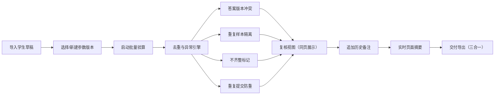

## 1. 产品概述

"误差传播批量验算"是面向教研编辑（阿宁）的批量验算与质量核对工具，解决学生草稿在多版本答案覆盖、重复样本混入、不齐整材料处理中造成的效率瓶颈，确保验算结果可信、备注留存可追溯、复核一目了然。

- 核心用户：教研编辑阿宁
- 核心价值：从"反复核对防重复"转向"工具自动识别+人工确认异常"
- 交付形态：单页 Web 应用，本地可运行，可导出摘要交付给他人查看

---

## 2. 核心功能

### 2.1 用户角色

| 角色 | 登录方式 | 核心权限 |
|------|----------|----------|
| 教研编辑 | 免登录（本地工具） | 草稿导入、参数版本管理、运行验算、复核异常、添加备注、导出交付摘要 |

### 2.2 功能模块

1. **主工作台**：草稿导入区、参数版本管理、任务列表、运行状态
2. **去重与异常引擎**：答案版本冲突检测、重复提交防重录、重复样本隔离、不齐整材料标记
3. **复核视图**：参数版本、异常点、解释说明同页展示；历史备注保留；页面摘要实时同步
4. **交付导出**：学生草稿、处理记录、页面摘要三合一导出，供他人查看

### 2.3 页面详情

| 页面名称 | 模块名称 | 功能描述 |
|----------|----------|----------|
| 主工作台 | 草稿导入区 | 粘贴/上传多条学生草稿，支持不齐整（部分无后补备注） |
| 主工作台 | 参数版本卡 | 切换/保存参数版本（v1/v2…），显示当前激活版本与创建时间 |
| 主工作台 | 任务列表 | 每次验算运行的记录，含运行时间、参数版本、异常数 |
| 去重引擎 | 答案版本冲突 | 同题号被两个版本答案覆盖时高亮，展示两个版本来源 |
| 去重引擎 | 重复提交防重 | 同一请求两次提交，后补备注只计一次，不产生双份 |
| 去重引擎 | 重复样本隔离 | 重复样本不纳入正常汇总，单独列出来源与影响范围 |
| 去重引擎 | 不齐整标记 | 缺失后补备注的条目以"待补"标记，不阻塞整体验算 |
| 复核视图 | 同页信息面板 | 参数版本、异常点、解释说明三块并排展示 |
| 复核视图 | 历史备注区 | 保留每次运行的备注，新备注追加不覆盖 |
| 复核视图 | 实时摘要卡 | 顶部摘要条随当前状态实时更新 |
| 交付导出 | 摘要面板 | 一键整理学生草稿 + 处理记录 + 页面摘要，可复制/导出 |

---

## 3. 核心流程

教研编辑阿宁拿到学生草稿 → 粘贴/导入主工作台 → 选择或新建参数版本 → 启动验算 → 工具自动识别答案版本冲突、重复样本、不齐整条目并隔离 → 阿宁在复核视图查看同页信息（参数版本+异常点+解释），补充历史备注 → 页面摘要实时同步 → 一键导出交付材料（草稿+处理记录+摘要）给他人查看。

---

## 4. 用户界面设计

### 4.1 设计风格

- **主色**：墨青 `#1F3A5F`（专业感、教研气质）
- **辅色**：赭石 `#C4652B`（异常警示）、苔绿 `#4A7C59`（正常通过）、雾灰 `#E8E4DE`（底纹与卡片）
- **按钮风格**：微浮雕方角按钮，悬停上浮 2px，强调点击反馈
- **字体**：标题用 "Noto Serif SC"（衬线，学报感）；正文用 "Noto Sans SC"；等宽数据区用 "JetBrains Mono"
- **布局风格**：三栏布局（左：草稿导入 | 中：复核与异常 | 右：参数与摘要），卡片式分层，顶部全局摘要条
- **图标风格**：线性细描边图标（Lucide），异常处用实心色块标记

### 4.2 页面设计概览

| 页面名称 | 模块名称 | UI 元素 |
|----------|----------|---------|
| 主工作台 | 全局摘要条 | 顶部悬浮，墨青底白字，显示当前参数版本、异常数、待补备注数、最后运行时间 |
| 主工作台 | 左栏草稿导入 | 卡片式，含粘贴区、文件导入、草稿列表（每条可展开看详情与后补备注） |
| 主工作台 | 中栏复核视图 | 异常点时间线、参数版本对比、解释说明三格并排 |
| 主工作台 | 右栏参数与摘要 | 参数版本切换卡、历史备注区、实时摘要、导出按钮 |
| 复核视图 | 异常点卡片 | 赭石描边，内含"来源 + 影响范围 + 解释"三段式，可折叠 |
| 复核视图 | 历史备注时间线 | 每次运行一条，标注参数版本与时间，新备注追加 |
| 交付导出 | 摘要面板 | 白色打印风格卡片，三段分区，可一键复制 |

### 4.3 响应式

- 桌面端优先（≥1280px）：三栏并列
- 平板端（768–1279px）：左右栏折叠为抽屉，中栏全宽
- 移动端（<768px）：纵向堆叠，顶部摘要常驻

### 4.4 动效细节

- 页面加载：三栏依次淡入（左→中→右，间隔 120ms）
- 异常卡片出现：赭石色边框由细到粗脉动一次
- 参数版本切换：卡片翻转动效（Y 轴 15°）
- 导出按钮：悬停时内部光晕扩散
