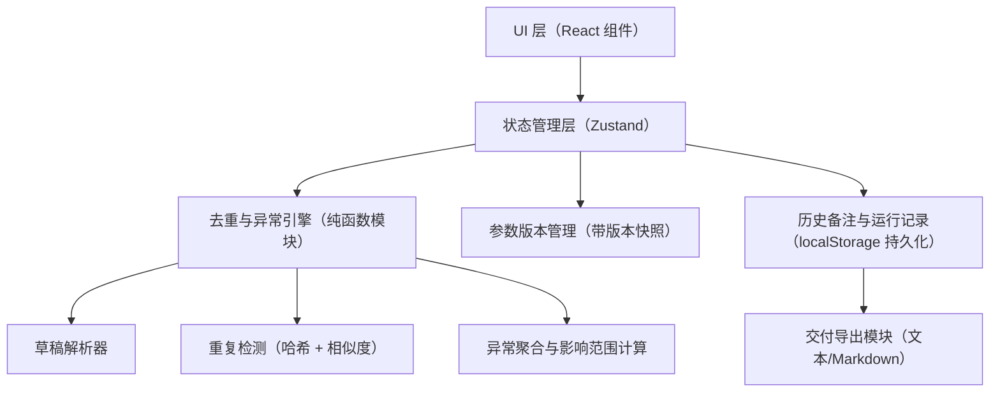

## 1. 架构设计



---

## 2. 技术选型说明

- **前端框架**：React 18 + TypeScript + Vite 5
- **样式方案**：TailwindCSS 3 + 自定义 CSS 变量（主题色、字体栈）
- **状态管理**：Zustand（轻量，支持 middleware 持久化到 localStorage）
- **图标库**：lucide-react（线性细描边，与学报风格匹配）
- **字体**：通过 Google Fonts 引入 Noto Serif SC、Noto Sans SC、JetBrains Mono
- **后端**：无（纯前端工具，数据存 localStorage + 内存）
- **数据库**：localStorage（草稿、参数版本、运行记录、备注全部本地持久化）
- **初始化工具**：`npm create vite@latest . -- --template react-ts`

---

## 3. 路由定义

| 路由 | 用途 |
|------|------|
| `/` | 主工作台（单页应用唯一视图，三栏布局内含所有模块） |

> 本工具为单页应用，不做路由拆分，所有模块通过状态切换与折叠面板展示。

---

## 4. 核心数据模型与类型定义

```typescript
// 学生草稿条目
interface DraftEntry {
  id: string;                // 唯一标识（UUID）
  questionNo: string;        // 题号
  answerContent: string;     // 答案内容
  answerVersion?: string;    // 答案版本（v1/v2...），用于版本冲突检测
  supplementaryNote?: string; // 后补备注（可能缺失，不齐整标记依据）
  rawSource: string;         // 原始粘贴文本（用于溯源）
  submittedAt: number;       // 提交时间戳
  submissionFingerprint: string; // 内容+备注的哈希，用于重复提交防重
}

// 参数版本
interface ParamVersion {
  id: string;
  name: string;              // 如 "v1-春季学期标准"
  createdAt: number;
  tolerance: number;         // 误差容忍阈值
  roundingRule: 'round' | 'floor' | 'ceil'; // 舍入规则
  sigFigs: number;           // 有效数字位数
  isActive: boolean;
}

// 异常/冲突类型
type AnomalyType =
  | 'answer_version_conflict'  // 同题号多版本答案覆盖
  | 'duplicate_submission'     // 重复提交（内容+备注指纹一致）
  | 'duplicate_sample'         // 重复样本（内容高度相似）
  | 'missing_note';            // 后补备注缺失（不齐整）

// 异常记录
interface Anomaly {
  id: string;
  type: AnomalyType;
  relatedDraftIds: string[];   // 涉及的草稿条目
  sourceDescription: string;   // 补看的来源
  impactScope: string;         // 影响范围描述
  explanation: string;         // 工具解释
  resolved: boolean;
  resolverNote?: string;       // 人工处理备注
}

// 单次验算运行记录
interface CalculationRun {
  id: string;
  paramVersionId: string;
  startedAt: number;
  finishedAt: number;
  draftIds: string[];
  anomalies: Anomaly[];
  summary: string;             // 本次运行摘要
  editorNote?: string;         // 阿宁追加的历史备注
}

// 全局状态
interface AppState {
  drafts: DraftEntry[];
  paramVersions: ParamVersion[];
  activeParamVersionId: string | null;
  runs: CalculationRun[];
  currentAnomalies: Anomaly[];
  globalSummary: string;       // 顶部实时摘要
}
```

---

## 5. 去重与异常引擎算法（核心）

### 5.1 重复提交防重（submissionFingerprint）
- 对 `answerContent + supplementaryNote + questionNo` 做 SHA-256 截取前 16 位
- 同一指纹的条目只保留最早提交记录，后到的标记为 `duplicate_submission`，其后补备注 **不重复计入**

### 5.2 答案版本冲突检测
- 按 `questionNo` 分组
- 同组内 `answerVersion` 不一致或出现多个不同版本 → 产生 `answer_version_conflict` 异常
- 异常的 `sourceDescription` 列出所有涉及版本的来源草稿 id

### 5.3 重复样本识别
- 计算 `answerContent` 的 Jaccard 相似度（分词后去重集合）
- 相似度 ≥ 0.92 且 `questionNo` 相同 → 标记为 `duplicate_sample`
- 重复样本 **不进入正常汇总**，在复核视图单独列出

### 5.4 不齐整标记
- `supplementaryNote` 为空或仅空白字符 → 标记 `missing_note`
- 不阻塞验算流程，仅在摘要与异常面板中提示"待补"

---

## 6. 状态管理与持久化

- 使用 Zustand 创建单一 store，挂载四个中间件：
  1. `persist`：`drafts`、`paramVersions`、`runs` 持久化到 localStorage
  2. `devtools`：开发模式开启 Redux DevTools
- 每次验算运行结束：
  - 新建 `CalculationRun` 追加到 `runs`（历史备注保留，永不覆盖）
  - 更新 `currentAnomalies` 与 `globalSummary`（与当前状态对齐）
- 参数版本切换时：
  - 复制一份当前参数快照，`isActive` 标记切换
  - 触发顶部摘要实时刷新

---

## 7. 组件目录结构

```
src/
├── main.tsx
├── App.tsx                 # 三栏布局容器
├── store/
│   └── useAppStore.ts      # Zustand store + 类型
├── engine/
│   ├── fingerprint.ts      # 指纹计算
│   ├── similarity.ts       # Jaccard 相似度
│   ├── dedupe.ts           # 重复提交与重复样本
│   ├── conflict.ts         # 答案版本冲突
│   └── anomalies.ts        # 异常聚合
├── components/
│   ├── layout/
│   │   ├── TopSummaryBar.tsx    # 顶部全局摘要条
│   │   ├── LeftPanel.tsx        # 左栏：草稿导入
│   │   ├── CenterPanel.tsx      # 中栏：复核视图
│   │   └── RightPanel.tsx       # 右栏：参数与摘要
│   ├── drafts/
│   │   ├── DraftImport.tsx      # 粘贴/上传区
│   │   └── DraftList.tsx        # 草稿条目列表
│   ├── params/
│   │   └── ParamVersionCard.tsx # 参数版本卡
│   ├── review/
│   │   ├── AnomalyCard.tsx      # 异常卡片（来源+影响+解释）
│   │   ├── AnomalyTimeline.tsx  # 异常时间线
│   │   └── NoteTimeline.tsx     # 历史备注时间线
│   └── export/
│       └── DeliveryPanel.tsx    # 交付摘要导出
├── styles/
│   └── index.css           # Tailwind + 主题变量 + 字体
├── utils/
│   └── export.ts           # 三合一导出（草稿+记录+摘要）
└── mock/
    └── seedData.ts         # 学生草稿示例（含不齐整、重复、冲突）
```

---

## 8. 交付导出模块

一键导出内容（Markdown 格式，可复制/下载 `.md` 文件）：

1. **学生草稿区**：列出所有草稿（含不齐整标记与后补备注）
2. **处理记录区**：每次运行的参数版本、异常数、阿宁追加备注
3. **页面摘要区**：当前 `globalSummary` + 未解决异常清单

导出按钮触发浏览器 `Blob` 下载或 `navigator.clipboard.writeText` 复制。
