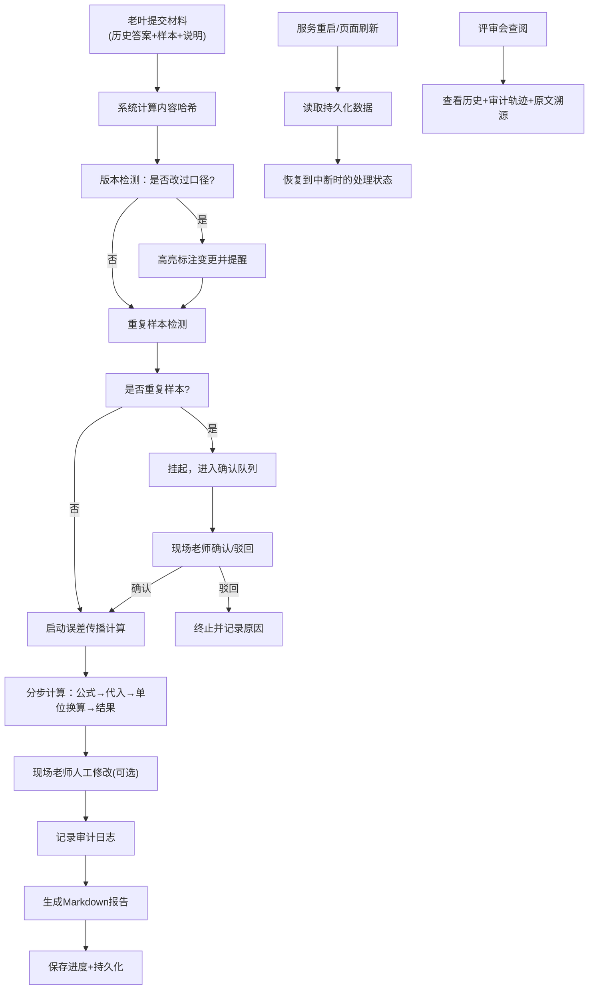

## 1. 产品概述

面向数学/物理教研场景的误差传播分析复核工具，解决历史答案中公式正确但单位换算导致结果偏差的问题，支持处理进度持久化、材料版本追踪、计算过程透明化。

- **核心价值**：将误差分析从"黑盒计算"变为"可追溯、可复核、可审计"的教研工作流
- **目标用户**：数学老师老叶（材料提交者）、现场老师（复核操作者）、评审会（结论审阅者）

## 2. 核心功能

### 2.1 用户角色

| 角色 | 使用场景 | 核心权限 |
|------|----------|----------|
| 数学老师老叶 | 提交历史答案、边界样本、口头说明 | 材料上传、口径追溯、报告导出 |
| 现场老师 | 日常复核操作、参数对照、挂起确认 | 计算操作、进度恢复、人工修改、确认挂起 |
| 评审会成员 | 审阅历史记录、查看审计轨迹 | 只读浏览、审计追踪、报告查看 |

### 2.2 功能模块

1. **复核工作台**：材料上传区、计算过程面板、参数对照区、进度状态条
2. **历史记录库**：会话列表、版本diff、操作审计、原文溯源
3. **挂起队列**：重复样本检测、人工确认、冲突解决
4. **报告中心**：Markdown报告生成、导出、历史版本对比

### 2.3 页面详情

| 页面名称 | 模块名称 | 功能描述 |
|----------|----------|----------|
| 复核工作台 | 材料上传 | 支持历史答案、边界样本、口头说明三类材料拖拽上传，自动计算内容哈希 |
| 复核工作台 | 版本检测 | 自动对比材料历史版本，高亮标注口径变更内容 |
| 复核工作台 | 计算引擎 | 分步展示公式代入、单位换算、误差传播计算全过程 |
| 复核工作台 | 参数对照 | 左右双栏对比两组参数的计算轨迹差异 |
| 复核工作台 | 进度持久化 | 自动保存进度，刷新/重启后一键恢复 |
| 历史记录库 | 会话管理 | 按时间轴展示所有复核会话，支持筛选和搜索 |
| 历史记录库 | 审计追踪 | 可视化展示每一步操作：自动计算/人工修改，支持diff对比 |
| 历史记录库 | 原文溯源 | 点击结论可跳转至历史答案中的原文引用位置 |
| 挂起队列 | 重复检测 | 基于内容哈希和语义相似度检测重复样本 |
| 挂起队列 | 人工确认 | 挂起任务列表，支持确认/驳回/合并操作 |
| 报告中心 | 报告生成 | 自动生成含计算过程、溯源引用的Markdown报告 |
| 报告中心 | 报告导出 | 支持.md/.pdf格式导出，保留完整审计信息 |

## 3. 核心流程



**主流程说明**：
1. 老叶提交三类材料后，系统先做指纹计算和版本比对
2. 若检测到口径变更或重复样本，优先进入人工确认环节
3. 计算过程全程透明化，每一步都可追溯
4. 所有人工修改留下审计记录
5. 进度和报告双写持久化，确保服务重启不丢失
6. 评审时可追溯到历史答案原文

## 4. 用户界面设计

### 4.1 设计风格

**学术精密仪器风格**：
- 主色调：深邃普鲁士蓝 `#1a365d` + 精密刻度绿 `#38a169`
- 辅助色：警示橙 `#dd6b20`（口径变更）、挂起红 `#c53030`（重复样本）
- 背景：深灰 `#1a202c` 配细微网格纹理，营造科研工作台氛围
- 字体：显示字体用 `JetBrains Mono`（等宽代码感），正文字体用 `Noto Serif SC`（学术严谨感）
- 按钮：直角矩形、细边框、hover时有科技感的发光效果
- 图标：线性描边风格，类似精密仪器仪表盘

### 4.2 页面设计概述

| 页面名称 | 模块名称 | UI元素 |
|----------|----------|--------|
| 复核工作台 | 顶部状态栏 | 进度条、当前会话ID、最后保存时间、恢复按钮 |
| 复核工作台 | 左侧材料区 | 三类材料卡片，带版本号、哈希值、变更标记 |
| 复核工作台 | 中间计算区 | 分步计算时间轴，每步可展开查看公式、代入值、单位换算 |
| 复核工作台 | 右侧对照区 | 双栏参数对照，差异处高亮闪烁 |
| 复核工作台 | 底部操作区 | 挂起/确认/保存/生成报告按钮 |
| 历史记录库 | 时间轴列表 | 卡片式历史会话，带状态标签（进行中/已完成/已挂起） |
| 历史记录库 | 审计详情 | 瀑布流展示操作记录，人工修改处用红框标注并可diff |
| 挂起队列 | 任务卡片 | 重复样本对比，左右并排显示相似度分数 |
| 报告中心 | 报告预览 | Markdown实时预览，原文引用处可点击回溯 |

**视觉焦点设计**：
- 计算过程时间轴采用"示波器"风格，关键节点有脉冲动画
- 口径变更处采用"涂改液"效果，鼠标悬停显示新旧对比
- 进度条采用"游标卡尺"刻度样式，精确到秒

### 4.3 响应式

- **桌面端（1280px+）**：三栏布局，材料区-计算区-对照区并列
- **平板（768-1279px）**：上下布局，材料区折叠为可展开面板
- **移动端（<768px）**：单页流式，标签页切换各功能区
- 触控优化：所有操作按钮≥44px，支持双指缩放查看计算过程

## 5. 关键交互细节

### 5.1 进度恢复
- 页面加载时自动检测本地持久化数据
- 弹出模态框："检测到未完成会话，是否恢复？"
- 恢复后精确滚动到最后操作位置

### 5.2 计算过程展开
- 点击计算步骤卡片，平滑展开显示LaTeX公式、代入数值、单位换算过程
- 单位换算处用不同颜色标注：原值→换算因子→换算后值

### 5.3 原文溯源
- 报告中引用历史答案的语句采用上标标记
- 点击上标弹出悬浮框，显示历史答案原文和上下文

### 5.4 人工修改审计
- 人工修改的数值用红色边框标注
- 悬停显示修改人、修改时间、修改前后对比
```