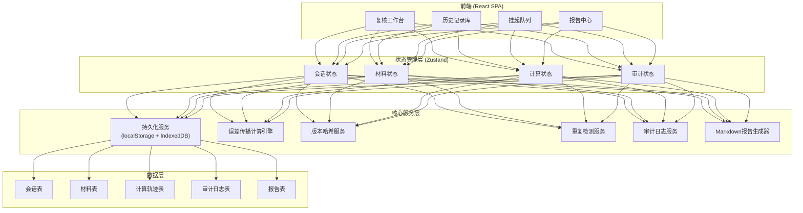
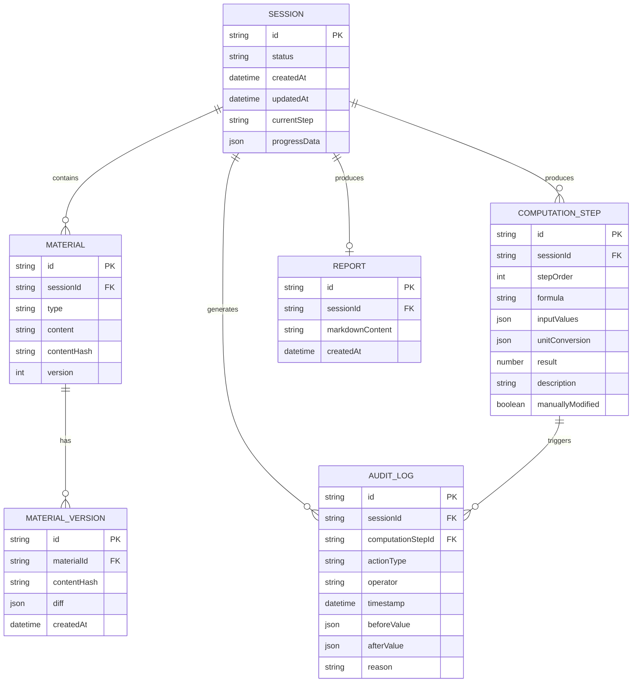

## 1. 架构设计



## 2. 技术描述

| 层级 | 技术选型 | 说明 |
|------|----------|------|
| 前端框架 | React@18 + TypeScript | 组件化开发，类型安全 |
| 构建工具 | Vite@5 | 快速开发构建 |
| 样式方案 | TailwindCSS@3 + CSS变量 | 原子化CSS，主题统一 |
| 状态管理 | Zustand@4 | 轻量状态管理，支持持久化中间件 |
| 路由 | React Router@6 | 单页路由管理 |
| 公式渲染 | KaTeX | 数学公式渲染 |
| Markdown | react-markdown + remark-gfm | Markdown渲染 |
| 图表 |  |  |
| 数据持久化 | localStorage + IndexedDB | 双写策略，localStorage存元数据，IndexedDB存大对象 |
| 哈希计算 | Web Crypto API | SHA-256计算内容指纹 |
| 相似度检测 | 编辑距离算法 | 检测材料版本差异和重复样本 |
| 导出功能 | html2canvas + jsPDF | PDF导出 |

**初始化方式**：`npm create vite@latest . -- --template react-ts`

**无后端**：纯前端应用，数据全部本地持久化

## 3. 路由定义

| 路由 | 页面组件 | 说明 |
|------|----------|------|
| `/` | 重定向到 `/workbench` | 默认路由 |
| `/workbench` | WorkbenchPage | 复核工作台 |
| `/history` | HistoryPage | 历史记录库 |
| `/pending` | PendingQueuePage | 挂起队列 |
| `/reports` | ReportsPage | 报告中心 |
| `/reports/:id` | ReportDetailPage | 报告详情 |

## 4. 数据模型

### 4.1 实体关系图



### 4.2 TypeScript 类型定义

```typescript
// 会话状态
interface Session {
  id: string;
  status: 'draft' | 'pending' | 'computing' | 'suspended' | 'completed';
  createdAt: number;
  updatedAt: number;
  currentStep: number;
  progress: ProgressState;
}

// 材料类型
type MaterialType = 'historical_answer' | 'boundary_sample' | 'verbal_note';

interface Material {
  id: string;
  sessionId: string;
  type: MaterialType;
  content: string;
  contentHash: string;
  version: number;
  versions: MaterialVersion[];
  hasCaliberChanged: boolean;
}

interface MaterialVersion {
  id: string;
  materialId: string;
  contentHash: string;
  diff: DiffChunk[];
  createdAt: number;
}

interface DiffChunk {
  type: 'added' | 'removed' | 'modified';
  value: string;
  oldValue?: string;
}

// 计算步骤
interface ComputationStep {
  id: string;
  sessionId: string;
  stepOrder: number;
  formula: string;
  inputValues: Record<string, { value: number; unit: string }>;
  unitConversion: UnitConversion;
  result: number;
  description: string;
  manuallyModified: boolean;
}

interface UnitConversion {
  originalUnit: string;
  targetUnit: string;
  conversionFactor: number;
  intermediateValue: number;
}

// 审计日志
type AuditActionType = 'compute' | 'manual_edit' | 'suspend' | 'confirm' | 'reject' | 'generate_report';

interface AuditLog {
  id: string;
  sessionId: string;
  computationStepId?: string;
  actionType: AuditActionType;
  operator: string;
  timestamp: number;
  beforeValue?: any;
  afterValue?: any;
  reason?: string;
}

// 挂起任务
interface SuspendedTask {
  id: string;
  sessionId: string;
  reason: 'duplicate_sample' | 'caliber_change';
  duplicateInfo?: DuplicateInfo;
  status: 'pending' | 'confirmed' | 'rejected';
  createdAt: number;
}

interface DuplicateInfo {
  similarity: number;
  existingSessionId: string;
  existingSampleHash: string;
  newSampleHash: string;
}

// 报告
interface Report {
  id: string;
  sessionId: string;
  markdownContent: string;
  citations: Citation[];
  createdAt: number;
}

interface Citation {
  id: string;
  sourceMaterialId: string;
  quoteText: string;
  location: { start: number; end: number };
}
```

## 5. 核心模块设计

### 5.1 持久化服务 (PersistenceService)

**职责**：统一管理所有数据的读写，确保服务重启后可恢复

**核心方法**：
```typescript
interface PersistenceService {
  saveSession(session: Session): Promise<void>;
  getSession(id: string): Promise<Session | null>;
  getAllSessions(): Promise<Session[]>;
  saveMaterial(material: Material): Promise<void>;
  saveComputationStep(step: ComputationStep): Promise<void>;
  saveAuditLog(log: AuditLog): Promise<void>;
  saveReport(report: Report): Promise<void>;
  getCurrentProgress(): Promise<{ sessionId: string; step: number } | null>;
  clearAll(): Promise<void>;
}
```

**持久化策略**：
- 元数据（会话列表、索引）存储在 localStorage
- 大对象（材料内容、计算轨迹、报告）存储在 IndexedDB
- 自动定时自动保存（每30秒自动保存
- 关键操作后立即保存
- 页面卸载前强制保存

### 5.2 误差传播计算引擎 (ErrorPropagationEngine)

**职责**：执行误差传播计算，记录每一步轨迹

**核心算法**：
1. 误差传播公式：对于函数 f(x₁, x₂, ..., xₙ)，误差传播公式：
   σ_f = √[(∂f/∂x₁)² + ... + (∂f/∂xₙ)²]

**核心方法**：
```typescript
interface ComputationResult {
  steps: ComputationStep[];
  finalResult: number;
  unitConversionTrace: UnitConversionTrace[];
}

interface ErrorPropagationEngine {
  compute(formula: string, inputs: Record<string, { value: number; unit: string; error: number }>): ComputationResult;
  convertUnit(value: number, fromUnit: string, toUnit: string): { value: number; factor: number };
  getUnitConversionFactor(from: string, to: string): number;
}
```

### 5.3 版本哈希服务 (VersionHashService)

**职责**：计算内容指纹、检测版本变更

**核心方法**：
```typescript
interface VersionHashService {
  computeHash(content: string): string;
  compareVersions(oldContent: string, newContent: string): DiffChunk[];
  detectCaliberChange(material: Material, newContent: string): boolean;
}
```

### 5.4 重复检测服务 (DuplicateDetectionService)

**职责**：检测重复样本，计算相似度

**核心方法**：
```typescript
interface DuplicateDetectionService {
  findDuplicate(sample: string, existingSamples: string[]): { isDuplicate: boolean; similarity: number; existingId?: string };
  calculateSimilarity(a: string, b: string): number;
}
```

### 5.5 Markdown报告生成器 (ReportGenerator)

**职责**：生成含计算过程、溯源引用的Markdown报告

**核心方法**：
```typescript
interface ReportGenerator {
  generate(session: Session, materials: Material[], steps: ComputationStep[], audits: AuditLog[]): Report;
  addCitation(text: string, sourceId: string): string;
}
```

## 6. 前端组件架构

```
src/
├── components/
│   ├── workbench/
│   │   ├── MaterialUploader.tsx      # 材料上传组件
│   │   ├── ComputationTimeline.tsx  # 计算时间轴
│   │   ├── StepDetail.tsx           # 计算步骤详情
│   │   ├── ParameterCompare.tsx        # 参数对照面板
│   │   └── ProgressBar.tsx          # 进度条
│   ├── history/
│   │   ├── SessionCard.tsx         # 会话卡片
│   │   ├── AuditTimeline.tsx       # 审计时间轴
│   │   └── DiffViewer.tsx         # 版本差异查看
│   ├── pending/
│   │   ├── SuspendedTaskCard.tsx  # 挂起任务卡片
│   │   └── DuplicateCompare.tsx   # 重复样本对比
│   ├── reports/
│   │   ├── ReportPreview.tsx     # 报告预览
│   │   └── CitationPopover.tsx # 引用悬浮框
│   └── common/
│       ├── StatusBadge.tsx
│       ├── Modal.tsx
│       └── Button.tsx
│       └── Tooltip.tsx
├── stores/
│   ├── useSessionStore.ts
│   ├── useMaterialStore.ts
│   ├── useComputationStore.ts
│   └── useAuditStore.ts
├── services/
│   ├── persistence.ts
│   ├── errorPropagation.ts
│   ├── versionHash.ts
│   ├── duplicateDetection.ts
│   └── reportGenerator.ts
│   └── auditLogger.ts
├── types/
│   └── index.ts
├── utils/
│   ├── hash.ts
│   ├── diff.ts
│   ├── unitConversion.ts
│   └── similarity.ts
├── hooks/
│   ├── useAutoSave.ts
│   └── useProgressRecovery.ts
├── App.tsx
├── main.tsx
└── index.css
```

## 7. 关键技术实现要点

### 7.1 进度恢复机制
- 应用启动时调用 `useProgressRecovery` hook
- 检查 localStorage 中是否有未完成会话
- 如有，弹出确认对话框，用户确认后恢复所有状态
- 滚动到最后操作的计算步骤

### 7.2 自动保存机制
- `useAutoSave` hook 每30秒自动保存
- 关键操作（材料上传、计算完成、人工修改）后立即保存
- 使用 `beforeunload` 事件确保页面关闭前保存

### 7.3 原文溯源实现
- 报告生成时，对引用的历史答案原文进行编号
- 渲染时，上标标记可点击，弹出悬浮框展示原文上下文

### 7.4 审计日志
- 所有操作通过 `auditLogger` 服务记录
- 人工修改时同时记录修改前后值和修改原因
- 历史记录页以时间轴形式展示

### 7.5 单位换算追踪
- 每步计算记录完整的单位换算过程
- 展示：原值(原单位) × 换算因子 = 新值(新单位)
- 差异高亮显示换算因子来源

### 7.6 挂起机制
- 检测到重复样本或口径变更时，将会话状态设为 `suspended`
- 挂起任务进入队列，等待现场老师确认
- 未经确认的挂起任务不生成最终结论
```