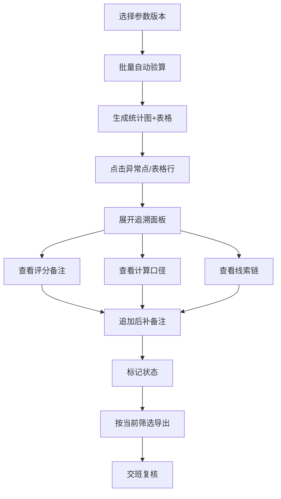

## 1. 产品概述
数列递推批量验算工具，面向建模助教团队，解决人工验算时"图表好看却点不回明细"、"评分备注与结论脱节"、"重复样本误判为正常"等交班痛点。通过**可追溯**、**线索化**、**口径一致**的设计，让异常有迹可循，交班有据可依。

- 核心用户：建模助教（如小岑）、排班复核同事
- 核心价值：让每一条验算结论都能回溯到评分备注、计算口径和参数版本

---

## 2. 核心功能

### 2.1 用户角色
| 角色 | 核心权限 |
|------|----------|
| 建模助教 | 批量验算、补录备注、标记异常、导出数据 |
| 复核同事 | 筛选查看、追溯明细、复核结论、导出报告 |

### 2.2 功能模块
1. **验算主页面**：参数版本切换、条件筛选、批量验算表格、统计图
2. **异常追溯面板**：评分备注、计算口径、后补备注线索链、历史操作记录
3. **导出功能**：按当前筛选口径导出CSV，保留异常标记和重复样本痕迹

### 2.3 页面详情
| 页面名称 | 模块名称 | 功能描述 |
|----------|----------|----------|
| 验算主页面 | 参数版本栏 | 显示当前参数版本、计算口径说明、版本切换 |
| 验算主页面 | 筛选区 | 按状态（正常/异常/重复）、样本ID、验算日期筛选 |
| 验算主页面 | 统计图区 | 贴合复核动作，点击异常点自动定位表格行并展开追溯面板 |
| 验算主页面 | 批量验算表 | 显示样本ID、递推序列、计算结果、状态标签、操作按钮 |
| 验算主页面 | 补录备注区 | 给指定样本追加后补备注，自动关联到结论线索链 |
| 异常追溯面板 | 评分备注区 | 展示原始评分备注，高亮与异常相关的关键词 |
| 异常追溯面板 | 计算口径区 | 展示本次验算使用的递推公式、参数值、版本号 |
| 异常追溯面板 | 线索链时间线 | 从原始评分→初次验算→后补备注→最终结论的完整时间线 |
| 异常追溯面板 | 重复样本检测 | 标记重复样本，显示关联的其他样本ID |

---

## 3. 核心流程

**验算复核流程：**
1. 助教打开工具，选择参数版本
2. 系统自动批量验算所有样本，生成结果
3. 助教查看统计图，点击红色异常点
4. 系统自动定位到表格对应行，展开追溯面板
5. 助教核对评分备注与计算口径，必要时追加后补备注
6. 标记状态（正常/异常/重复）
7. 导出当前筛选结果，文件中保留所有异常痕迹
8. 复核同事接班，按相同筛选条件查看，可逐行追溯

---

## 4. 用户界面设计

### 4.1 设计风格
- **主色调**：深蓝 `#0F2A4A`（专业严谨），搭配象牙白 `#F8F5F0` 背景
- **强调色**：异常红 `#D64545`，正常绿 `#27AE60`，重复橙 `#F39C12`，线索蓝 `#3498DB`
- **字体**：标题用 **Noto Serif SC**（衬线，学术感），正文用 **IBM Plex Mono**（等宽，数据清晰）
- **布局**：三栏式 — 左：参数+筛选，中：统计图+表格，右：追溯面板（可展开收起）
- **交互细节**：
  - 统计图异常点悬停时显示微型预览卡
  - 点击异常点时，表格行高亮闪烁，追溯面板滑入
  - 线索链时间线节点点击可展开详情
  - 所有状态标签带独特图标和角标

### 4.2 页面设计概览
| 页面名称 | 模块名称 | UI元素 |
|----------|----------|--------|
| 验算主页面 | 参数版本栏 | 版本下拉框、版本说明卡片、计算口径快速预览 |
| 验算主页面 | 筛选区 | 状态徽章多选、日期范围、样本ID搜索、重置按钮 |
| 验算主页面 | 统计图区 | 散点图（正常绿点/异常红点/重复橙三角）、点击交互、悬停提示 |
| 验算主页面 | 批量验算表 | 斑马纹行、状态标签、操作按钮组、展开/收起箭头 |
| 验算主页面 | 追溯面板 | 滑入动画、三个tab（评分备注/计算口径/线索链）、时间线组件 |
| 验算主页面 | 底部操作栏 | 批量标记按钮、导出按钮、数据统计摘要 |

### 4.3 响应式
- Desktop-first，以1280px以上为主
- 1024px以下：追溯面板改为底部抽屉
- 768px以下：统计图与表格堆叠显示

---

## 5. 测试数据设计
预置4条测试数据，覆盖所有场景：
1. **正常样本**：递推结果符合预期，用于演示正常流程
2. **异常样本**：递推结果偏差超过阈值，用于演示异常追溯
3. **重复样本**：与其他样本ID关联，用于演示重复检测
4. **含后补备注样本**：已有后补备注，用于演示线索链
