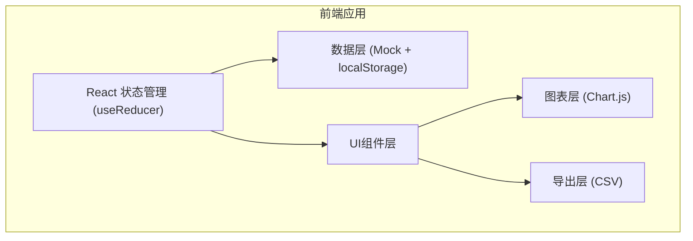
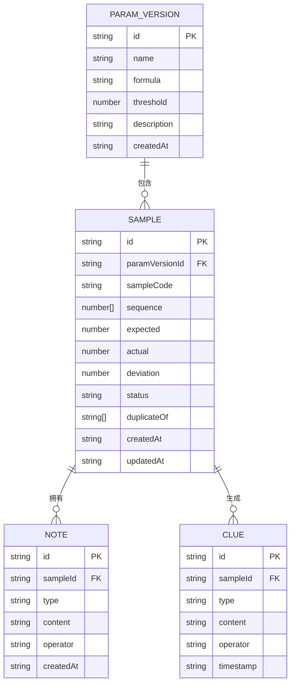

## 1. 架构设计
纯前端应用，数据与状态在前端管理，无需后端服务。



---

## 2. 技术栈说明
- **前端框架**：React@18 + TypeScript
- **构建工具**：Vite@5
- **样式方案**：TailwindCSS@3 + CSS变量
- **图表库**：Chart.js@4 + react-chartjs-2
- **状态管理**：React useReducer + Context
- **数据持久化**：localStorage（本地缓存验算记录）
- **字体**：Noto Serif SC + IBM Plex Mono（Google Fonts）
- **图标**：Lucide React

---

## 3. 路由定义
单页应用，无需多路由。

| 路径 | 页面/组件 | 说明 |
|------|----------|------|
| `/` | 主应用组件 | 包含所有功能模块 |

---

## 4. 数据模型

### 4.1 数据模型定义



### 4.2 TypeScript 类型定义

```typescript
// 参数版本
interface ParamVersion {
  id: string;
  name: string;
  formula: string;
  threshold: number;
  description: string;
  params: {
    a: number;
    b: number;
    c: number;
  };
  createdAt: string;
}

// 样本状态类型
type SampleStatus = 'normal' | 'abnormal' | 'duplicate' | 'pending';

// 样本数据
interface Sample {
  id: string;
  paramVersionId: string;
  sampleCode: string;
  sequence: number[];
  expected: number;
  actual: number;
  deviation: number;
  status: SampleStatus;
  duplicateOf: string[];
  scoreNote: string;
  calculationTrace: string;
  createdAt: string;
  updatedAt: string;
}

// 备注类型
type NoteType = 'score' | 'supplement' | 'conclusion';

// 备注记录
interface Note {
  id: string;
  sampleId: string;
  type: NoteType;
  content: string;
  operator: string;
  createdAt: string;
}

// 线索链节点
interface Clue {
  id: string;
  sampleId: string;
  type: 'score' | 'calculation' | 'supplement' | 'conclusion';
  title: string;
  content: string;
  operator: string;
  timestamp: string;
}

// 筛选条件
interface FilterState {
  status: SampleStatus[];
  sampleCode: string;
  dateRange: [string, string] | null;
}

// 应用状态
interface AppState {
  paramVersions: ParamVersion[];
  currentParamVersionId: string;
  samples: Sample[];
  notes: Note[];
  clues: Clue[];
  filters: FilterState;
  selectedSampleId: string | null;
  tracePanelOpen: boolean;
}
```

### 4.3 Mock 数据设计

**参数版本（2个）：**
- v1.0: 基础递推公式，阈值 5%
- v1.1: 修正递推公式，阈值 3%

**样本数据（4条测试数据）：**
1. S-001：正常样本，偏差 1.2%
2. S-002：异常样本，偏差 8.7%，含评分备注
3. S-003：重复样本，duplicateOf: ['S-001']
4. S-004：含后补备注样本，已有2条补充备注

---

## 5. 核心组件结构

```
src/
├── types/              # 类型定义
│   └── index.ts
├── data/               # Mock数据
│   ├── paramVersions.ts
│   ├── samples.ts
│   └── notes.ts
├── hooks/              # 自定义Hooks
│   ├── useAppState.ts
│   └── useFilter.ts
├── components/
│   ├── layout/         # 布局组件
│   │   ├── Header.tsx
│   │   ├── Sidebar.tsx
│   │   └── TracePanel.tsx
│   ├── params/         # 参数版本组件
│   │   └── ParamVersionSelector.tsx
│   ├── filters/        # 筛选组件
│   │   └── FilterBar.tsx
│   ├── chart/          # 图表组件
│   │   └── ScatterChart.tsx
│   ├── table/          # 表格组件
│   │   ├── SampleTable.tsx
│   │   └── SampleRow.tsx
│   ├── trace/          # 追溯面板组件
│   │   ├── ScoreNoteTab.tsx
│   │   ├── FormulaTab.tsx
│   │   └── ClueTimeline.tsx
│   └── common/         # 通用组件
│       ├── StatusBadge.tsx
│       └── NoteInput.tsx
├── utils/              # 工具函数
│   ├── calculator.ts   # 递推验算逻辑
│   ├── exporter.ts     # CSV导出
│   └── clueGenerator.ts # 线索链生成
├── App.tsx
├── main.tsx
└── index.css
```

---

## 6. 核心功能实现要点

### 6.1 递推验算逻辑
```
递推公式（可配置）: a(n) = a(n-1) * A + a(n-2) * B + C
偏差计算: |actual - expected| / expected * 100%
状态判定:
  - 偏差 ≤ 阈值 → normal
  - 偏差 > 阈值 → abnormal
  - 样本序列重复 → duplicate
```

### 6.2 线索链生成
每次操作自动生成线索节点：
- 样本创建 → 「评分录入」节点
- 验算完成 → 「计算完成」节点（含公式和参数）
- 追加备注 → 「补充说明」节点
- 标记状态 → 「结论确认」节点

### 6.3 导出口径一致性
导出时使用**当前筛选条件**过滤数据，CSV列包含：
- 所有样本字段
- 状态标记列（带文字说明，非仅代码）
- 异常痕迹列（偏差值、重复关联ID）
- 备注摘要列（所有备注的拼接）
- 计算口径列（版本号+公式简述）

### 6.4 交互实现
1. **统计图点击联动**：
   - 点击数据点 → 更新 selectedSampleId
   - 表格行定位 + 高亮闪烁动画
   - 追溯面板滑入展开

2. **追溯面板Tab切换**：
   - 评分备注：高亮关键词（异常、偏差、错误等）
   - 计算口径：公式显示、参数值、计算过程展开
   - 线索链：时间线组件，可展开查看详情

3. **后补备注**：
   - 提交后自动生成线索节点
   - 更新样本 updatedAt 时间戳
   - 表格行显示「有新备注」角标
