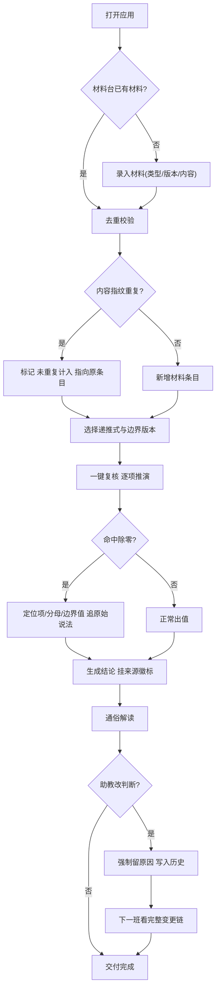

# 数列递推边界复核 · 产品需求文档（PRD）

## 1. 产品概述
「数列递推边界复核」是一个面向建模复盘、可独立运行、可向非技术人员讲清楚的单页复核工具。它把断断续续的材料（历史答案旧版、后补备注、口头备注）归集去重，对数列递推式逐项推演并精确定位除零等边界问题，每条结论都能溯源到原始材料的说法，判断改动全程留原因。
- 解决的问题：边界样本少时"凭感觉收尾才冒出来"的边界问题、重复提交把后补备注算成两份、除零变成一句含糊警告、判断改动只留最终值不留原因、负责人还要问材料放哪。
- 目标用户：建模助教（小岑，录入材料与改判断）、复盘负责人（一键复核与看报告）、不读代码的评审者（只读报告与溯源）。
- 交付价值：把"凭感觉"变成可追溯、可复跑、可交接的复核档案。

## 2. 核心功能

### 2.1 用户角色
| 角色 | 进入方式 | 核心权限 |
|------|----------|----------|
| 建模助教（小岑） | 直接打开页面 | 录入/去重材料、运行复核、临时改判断并留原因 |
| 复盘负责人 | 直接打开页面 | 一键复核、查看报告与判断历史、自助复跑 |
| 评审者（不看代码） | 直接打开页面 | 只读复核报告与通俗解读、点击查看数字出处 |

> 无注册、无登录；纯前端应用，数据落在本地，打开即用。

### 2.2 功能模块（页面）
1. **材料台**（`/`）：材料录入、去重判定、材料清单与来源标签、一键复核入口、材料位置说明。
2. **复核报告**（`/report`）：递推推演表、除零精确定位、每条结论的溯源链、通俗解读（讲给不看代码的人）。
3. **判断历史**（`/audit`）：判断变更时间线、每次改动的原因留痕、前后值对照。

### 2.3 页面详情
| 页面名称 | 模块名称 | 功能描述 |
|----------|----------|----------|
| 材料台 | 录入面板 | 选择类型（历史答案/后补备注/口头备注）、填版本与来源、粘贴内容；提交后即时显示是否被去重 |
| 材料台 | 去重判定 | 按内容指纹判定；重复提交同一后补备注显示"已存在，未重复计入"，并指向原条目 |
| 材料台 | 材料清单 | 列出全部材料：类型徽标、版本、来源、内容摘要、指纹、影响哪些结论 |
| 材料台 | 一键复核 | 选择递推式与边界材料版本后运行复核，跳转报告 |
| 材料台 | 材料位置说明 | 顶部固定提示"材料在这里：左录入、右清单、点一键复核"，避免负责人问材料放哪 |
| 复核报告 | 推演表 | 逐项展示 n、数值、分子、分母、分母值、状态（初始/正常/除零） |
| 复核报告 | 除零定位 | 除零不止一句警告：定位到第几项、哪个分母、由哪个边界值引起、追到原始材料说法 |
| 复核报告 | 结论溯源 | 每条结论挂来源徽标（历史答案旧版/后补备注/口头备注），点击展开原始说法 |
| 复核报告 | 通俗解读 | 用自然语言讲清"数字从哪来、边界为何有问题、改了什么就没事"，面向不看代码者 |
| 判断历史 | 变更时间线 | 按时间倒序展示每次判断改动：字段、前值、后值、原因、操作人、时间 |
| 判断历史 | 原因留痕 | 每条强制写原因；报告页结论旁显示"为何变化"入口直达对应历史条目 |

## 3. 核心流程
负责人打开 → 在材料台确认材料（重复提交自动去重）→ 选择递推式与边界版本 → 点【一键复核】→ 引擎逐项推演 → 命中除零即精确定位并追到原始说法 → 生成报告（每条结论带溯源）→ 助教改判断时强制留原因写入历史 → 下一班在判断历史看到完整变更链 → 评审者读通俗解读。

## 4. 用户界面设计

### 4.1 设计风格
- 定位：**复核档案 / Review Dossier**——像一份被反复校阅的工程档案，纸面、墨字、朱砂警示。
- 主色：墨黑 `#1a1a1a`（正文）on 暖纸 `#f4efe6`（背景，带细噪点纹理）。
- 强调色：朱砂红 `#c8392f`（除零与边界警示）、墨蓝 `#2f4858`（溯源链）、青苔绿 `#5b7c5a`（正常/已修正）。
- 字体：标题 Noto Serif SC（带衬线档案感）；正文 Noto Sans SC；数值与公式 JetBrains Mono（等宽，便于逐项核对）。
- 布局：网格 + 细分割线 + 编号章节（§01/§02）；材料以卡片条目呈现；推演用等宽数据表；溯源链用纵向时间轴。
- 按钮：方角、细描边、按压微位移；主操作（一键复核）用朱砂实色。
- 图标/标记：用 § 编号、× 标记除零、来源用首字徽标（历/补/口）。

### 4.2 页面设计概览
| 页面名称 | 模块名称 | UI 元素（样式/布局/配色/字体/动效） |
|----------|----------|----------|
| 材料台 | 录入面板 | 左栏表单卡片，朱砂主按钮，提交后弹出去重结果横幅 |
| 材料台 | 材料清单 | 右栏条目卡，左侧类型徽标色块，等宽指纹，hover 高亮影响结论 |
| 材料台 | 一键复核 | 底部固定操作条，版本选择下拉 + 朱砂按钮，点击后页面切换 |
| 复核报告 | 推演表 | 等宽表格，除零行整行朱砂底 + × 标记，分母值 0 加粗朱砂 |
| 复核报告 | 除零定位 | 卡片：项号→分母表达式→边界值→来源徽标→原始说法引文 |
| 复核报告 | 结论溯源 | 每条结论下方来源徽标链，点击展开原始材料引文 |
| 复核报告 | 通俗解读 | 浅纸卡片，大字号自然语言，关键数字用等宽并加来源脚注 |
| 判断历史 | 时间线 | 纵向轴，每节点：前值→后值、原因引文、操作人、时间；可折叠 |

### 4.3 响应式
桌面优先（复盘在笔记本/大屏进行）；窄屏下表单与清单纵向堆叠，推演表横向可滚动，溯源与时间线保持可读。触控目标≥44px。

### 4.4 3D 场景
不适用（本工具为数据与文本驱动的复核档案，无 3D 需求）。

---

## 附：演示数据（内置，首开即用）

为让"负责人自己跑一遍"开箱即通，应用预置以下材料与递推式：

- **递推式**：`a_n = a_{n-1} / (a_{n-2} - 3)`
- **历史答案 v1（旧版）**：递推式同上，边界 `a_0 = 5, a_1 = 3`。
- **后补备注**：修正 `a_1 = 2`（旧版 `a_1 = 3` 会在 n=3 处触发分母 `a_1 - 3 = 0`）。
- **口头备注**："我记得边界 a_1 取过 3。"（佐证旧版来源）

推演对照：
- 旧版（a_1=3）：`a_0=5, a_1=3, a_2=3/(5-3)=1.5, a_3=1.5/(3-3)=除零` → n=3 除零，根源是旧版边界 `a_1=3`。
- 修正（a_1=2）：`a_0=5, a_1=2, a_2=2/(5-3)=1, a_3=1/(2-3)=-1, a_4=-1/(1-3)=0.5, a_5=0.5/(-1-3)=-0.125 …` → 无除零。

判断留痕演示：小岑初次判断"边界安全"→补算发现 n=3 除零→改为"边界有除零风险"，原因："补算 n=3，分母 `a_{n-2}-3` 在 `a_1=3` 时为 0，源自历史答案 v1（旧版）；后补备注已修正为 2。"

## 附：验收清单（对应你提出的点）
1. **幂等去重**：两次相同请求提交同一后补备注 → 只算一份（内容指纹去重）。
2. **结论溯源**：历史答案旧版 / 后补备注 / 口头备注 谁影响了结论可分清，且可追到原始说法。
3. **除零具体化**：除零定位到项、分母、边界值，追到原始材料说法，而非含糊警告。
4. **可向非技术人员讲清**：报告含通俗解读，关键数字带来源线索。
5. **判断留原因**：临时改判断时历史写原因，下一班看到的是变更链而非仅最终值。
6. **自助可跑**：负责人打开即见材料位置说明，一键复核无需问材料放哪。
