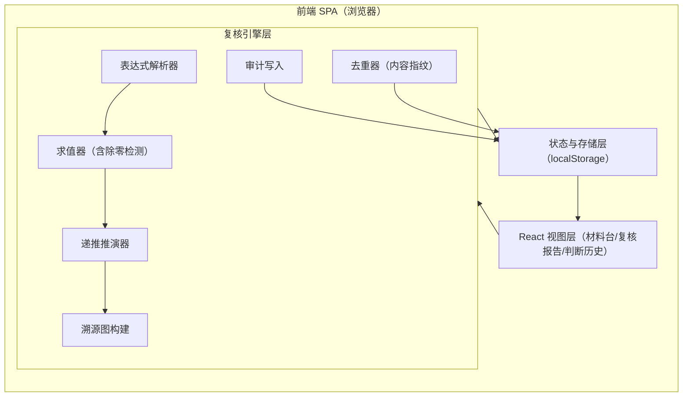
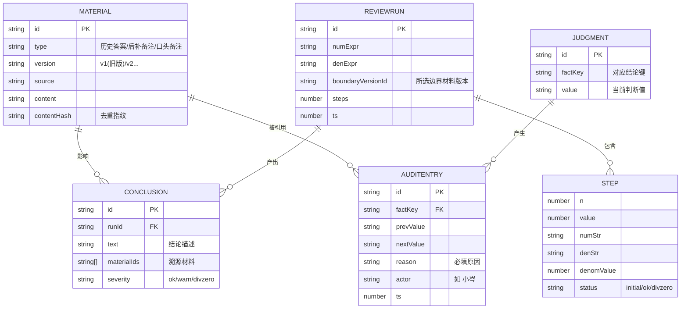

# 数列递推边界复核 · 技术架构文档

## 1. 架构设计
纯前端单页应用，无后端、无外部服务。所有复核逻辑（表达式求值、递推推演、去重、溯源、审计）在浏览器内完成，数据持久化到 localStorage，保证负责人"打开即跑、不必问材料放哪"。



## 2. 技术说明
- 前端：React@18 + tailwindcss@3 + vite
- 初始化工具：vite（`npm create vite@latest` react-ts 模板）
- 后端：无（纯客户端）
- 数据库：无；本地 localStorage 持久化，内存态即时计算
- 字体：Noto Serif SC / Noto Sans SC / JetBrains Mono（Google Fonts）
- 安全：自实现受限表达式求值器（仅数字、`+ - * /`、括号、`a1`=`a_{n-1}`、`a2`=`a_{n-2}`），不使用 `eval`/`Function`。

## 3. 路由定义
| 路由 | 用途 |
|------|------|
| `/` | 材料台：录入/去重/清单/一键复核入口 |
| `/report` | 复核报告：推演表/除零定位/溯源/通俗解读 |
| `/audit` | 判断历史：变更时间线/原因留痕 |

> 路由用轻量方案（hash 路由或 react-router）。无后端，部署为静态文件，可直接 `npm run dev` 或构建后任意静态托管。

## 4. API 定义
不适用（无后端）。模块间为函数调用接口：
- `parseExpr(str): AST`
- `evalExpr(ast, {a1, a2}): { value } | { divByZero, denomAst }`
- `runRecurrence(numAst, denAst, initials, steps): Step[]`
- `ingestMaterial(input): { id, duplicated, refId }`
- `recordJudgment(change): AuditEntry`
- `buildProvenance(run, materials): Conclusion[]`

## 5. 服务端架构
不适用（纯前端）。

## 6. 数据模型

### 6.1 数据模型定义


### 6.2 数据定义语言（伪 DDL · localStorage 结构）
```ts
// 材料条目
interface Material {
  id: string;                 // 稳定 id
  type: '历史答案' | '后补备注' | '口头备注';
  version: string;            // 'v1(旧版)' | 'v2' ...
  source: string;
  content: string;
  contentHash: string;        // 内容指纹：去重依据（见下）
}

// 复核一次推演
interface ReviewRun {
  id: string;
  numExpr: string;            // 分子表达式，如 "a1"
  denExpr: string;            // 分母表达式，如 "a2-3"
  boundaryVersionId: string;  // 选用哪份材料的边界
  a0: number; a1: number;
  steps: number;
  ts: number;
}

// 单步推演
interface Step {
  n: number;
  value: number | null;       // 除零时为 null
  numStr: string;             // 代入后的分子串
  denStr: string;             // 代入后的分母串
  denomValue: number;
  status: 'initial' | 'ok' | 'divzero';
  causedBy?: { boundVar: 'a0'|'a1'; value: number; materialId: string };
}

// 结论与溯源
interface Conclusion {
  id: string;
  runId: string;
  text: string;
  severity: 'ok' | 'warn' | 'divzero';
  materialIds: string[];      // 影响该结论的材料
  quoteRefs?: { materialId: string; quote: string }[]; // 原始说法引文
}

// 判断与审计
interface Judgment { id: string; factKey: string; value: string; }
interface AuditEntry {
  id: string; factKey: string;
  prevValue: string; nextValue: string;
  reason: string;             // 必填，留原因
  actor: string; ts: number;
}
```

**去重指纹算法**：`contentHash = sha256(归一化(type + version + 去首尾空白并合并连续空白后的 content))`；提交时若已存在同 hash，则 `duplicated=true`，返回原条目 id，不新增、不重复计入结论影响。

**除零定位**：求值器对分母 AST 求值；若结果为 0，返回 `divByZero` 并记录分母 AST 与代入值；推演器据此在对应 Step 标记 `status='divzero'`，并回查使分母为 0 的边界变量（a0/a1）及其来源材料，写入 `causedBy` 与结论 `quoteRefs`，实现"追到原始说法"。
