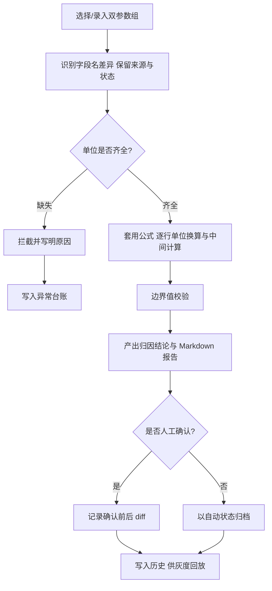

# 优化调参错题归因 — 产品需求文档

## 1. 产品概述
"优化调参错题归因"是一个面向教研编辑与排班同事的参数调参错题归因工作台，解决"公式写对、单位一换结果就偏"的核心痛点。它把公式、单位、边界值、单位换算与中间计算过程全程摆在明处，输出可对照、可追溯的 Markdown 归因报告，并保留人工确认前后的变化以支撑灰度发布。

- 目标用户：教研编辑（阿宁，负责公式与归因复核）、排班同事（对照两组参数、读取结果）
- 核心价值：让"为什么偏 / 为什么被拦"一目了然；接班人 30 秒内定位样例、异常与导出入口，无需阅读大段说明

## 2. 核心功能

### 2.1 用户角色
| 角色 | 进入方式 | 核心权限 |
|------|----------|----------|
| 教研编辑（阿宁） | 直接进入工作台 | 录入/对照参数、复核归因、人工确认、导出报告 |
| 排班同事 | 直接进入工作台 | 对照两组参数、查看中间计算与单位换算、导出结果 |

### 2.2 功能模块
1. **归因工作台**：双参数组对照录入 → 公式/单位/边界值明示 → 单位换算与中间计算逐步展开 → 归因结论与 Markdown 报告
2. **历史与灰度**：归因历史列表、人工确认前后 diff、灰度发布说明
3. **样例与异常**：样例库、异常台账（含单位缺失拦截记录）、结果导出入口

### 2.3 页面详情
| 页面名称 | 模块名称 | 功能描述 |
|----------|----------|----------|
| 归因工作台 | 双参数对照 | 左右并排录入 A/B 两组参数，标记来源字段名与处理状态 |
| 归因工作台 | 公式与单位 | 展示当前公式表达式、各参数规范单位、边界值（上下界） |
| 归因工作台 | 计算过程 | 逐行展示代入、单位换算、中间值、边界校验，不藏中间步 |
| 归因工作台 | 归因结论 | pass/警告/拦截状态，拦截须写清原因；一键生成 Markdown 报告 |
| 历史与灰度 | 历史列表 | 按时间列出归因记录，含状态徽标（自动/已人工确认） |
| 历史与灰度 | 确认 diff | 展示人工确认前后参数/结论变化，灰度说明备注 |
| 样例与异常 | 样例库 | 内置典型样例（正常/单位缺失/越界），点击载入工作台 |
| 样例与异常 | 异常台账 | 列出被拦截项及原因（如"单位缺失→无法换算→已拦截"） |
| 样例与异常 | 结果导出 | 导出 Markdown 报告/CSV 明细，标注来源与处理状态 |

## 3. 核心流程
排班同事/教研编辑在工作台选择或录入两组参数 → 系统识别字段名差异并保留来源与处理状态 → 逐参数校验单位是否齐全（缺失则拦截并写明原因）→ 套用公式、展示单位换算与中间计算 → 边界值校验 → 产出归因结论与 Markdown 报告 → 可选择人工确认，确认前后变化写入历史 → 灰度发布前从历史回放 diff。

## 4. 用户界面设计

### 4.1 设计风格
- 主色：碳黑底 `#0a0c0b` + 校准琥珀 `#ffb000`；通过/绿 `#00d97e`、拦截/红 `#ff4d4f`、警告/黄 `#e8c547`
- 按钮：直角/微圆角(2px)、扁平、边框驱动，强调"仪表"克制感
- 字体：标题 Syne（几何感）、正文 IBM Plex Sans、数据/公式 IBM Plex Mono
- 布局：栅格化仪表盘，左右双栏对照 + 顶部状态条 + 底部报告抽屉
- 图标/符号：度量刻度、⊕/⊖、状态圆点，避免花哨 emoji

### 4.2 页面设计概览
| 页面名称 | 模块名称 | UI 元素 |
|----------|----------|----------|
| 归因工作台 | 双参数对照 | 双栏卡片、来源标签、处理状态徽标、琥珀分隔线 |
| 归因工作台 | 公式与单位 | 公式块(等宽)、单位标注、边界值刻度条 |
| 归因工作台 | 计算过程 | 逐行展开式(代入→换算→中间值→校验)，等宽对齐 |
| 归因工作台 | 归因结论 | 状态灯、拦截原因卡、Markdown 报告抽屉/复制 |
| 历史与灰度 | 历史列表 | 时间线、状态徽标、确认 diff 左右对照 |
| 样例与异常 | 样例库 | 样例卡网格、一键载入 |
| 样例与异常 | 异常台账 | 表格、拦截原因高亮、导出按钮组 |

### 4.3 响应式
桌面优先（≥1280px 双栏对照），平板/窄屏自适应单栏堆叠，触控放大点击区。

### 4.4 交接要点（面向阿宁接班）
- 样例在哪：`/samples` 页样例库，一键载入工作台
- 异常在哪：`/samples` 页异常台账 + 工作台拦截原因卡
- 结果怎么导出：`/samples` 页导出按钮组（Markdown / CSV）
