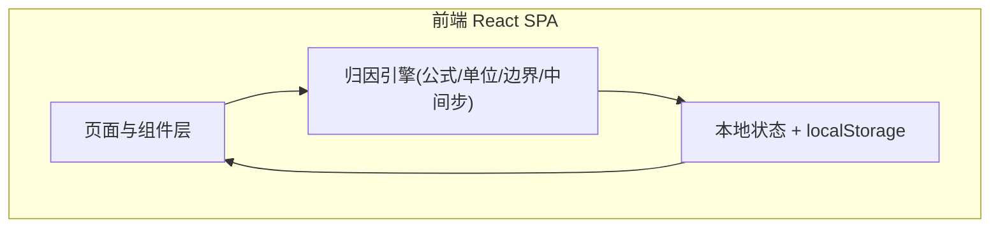
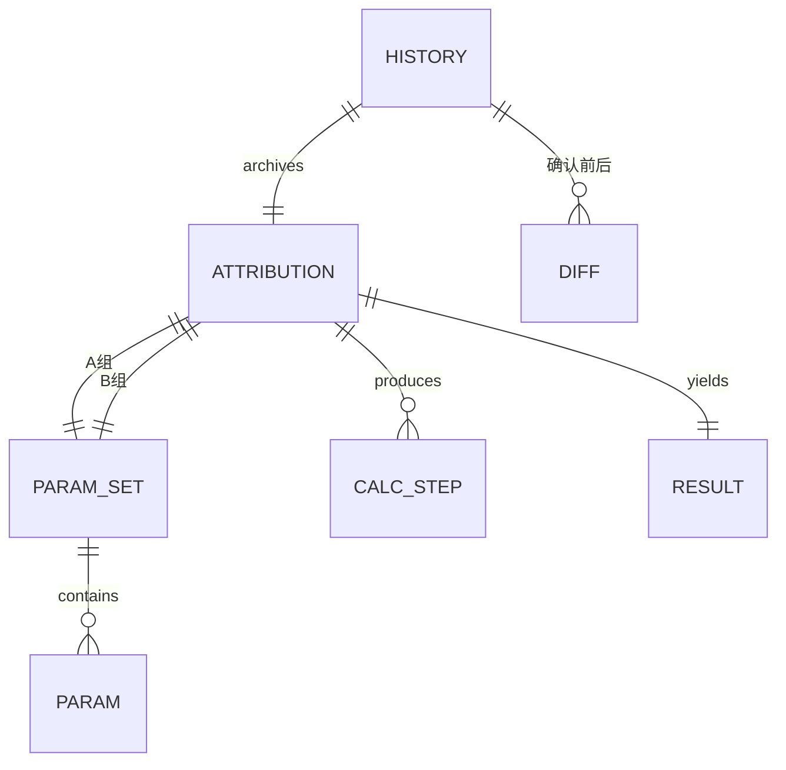

# 优化调参错题归因 — 技术架构文档

## 1. 架构设计
纯前端单页应用，无后端；历史与样例持久化于浏览器 `localStorage`，保证交接即用、灰度可回放。



## 2. 技术说明
- 前端：React@18 + tailwindcss@3 + vite
- 初始化工具：vite-init（react-ts 模板）
- 后端：无
- 数据：`localStorage` 持久化历史与样例；内置 mock 样例数据（含正常/单位缺失/越界三类）

## 3. 路由定义
| 路由 | 用途 |
|------|------|
| `/` | 归因工作台（双参数对照、公式/单位/边界、计算过程、结论与报告） |
| `/history` | 历史与灰度（历史列表、人工确认 diff、灰度说明） |
| `/samples` | 样例与异常（样例库、异常台账、结果导出） |

## 4. 数据模型

### 4.1 数据模型定义


### 4.2 类型定义
- `ParamSet`：`{ id, label, source(rawFieldName), params: Param[] }`
- `Param`：`{ canonicalName, rawFieldName, value, unit, status: 'ok'|'unit_missing'|'blocked' }`
- `Formula`：`{ id, expression, canonicalUnits: Record<name,string>, boundaries: Record<name,{min,max}> }`
- `CalcStep`：`{ order, type:'substitute'|'convert'|'compute'|'boundary', detail, before, after, unit }`
- `AttributionResult`：`{ status:'pass'|'warn'|'blocked', blockReason?, finalValue, markdown }`
- `HistoryEntry`：`{ id, ts, attributionSnapshot, confirmed:boolean, diffs:Diff[], grayscaleNote? }`

### 4.3 持久化结构
- `localStorage.attribution_history`：`HistoryEntry[]`
- `localStorage.attribution_samples`：内置样例（首次运行写入）
- `localStorage.attribution_exceptions`：异常台账记录

## 5. 核心算法
- **单位换算**：维护单位换算因子表（如 `cm→m: ×0.01`、`min→s: ×60`），缺单位直接拦截并写明 `blockReason`
- **公式求值**：按 `CalcStep` 逐步求值并记录 `before/after`，过程不藏
- **边界校验**：对结果与关键中间值做 `min/max` 校验，越界产出 `warn`
- **Markdown 报告**：模板化拼装（公式 / 单位 / 边界 / 中间步 / 结论 / 来源与处理状态）
- **人工确认 diff**：对比确认前后 `ParamSet` 与 `AttributionResult`，逐字段输出变化项

## 6. 目录结构
```
src/
  engine/        归因引擎（公式、单位换算、边界、中间步、Markdown）
  data/          样例数据、换算因子表
  store/         localStorage 读写、历史与异常状态
  pages/         Workbench / History / Samples
  components/    参数对照卡、计算过程行、状态徽标、报告抽屉
  App.tsx / main.tsx
```
